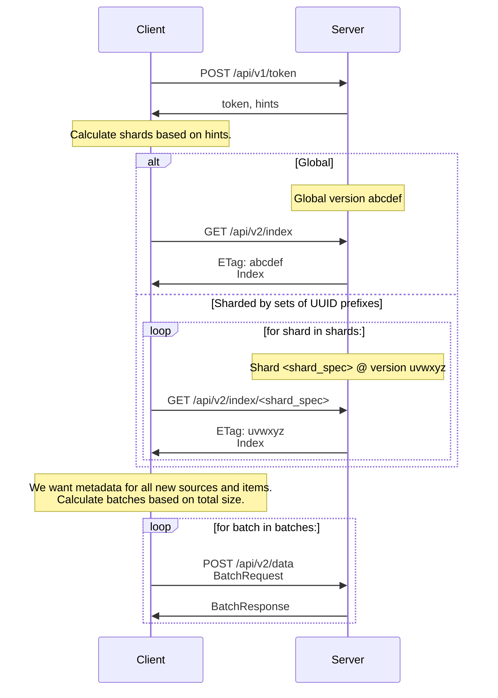
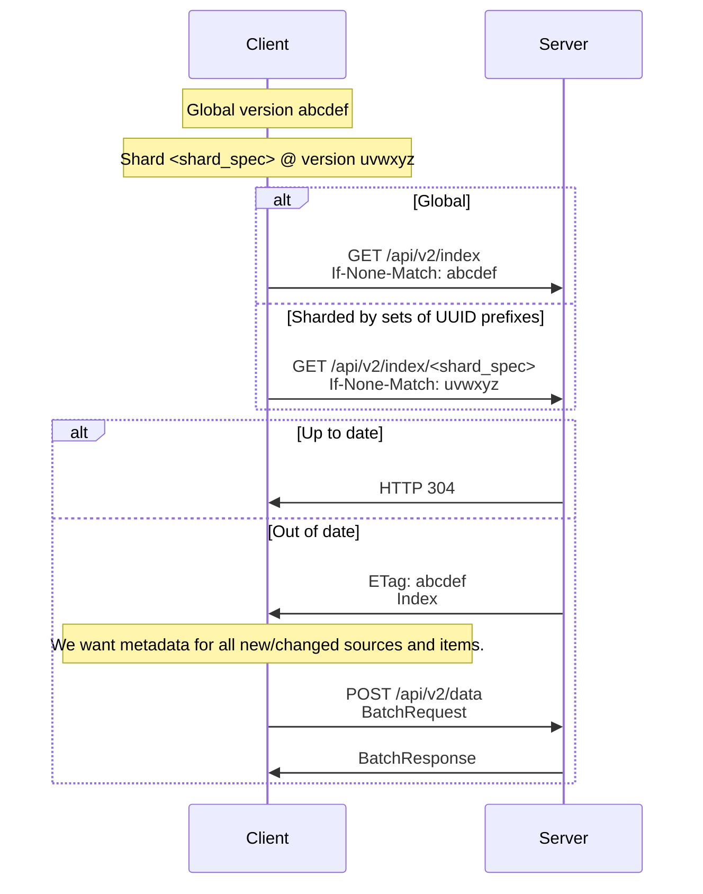
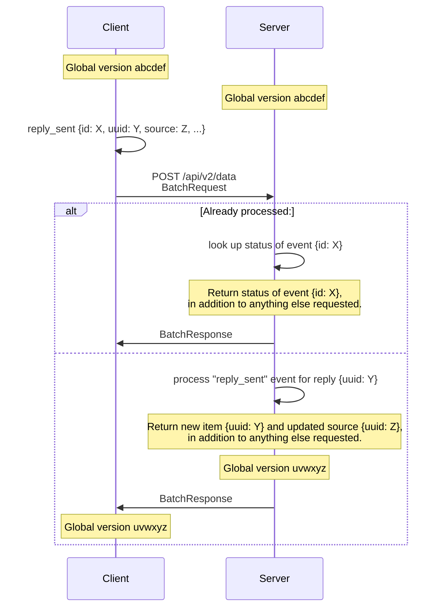
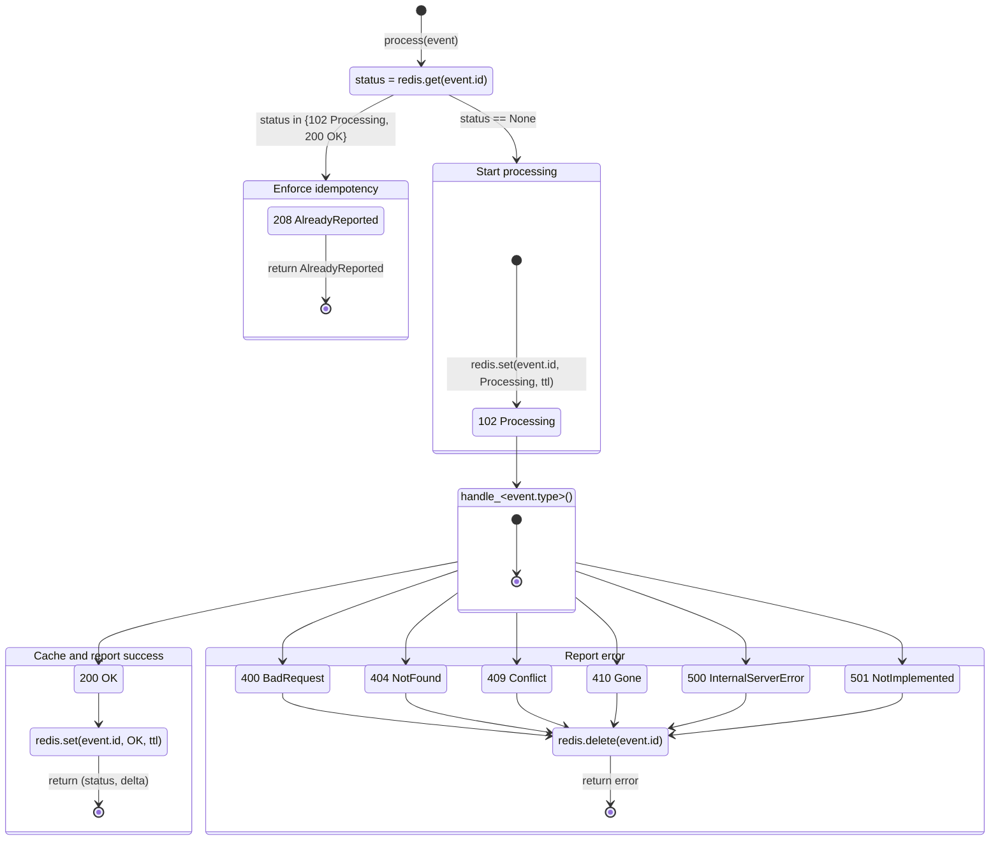

# Journalist API v2

The `securedrop.journalist_app.api2` package implements the synchronization
strategy for the v2 Journalist API.

| File/module                             | Contents                                                                                                       |
| --------------------------------------- | -------------------------------------------------------------------------------------------------------------- |
| `API2.md` (you are here)                | Specification                                                                                                  |
| `securedrop.journalist_app.api2`        | Flask blueprint for `/api/v2/`                                                                                 |
| `securedrop.journalist_app.api2.events` | Event-handling framework                                                                                       |
| `securedrop.journalist_app.api2.shared` | Helper functions factored out of and still shared with the v1 Journalist API (`securedrop.journalist_app.api`) |
| `securedrop.journalist_app.api2.types`  | Types                                                                                                          |
| `securedrop.tests.test_journalist_api2` | Test suite for server implementation                                                                           |

A client-side implementation should be able to interact with the endpoints
implemented in `securedrop.journalist_app.api2` according to this specification.

## Audience

This API is intended for use by the [SecureDrop journalist app][app], and this
documentation is intended to support its development. We make no guarantees
about support, compatibility, or documentation for other purposes.

[app]: https://github.com/freedomofpress/securedrop-client/tree/main/app

## Goals and properties

Although the SecureDrop Server remains the source of truth for its clients, the
v2 Journalist API borrows ideas from distributed systems and content-addressable
storage in order to:

1. Support the Journalist API's "occasionally connected" clients: actions should
   be possible while in offline mode, responsive and idempotent even over flaky Tor
   connections, etc.

2. Provide a single write-read loop in every synchronization round trip, at an
   interval of the client's choosing.

3. Hash a canonical representation of each record (source, item, etc.) to
   version it deterministically.

4. Hash a canonical representation of an endpoint's entire state (all sources,
   all items, etc.) to version it deterministically.

## Overview

> [!NOTE]
> The key words MUST, MUST NOT, REQUIRED, SHALL, SHALL NOT, SHOULD, SHOULD NOT,
> RECOMMENDED, MAY, and OPTIONAL in this document are to be interpreted as
> described in [RFC 2119].

The request/response schemas referred to in these sequence diagrams are defined
as mypy types in `securedrop.journalist_app.api2.types`.

A client can request a specific shape (version) of response from the server by
including in its requests a header of the form—

```
Prefer: securedrop=x
```

—where `x` is one of the values documented in
`securedrop.journalist_app.api2.shared.API_MINOR_VERSION`.

### Request tracing

A client MAY include an `X-Request-ID` header on any request so that a single
request can be correlated across the SecureDrop Inbox, `securedrop-proxy`, and
the server's own logs. A well-formed request ID is `req-` followed by a
lowercase UUID (as generated by the Inbox and validated by `securedrop-proxy`),
matching `securedrop.journalist_app._request_id_re`:

```
X-Request-ID: req-72d64b57-4632-4d3e-96b0-24a0428f7ec1
```

The server validates the header and behaves as follows:

- If it is **well-formed**, the server echoes it back in the `X-Request-ID`
  response header, and Apache records it in the Journalist Interface's access
  log.
- If it is **malformed**, the server ignores it: it is neither echoed nor
  logged verbatim so a client cannot inject arbitrary strings into the logs,
  and a warning is logged. The request still proceeds normally, since the
  header is optional.
- If it is **absent**, the server neither echoes nor logs a request ID.

### Initial synchronization

**Figure 1.**



#### Sharding metadata

<!-- TODO: #7772 -->

On login, the server returns _hints_ to help the client choose whether and how
to shard metadata for sources and their items:

```json
{
  "version": "abcdef",
  "sources": 100,
  "items": 200
}
```

A _shard_ is specified by _shard spec_ consisting of a comma-separated list of
UUID _prefixes_, so that the client can choose both the breadth and the depth of
the shard:

| Shard | Matches                                                            |
| ----- | ------------------------------------------------------------------ |
| `a`   | All sources (and their items) with UUIDs beginning with `a`        |
| `ab`  | All sources (and their items) with UUIDs beginning with `ab`       |
| `a,b` | All sources (and their items) with UUIDs beginning with `a` or `b` |

Putting it all together, the client MAY make sharding decisions such as:

| Client's version | `version` | `sources` | `items` | Client's next step                                                                | Records synced     |
| ---------------- | --------- | --------- | ------- | --------------------------------------------------------------------------------- | ------------------ |
| `abcdef`         | `abcdef`  | 100       | 200     | None; already in sync                                                             | 0                  |
| `ghijkl`         | `abcdef`  | 100       | 200     | Global sync; no sharding necessary                                                | 300                |
| `ghijkl`         | `abcdef`  | 100       | 1000    | Sync over 4 shards:<br>`["0,1,2,3", "4,5,6,7", "8,9,a,b", "c,d,e,f"]`             | ~275 records/shard |
| `ghijkl`         | `abcdef`  | 100       | 2000    | Sync over 8 shards:<br>`["0,1", "2,3", "4,5", "6,7", "8,9", "a,b", "c,d", "e,f"]` | ~262 records/shard |

The client SHOULD ensure that the set of shards it requests covers either (a)
the entire UUID namespace or (b) the portion of the UUID namespace of interest.

#### Batching data

As described in ["Incremental Synchronization"](#incremental-synchronization),
the client MAY request arbitrary batches of data at any time. During initial
synchronization, the client MAY choose (for example) to send a separate
`BatchRequest` for each metadata shard, in order to fetch only the records whose
metadata was returned in that shard.

### Incremental synchronization

**Figure 2.**



### Batched events from client

**Figure 3.**



#### State machine

Events in a given `BatchRequest` are handled in [snowflake-ID](#snowflake-ids)
order. Each event is handled according to the following state machine:

**Figure 4.**



Broadly speaking, each event will terminate in one of the following states:

1.  **Success:** A client that submits a successful event $E$ will receive HTTP
    `200 OK` for $E$ and SHOULD apply the event locally as confirmed based on
    the returned data (`sources`, `items`, etc.).

2.  **Idempotence:** A client that subsequently resubmits $E' = E$ will receive
    only HTTP `208 Already Reported` and SHOULD apply the event locally as
    acknowledged. The server will not return data in this case, but the client
    SHOULD already know the results of the operation once acknowledged.
    - Uniquely among the properties of this API, **event idempotence is a
      correctness property as well as a performance enhancement.** The server MUST
      preserve this property for all types of events with defined handlers.

3.  **Failure:** A client that submits a failed event $E'$ will receive an
    individual error code for $E'$. The client MAY resubmit $E'$ immediately, since
    idempotence is not enforced for error states.

4.  **Overload:** If a client submits more than
    `securedrop.journalist_app.api2.EVENTS_MAX` events, the server will skip
    processing them, and the client will receive HTTP `429 Too Many Requests`
    for the entire `BatchRequest`.

#### Consistency

Figure 3 above depicts single-round-trip consistency. That is:

1. If the server $S$ currently has exactly one active client $C$; and

2. $C$ submits a valid `BatchRequest` $BR$ with $n$ events $\{E_0, \dots,
E_n\}$; and

3. $S$ accepts $BR$ as valid and successfully processes all $E_i$; then

4. $C$'s index SHOULD match $S$'s index without a subsequent synchronization.

This property does not hold:

- when the server has multiple active clients. Because this API reuses some
  utility functions from the v1 Journalist API, it inherits the inconsistent
  transaction isolation of the latter's use of a shared SQLAlchemy session, which
  may cause side effects of events received very close in time to be interleaved
  at the SQLite level.

- for resubmitted events, which return an HTTP `208 Already Reported` status
  without the full result of the event.

In these cases, a subsequent synchronization MAY be necessary for the client to
"catch up" to the effects of accepted events.

#### Snowflake IDs

The `Event.id` field is a "snowflake ID", which a client can generate using a
library like [`@sapphire/snowflake`]. To avoid precision-loss problems:

- A client SHOULD store its IDs as opaque strings and sort them
  lexicographically.

- A client MUST encode its IDs on the wire as JSON strings.

- The server MAY convert IDs it receives to integers, but only for sorting and
  testing equality.

[#7788]: https://github.com/freedomofpress/securedrop/issues/7788
[`@sapphire/snowflake`]: https://www.npmjs.com/package/@sapphire/snowflake
[RFC 2119]: https://datatracker.ietf.org/doc/html/rfc2119
