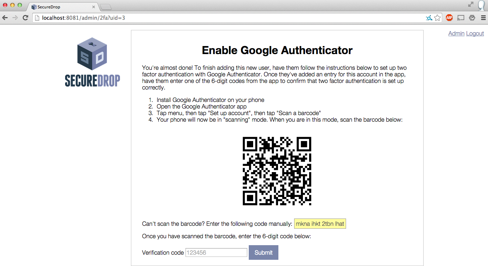
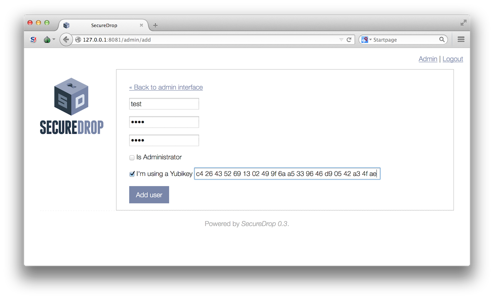
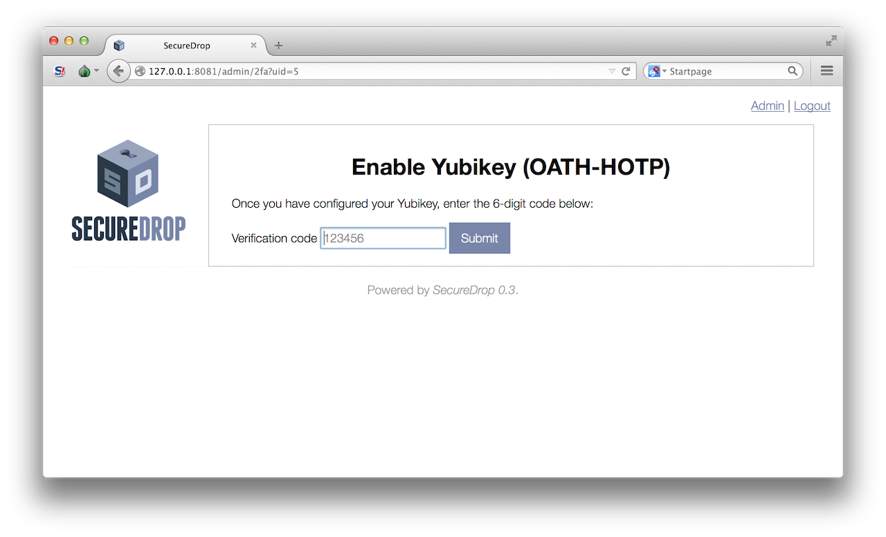

# Admin Interface Guide

At this point, you (the administrator) should have your own username and password, plus 2 factor authentication through either the Google Authenticator app on your smartphone or a Yubikey.

## Adding Users

Now you can add create new log-ins for the journalists at your news organization who will be checking the system for submissions. Make sure the journalist is physically in the same room as you when you do this, as they will have to create a password and scan a bar code for their 2 factor authentication. Since you’re logged in, this is the screen you should see now:

In the top right corner click the “Admin” link, which should bring you to this page:

Once there, click ‘Add User’ button, which will take you to this page:

Here, you will hand the keyboard over to the journalist so they can create their own username and password. Once they’re done entering a username and password for themselves, select whether you would like them to also be an administrator (this allows them to add or delete other journalist accounts), and whether they will be using Google Authenticator or a Yubikey for 2 factor authentication.

### Google Authenticator

If they are using Google Authenticator for their 2 factor, they can just proceed to the next page:

At this point, the journalist should make sure they have downloaded the Google Authenticator app to their smartphone. It can be installed from the Apple Store for an iPhone or from the Google Play store for an Android phone. Once you download it and open it, the app does not require set up. It should prompt you to scan a barcode. The journalist should use their phone's camera to scan the barcode on the screen.

If they have difficulty scanning the barcode, they can use the "Manual Entry" option and use their phone's keyboard to input the random characters that are highlighted in yellow.

Inside the Google authenticator app, a new entry for this account will appear on the main screen, with a six digit number that recycles to a new number every thirty seconds. Enter the six digit number under “Verification code” at the bottom of the SecureDrop screen here, and hit enter:

If Google Authenticator was set up correctly, you will be redircted back to the Admin Interface and will see a flashed message that says "Two factor token successfully verified for user *new username*!".

### Yubikey

If the journalist wishes to use a Yubikey for two factor authentication, check the box next to "I'm using a Yubikey". You will then need to enter the OATH-HOTP Secret Key that your Yubikey is configured with. For more information, read the [Yubikey Setup Guide](yubikey_setup.md).

Once you've configured your Yubikey and entered the Secret Key, click *Add user*. On the next page, enter a code from your Yubikey by inserting it into the workstation and pressing the button.

If everything was set up correctly, you will be redirected back to the Admin Interface, whre you should see a flashed message that says "Two factor token successfully verified for user *new username*!".

Congratulations! You have successfully set up a journalist on SecureDrop. Make sure the journalist remembers their username and password and always has their 2 factor authentication device in their possession when they attempt to log in to SecureDrop.

