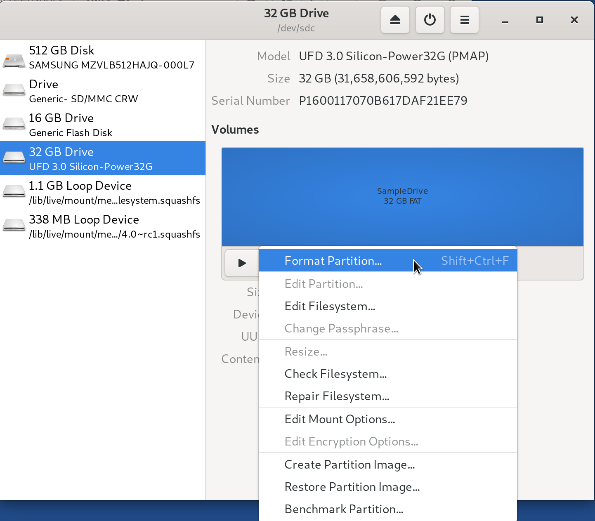
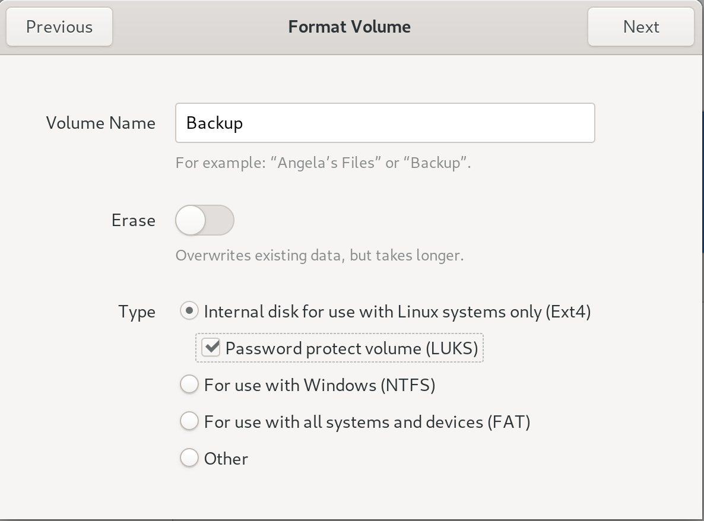
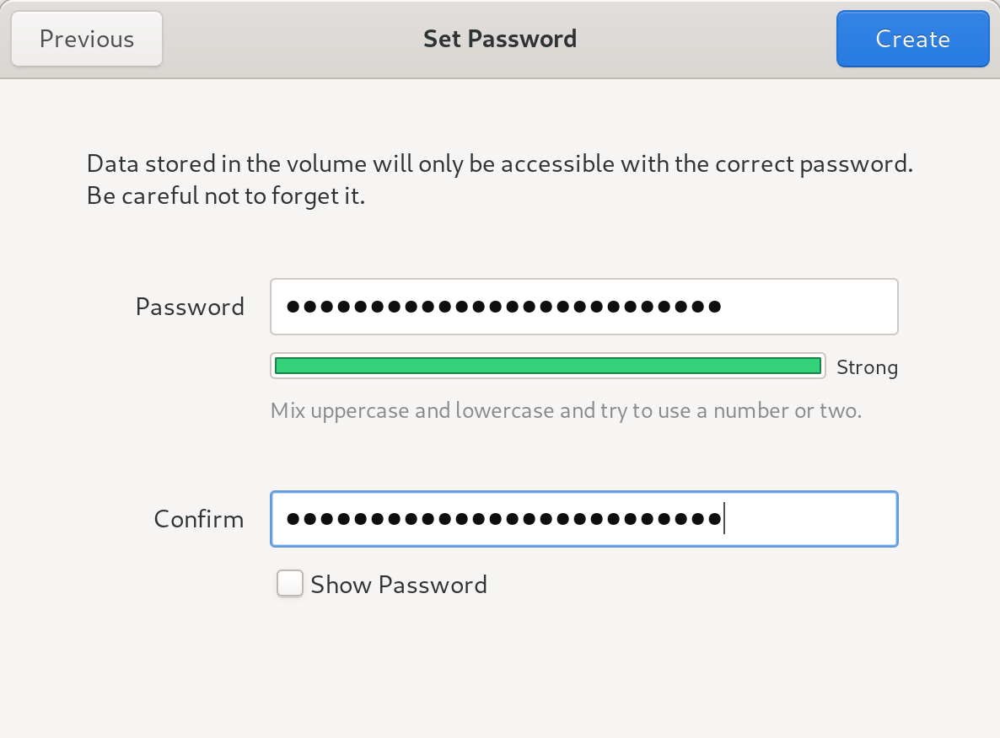
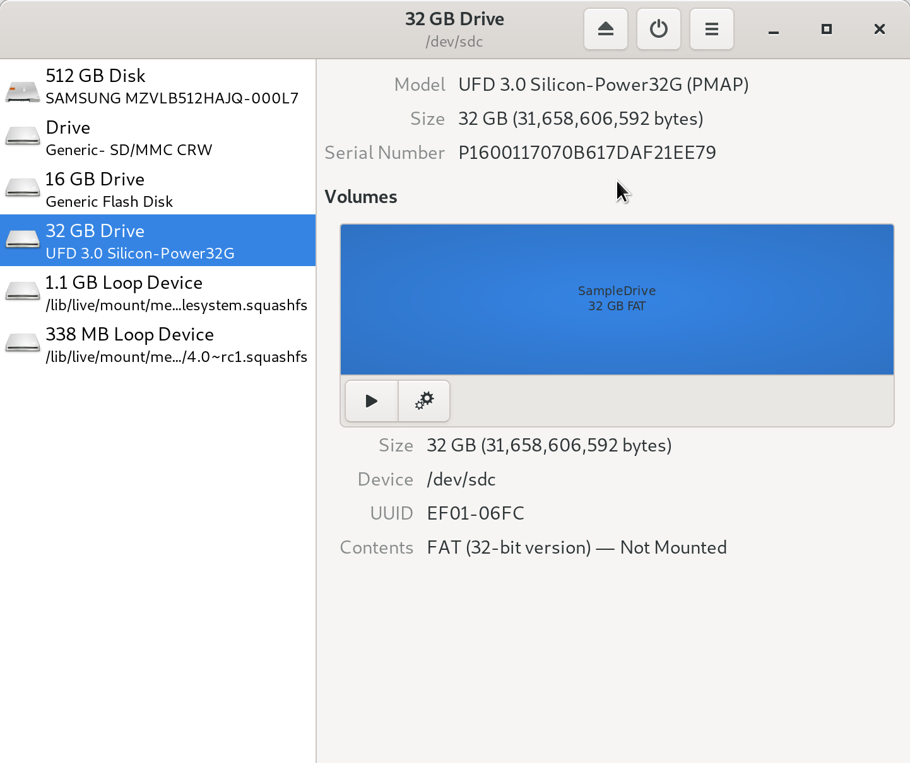
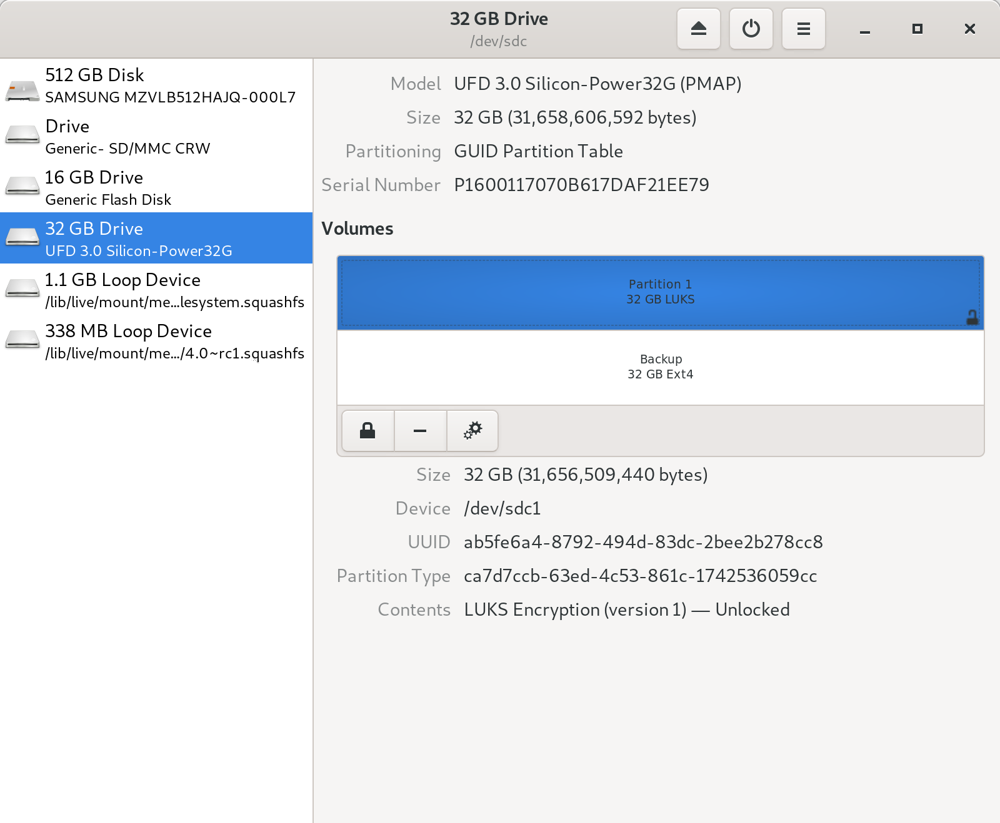

Backing Up and Restoring Workstations
=====================================

.. _backup_workstations:

Backup the Workstations
-----------------------

.. note::  This workflow will create a single USB drive with the data backed up
 from all Tails drives. If instead you'd like to create a single duplicate
 Tails drive, you should follow the official documentation
 `maintained by the Tails project <https://tails.boum.org/doc/first_steps/persistence/copy/index.en.html>`_.

Now that you have set up the *Secure Viewing Station*, the *Admin Workstation*,
and your *Journalist Workstations*, it is important you make a backup. Your USB
drive may wear out, a journalist might lose their drive, or something completely
unexpected may happen.

In all these cases, it is useful to have a backup of your data for each device.

What You Need
~~~~~~~~~~~~~

  #. You will need your *existing SecureDrop Tails USB sticks* (*Admin
     Workstation*, *Journalist Workstation*, and *Secure Viewing Station*).
  #. You will also need an *airgapped machine* to perform the backups. The
     *Secure Viewing Station* may be used for this task.
  #. You will also need a "primary" Tails USB, which we will use to perform
     the backups.
  #. You also need at least one USB drive to backup the data from your current
     SecureDrop Tails USB sticks.

.. warning:: An airgapped machine (such as the *Secure Viewing Station*) is
 required in order to perform these backups safely. By isolating
 the machine from all network access, you reduce the exposure of
 sensitive data to networked computers, thereby reducing the threat
 of compromise by adversaries who wish to gain access to your
 SecureDrop instance.

The airgapped machine should have 3 USB ports, so you can plug in the *primary
Tails USB* drive, the Tails drive you want to backup, and the *backup drive* at
the same time. If you don't have 3 USB ports available you can use a USB
hub which may reduce transfer speeds.

.. note:: The steps in this section should be performed for each *Secure Viewing
 Station*, *Journalist Workstation*, and *Admin Workstation* USB drive in
 your organization.

Preparing the Backup Device
~~~~~~~~~~~~~~~~~~~~~~~~~~~

First you must boot the *primary Tails USB* drive. Ensure you set an
administrator password set at the login screen. Then navigate to
**Applications** ▸ **Utilities** ▸ **Disks**.

|Applications Utilities Disks|

Insert the USB drive you wish to use as a backup drive.

Select the drive from the list of drives in the left column.

|Select the Disk|

Click the button with the two cogs and click **Format Partition...**.

|Click Cogs|

Fill out the form as follows:

|Format Backup Drive|

* **Erase**: `Don't overwrite existing data (Quick)`
* **Type**: `Internal disk for use with other Linux systems only (Ext4)`, and
             make sure `Password protect volume (LUKS)` is checked
* **Name**: `Backup`

|Backup Drive Passphrase|

.. warning:: Since this will serve as a long-term backup, **make sure to
 use a strong passphrase**.

Click **Format**.

A dialog box will appear asking you **Are you sure you want to format the
volume?** appears, click **Format**.

Once completed, you will see two partitions appear:

|Two Partitions Appear|

Now that you made the backup device, plug in the device you want to backup.
Then, browse to **Places** ▸ **Computer**:

|Browse to Places Computer|

Click on the disk on the left side column. Fill in the passphrase you set up
when you :ref:`created your Tails devices <set_up_tails>`.

|Fill in Passphrase|

You should now have both the Backup and TailsData partition to be backed up
mounted and ready to access.

Create the backup using Rsync
~~~~~~~~~~~~~~~~~~~~~~~~~~~~~

|Backup and TailsData Mounted|

Open a terminal by going to
**Applications** ▸ **Favorites** ▸ **Terminal**.

Next, create a directory on the Backup USB for the device to be backed up - the
command below creates a directory named ``admin-backup``:

.. code:: sh

  mkdir /media/amnesia/Backup/admin-backup

Then, copy the contents of the device's persistent volume to the directory using
``rsync``:

.. code:: sh

  sudo bash -c "rsync -a --info=progress2 --no-specials --no-devices \
      /media/amnesia/TailsData/ /media/amnesia/Backup/admin-backup/ && sync"

.. note:: Please make sure to include the trailing ``/`` in the directory
          paths in the command above, otherwise the files will not
          be backed up correctly.

Once complete, unmount the TailsData partition by clicking the Eject button
beside its entry in the lefthand column of the file manager. When its entry is
no longer shown in the lefthand column, it is save to remove the
*Admin Workstation* USB.

Repeat these steps for every device, making a new folder on the backup device
for each device you back up.

Finally, once you have completed the steps described in this section for each
USB drive, unmount the Backup partition by clicking its Eject button. Wait until
the Backup USB can be safely removed, and store it somewhere safely.

.. note:: After the Eject button is clicked, it may be take some time before
          the drive can be safely removed. Wait until its entry  is removed from
          the lefthand column of the file manager.

.. _restore_workstations:

Restoring a Workstation from a Backup
-------------------------------------

To recreate a backed-up *Admin Workstation*, *Journalist Workstation*, or
*Secure Viewing Station* Tails USB,  you will need

- your Backup USB containing the persistent volume to be restored,
- a blank USB stick to be set up as the new workstation USB,
- an airgapped machine and a USB with Tails already installed, referred to as
  the host Tails USB in this document. The host Tails USB is only used to
  transfer files between the Backup USB and the new workstation USB.

The process will require 3 USB ports - if necessary, you can use a USB hub. We
recommend labeling USB devices before use, as it can be easy to confuse them.

Prepare the new Tails USB
~~~~~~~~~~~~~~~~~~~~~~~~~

Follow the guide to :ref:`creating a Tails USB <set_up_tails>` to install
Tails and create a persistent volume on the blank USB stick to create the new
workstation USB.

Open the Backup USB and new Tails Persistent Volume
~~~~~~~~~~~~~~~~~~~~~~~~~~~~~~~~~~~~~~~~~~~~~~~~~~~

First, boot up the host Tails USB on the airgapped machine, making sure to set
an administration password on the Tails Greeter dialog.

Then, navigate to **Places** ▸ **Computer** to open the file manager, and insert
the Backup USB. Click its entry in the lefthand column and enter its decryption
passphrase when prompted. Its volume name (``Backup`` in the instructions above)
will appear in place of the generic ``N.M GB Encrypted`` name.

Next, insert the new workstation USB, and click its entry in the lefthand
column. When prompted, enter its persistent volume's passphrase. The volume
name ``TailsData`` will appear in the lefthand column.

Copy the Backup to the New Workstation USB's Persistent Volume
~~~~~~~~~~~~~~~~~~~~~~~~~~~~~~~~~~~~~~~~~~~~~~~~~~~~~~~~~~~~~~

Open a terminal by navigating to **Applications** ▸ **Favorites**
▸ **Terminal** . Next, use the ``rsync`` command to copy the appropriate backup
folder to the new workstation USB's persistent volume. For example, if the
backup folder to be copied is named ``admin-backup``, run the following command:

.. code:: sh

  sudo bash -c "rsync -a --info=progress2 --no-specials --no-devices \
      /media/amnesia/Backup/admin-backup/ /media/amnesia/TailsData/ && sync"

.. note:: Please make sure to include the trailing ``/`` in the directory
          paths in the command above, otherwise the backup files will not
          be restored correctly.

Once the command is complete, click the Eject button for the ``TailsData``
volume in the lefthand column of the file manager, wait for the ``TailsData``
entry to disappear from the column, and remove the new workstation USB.

You may now repeat the restore process for any other USBs that you wish to
restore, or shut down the host Tails USB and test your new workstation USB by
booting it with persistence unlocked and verifying its functionality.

.. |Browse to Places Computer| image:: images/upgrade_to_tails_3x/browse_to_places_computer.png

.. |Fill in Passphrase| image:: images/upgrade_to_tails_3x/fill_in_passphrase.png

.. |Start Nautilus| image:: images/screenshots/root_terminal_nautilus_cli.png
.. |Make Folders for All Drives| image:: images/upgrade_to_tails_3x/make_folders_for_all_drives.png
.. |Backup and TailsData Mounted| image:: images/upgrade_to_tails_3x/backup_and_tailsdata_mounted.png
.. |Applications Utilities Disks| image:: images/upgrade_to_tails_3x/navigate_to_applications.png

