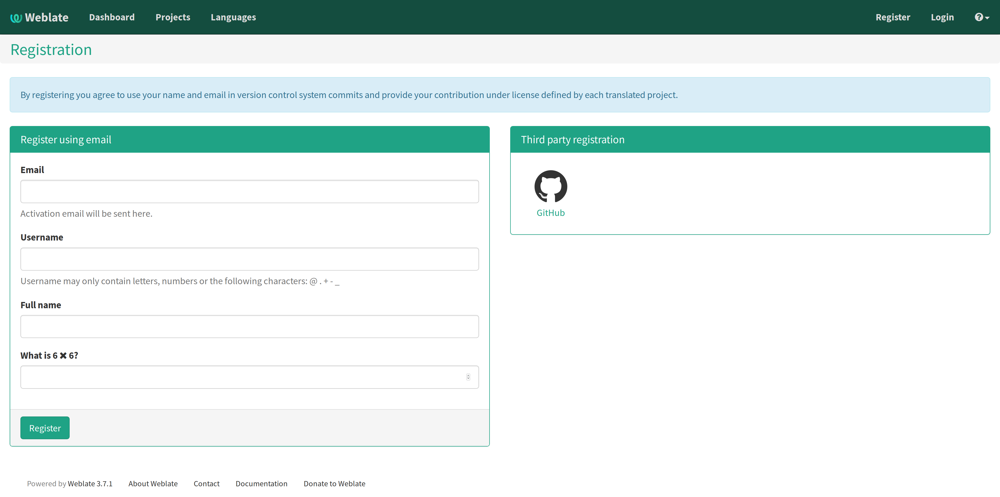
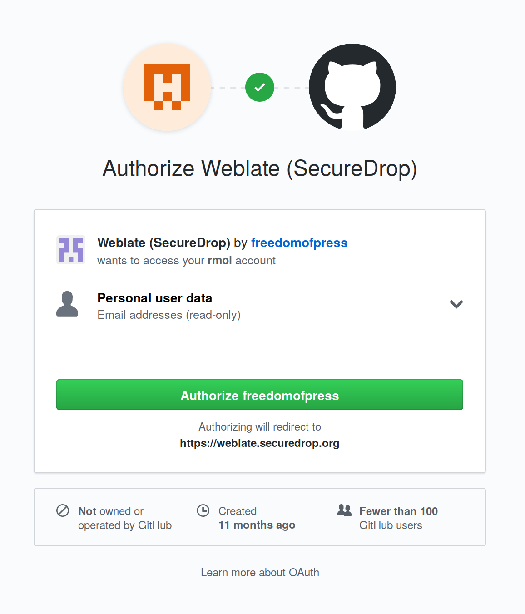
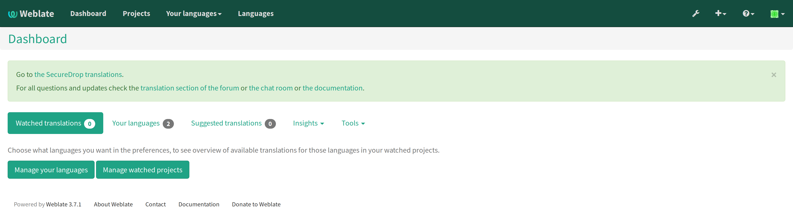
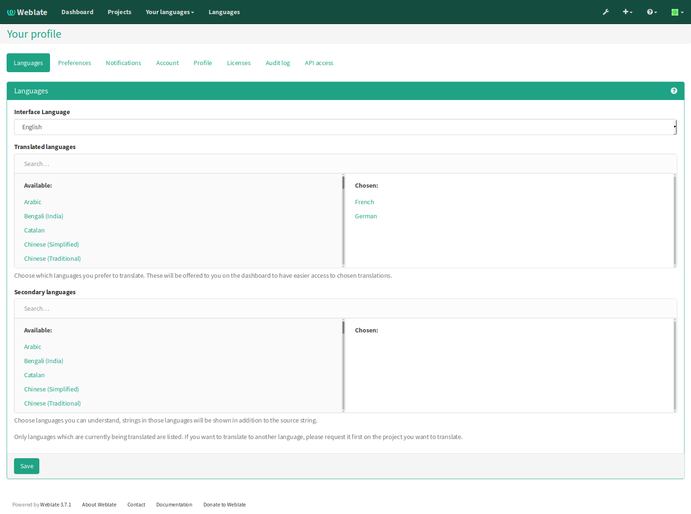
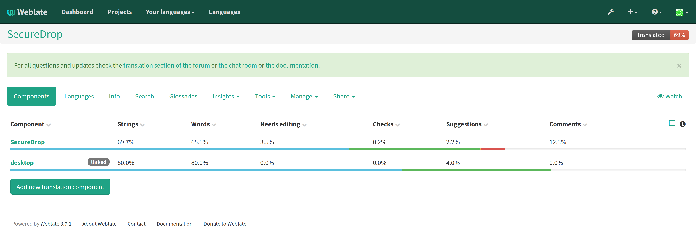
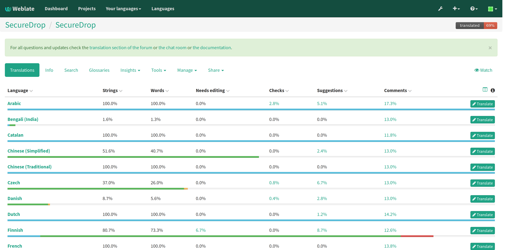
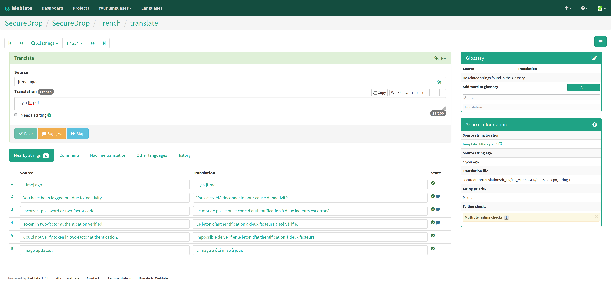
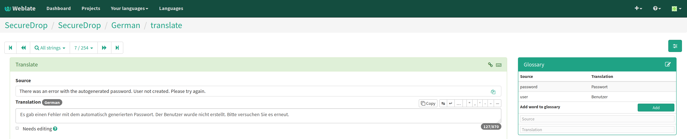
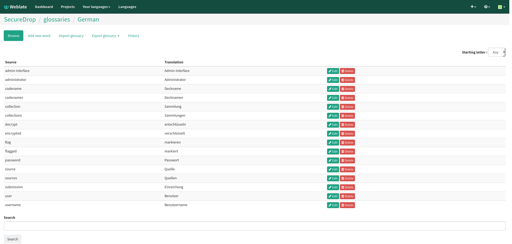
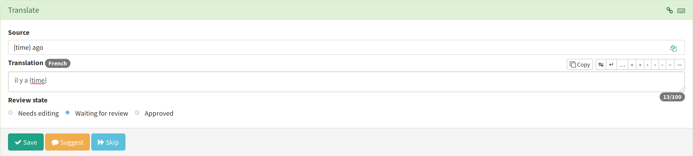

Translating SecureDrop
======================

Putting SecureDrop in context for translation
---------------------------------------------

What is SecureDrop?
^^^^^^^^^^^^^^^^^^^

SecureDrop is a system that lets people share sensitive information
with investigative journalists anonymously and securely. It's designed
to protect its users with strong cryptography and network
communications that hide locations and activity. For more information:

* Learn about :doc:`what makes SecureDrop unique <../what_makes_securedrop_unique>`..
* Watch `The Globe and Mail guide to using SecureDrop <https://www.youtube.com/watch?v=oSW2wMWtAMM>`_.
* Read the `Localization Lab "Ask Me Anything" on SecureDrop <https://www.localizationlab.org/blog/2018/4/20/4bp1j2olispup45z8o2mm5nb5snxm2>`_.


Who Uses SecureDrop?
^^^^^^^^^^^^^^^^^^^^

There are two kinds of SecureDrop users: :doc:`Sources <../source>`
and :doc:`Journalists <../journalist>`. A source is an individual who
wants to communicate securely and anonymously with a
journalist. Sources are not expected to have any technical
background. Journalists using SecureDrop have usually received proper
training and understand the basic workflow of SecureDrop.

How is SecureDrop translated?
^^^^^^^^^^^^^^^^^^^^^^^^^^^^^

SecureDrop is translated using the `Weblate`_ platform. Read on to
find out how to use Weblate.

Using Weblate
-------------

Registration
^^^^^^^^^^^^

The first step is registering an account on our Weblate server by
visiting the `Weblate registration page`_.

|Weblate registration page screenshot|

You can choose to register with your email address, or by linking a
GitHub account. If you already have a GitHub account to which you're
usually logged in, that can be easier, but it's not required.

Register with email
"""""""""""""""""""

If you want to just register with your email address, you'll use the
**Register using email** form on the left side of the registration
page.

Fill the form and click **Register**, then check your email for a
message from **weblate@securedrop.org** with the subject **[Weblate]
Your registration on Weblate**. That message will contain a
confirmation link. Clicking that link will complete your registration
and redirect you to the `Weblate dashboard`_.

Register with GitHub
""""""""""""""""""""

To register with your GitHub account, click on the GitHub icon on the
right, under **Third party registration**. This should take you to a
page on https://github.com asking you to authorize the SecureDrop
Weblate server to ask GitHub to authenticate you. (If you're not
already logged in to GitHub, you'll be asked to do that first.) The
authorization request looks like this:

|GitHub authorization page screenshot|

Click the green **Authorize freedomofpress** button, and you will be
redirected to the `Weblate dashboard`_.

Choosing your preferred languages
^^^^^^^^^^^^^^^^^^^^^^^^^^^^^^^^^

You can contribute to any language, but Weblate has some conveniences
to make it easier to work with your preferred languages. You can
manage those from the `Weblate dashboard`_:

|Weblate dashboard screenshot|

Click the **Manage your languages** button.

|Weblate manage languages screenshot|

In each selection box, simply click on the languages you would like to
translate. When you're done, click the **Save** button at the bottom
of the page.

The SecureDrop translation project
^^^^^^^^^^^^^^^^^^^^^^^^^^^^^^^^^^

Weblate supports multiple projects. Our instance only contains one,
SecureDrop, which has two translation components: the main SecureDrop
web application (labeled "SecureDrop"), and the translations for the
desktop icons of the admin and journalist workstations used by news
organizations (labeled "desktop").

On the dashboard you will find links to both sets of translations. You
can also drill down to them via the **Projects** menu in the top
navigation bar.

|Weblate project page screenshot|

If you click on a component, you'll arrive at the list of languages into which it's translated:

|Weblate translations screenshot|

To start translating a language, click the **Translate** button at the far right of its row.

Translating a phrase
^^^^^^^^^^^^^^^^^^^^

Each translatable string is shown in the text area labeled
**Source**. You can translate it right below in the **Translation**
text area. When you are done, click **Save** and the next untranslated
string will appear.

|Weblate translate screenshot|

On the right of the page you can find helpful information about the
source string. If the language glossary contains terms from the source
string, their suggested translations will appear in the **Glossary**
sidebar. In the **Source information** sidebar, you'll find contextual
information about the source string, like its location in our source
code. If a screenshot showing the string in context in the SecureDrop
user interface is available, that might be linked here as well.


Placeholders
------------

Source strings may contain placeholder text in curly braces, for
example ``{count}``. These represent variable content (like a
username, as in the example below), and must be left unmodified, but
they can be moved around in a string. For instance::

  Edit user {user}

might be displayed to the user as::

  Edit user Jean-Claude

The French translated string should look like::

  Modifier l'utilisateur {user}

And it would be **incorrect** to translate the placeholder like so::

  Modifier l'utilisateur {utilisateur}

HTML content
^^^^^^^^^^^^

Some source strings represent HTML that will be presented in the
SecureDrop web interface. It can be hard to tell what to translate,
since HTML is source code and changing the wrong thing can break the
page layout.

One thing you should always translate are ``alt`` attributes of image
elements. Image elements (````) in HTML place a picture on the
page. People with visual impairments rely on a special note on the
image element -- the ``alt`` attribute -- to describe the image, so
it's helpful to translate those. Here's an example that contains an
image with both an ``alt`` attribute *and* a placeholder::

  

As explained above, the placeholder ``{icon}`` in the ``src``
attribute of the ```` element should not be translated. The
``alt`` attribute text (``"shield icon"``) should be. The correctly
translated HTML in Portuguese would be::

  

Reviews
-------

Translated strings must be approved by a reviewer before being
accepted into SecureDrop. This is to make sure the source or
journalist will not be confused by an incorrect translation.

Anyone can contribute translations, just like anyone can edit
Wikipedia. However the right to review translations is only extended
to trusted translators. You can ask to become a reviewer for a
language by posting a message in the `translation category of the
SecureDrop forum`_.

A reviewer sees a **Review state** section below the source string,
including the ``Waiting for review`` and ``Approved`` radio buttons.
All source strings are initially set to ``Waiting for review``.

|Waiting for review screenshot|

When the translation is deemed correct, the reviewer should change it to
``Approved``.

|Approved screenshot|

Once a translation has been approved, only reviewers can modify
it. Translators can still suggest modifications or make comments if
they notice something wrong.

Glossaries
----------

Translating SecureDrop requires understanding some complicated
security terminology, involving cryptography, networking, and threat
models. If you are unfamiliar with terms you encounter in source
strings, consult one of the following glossaries, or ask in the
`translation category of the SecureDrop forum`_.

- The SecureDrop :doc:`glossary <../glossary>` explains terms specific
  to SecureDrop.
- The `EFF Surveillance Self-Defense glossary`_ explains many general
  security concepts.

Weblate Glossary
^^^^^^^^^^^^^^^^

Weblate also contains an internal glossary for each language, to which
we can add suggested translations. If a source string contains terms
from this glossary, the glossary entries will be displayed in a box on
the right side of the translation page.

|Weblate glossary sidebar screenshot|

If you find that a source string contains terms from the
:doc:`SecureDrop glossary <../glossary>` or the `EFF Surveillance
Self-Defense glossary`_, but the glossary sidebar says ``No related
strings found in the glossary.``, we'd really appreciate it if you
could add those terms to the glossary of the language you're working
with. Simply fill out the **Source** and **Translation** fields in the
sidebar under **Add new word to glossary**, then click the **Add**
button.

You can see the full glossary for a language by clicking the edit icon
at the top right of the glossary sidebar. The glossary page contains
all the terms that have been translated for the language:

|Weblate glossary list screenshot|

Getting Help
------------

Should you need help, you can do one of the following:

* Post a message in the `translation category of the SecureDrop forum`_
* Chat in the `SecureDrop instant messaging channel`_
* Read the `Weblate documentation`_

Collaboration Guidelines
------------------------

Adding new languages
^^^^^^^^^^^^^^^^^^^^

We love seeing SecureDrop translated into new languages. Just ask us
to add yours by posting in the `translation category of the SecureDrop
forum`_.

Suggesting changes to source strings
^^^^^^^^^^^^^^^^^^^^^^^^^^^^^^^^^^^^

If you notice errors in our source strings, or catch us using English
idioms that are hard to translate, please add comments letting us
know. At the beginning of every translation cycle in our release
schedule, we have a few days for incorporating your feedback, and very
much appreciate it.

Changing an existing translation
^^^^^^^^^^^^^^^^^^^^^^^^^^^^^^^^

If you think a translation can be improved, please don't run roughshod
over another translator's work. Make a suggestion or comment first, to
allow discussion before saving your changes.

Exceptions to this policy would be:

- Obvious errors in spelling, grammar, or punctuation.

- A string in our interface that is supposed to match another
  project. For example, we include instructions for adjusting Tor
  Browser settings, so if our wording is out of date, it has to be
  corrected to reduce confusion for people using SecureDrop.

In those cases, please feel free to correct the existing translation.

.. _`Weblate`: https://weblate.org/
.. _`SecureDrop Weblate instance`: https://weblate.securedrop.org/
.. _`Weblate registration page`: https://weblate.securedrop.org/accounts/register/
.. _`Weblate dashboard`: https://weblate.securedrop.org/
.. _`translation category of the SecureDrop forum`: https://forum.securedrop.org/c/translations
.. _`SecureDrop instant messaging channel`: https://gitter.im/freedomofpress/securedrop
.. _`Weblate documentation`: http://docs.weblate.org/
.. _`EFF Surveillance Self-Defense glossary`: https://ssd.eff.org/en/glossary/













