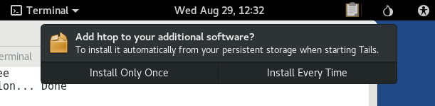

Install SecureDrop
==================

Install Prerequisites
---------------------

SecureDrop has dependencies that need to be loaded onto the *Admin Workstation*
before installing the servers. To install these dependencies, from the base of
the SecureDrop repository (``~/Persistent/securedrop/``) run the following
command:

.. code:: sh

    ./securedrop-admin setup

The package installation will take approximately 10 minutes or longer, depending
on network speed and computing power.

.. note:: On Tails 3.9 or later, the apt persistence feature will prompt
          to install the package automatically from persistent storage on
          each boot. These apt packages don't need to persist, click on
          `Install Only Once`:

          |Tails Apt Persistence|

.. note:: Occasionally this command times out due to network latency issues. You
          should be able to re-run the command and complete the setup. If you
          run into a problem, try removing the
          ``~/Persistent/securedrop/admin/.venv3/`` directory and running the
          command again.

.. important:: The setup command should only be run as the ``amnesia`` user,
               **not** as root. Contact the SecureDrop team if the package
               installation encounters repeated errors.

.. _configure_securedrop:

Localization of the *Source Interface* and *Journalist Interface*
-----------------------------------------------------------------

The *Source Interface* and *Journalist Interface* are translated in the following
languages:

.. include:: includes/l10n.txt

During the installation you will be given the opportunity to choose from a
list of supported languages to display using the codes shown in
parentheses.

.. note:: With a *Source Interface* displayed in French (for example), sources
          submitting documents are likely to expect a journalist fluent in
          French to be available to read the documents and follow up in that
          language.

Onion Service Options
---------------------
SecureDrop supports the use of tradtional (v2)  or next-generation (v3) onion
services for the *Source* and *Journalist Interfaces*, as well as the SSH proxy
services if they are configured. Either or both may be enabled, but we recommend
the use of v3 onion services for any new instances, as they offer greater
security.

For more information on v3 onion services, including upgrade options 
for existing instances, see 
:doc:`SecureDrop v3 onion services <v3_services>`.

Configure the Installation
--------------------------

Make sure you have the following information and files ready before
continuing:

-  the *Application Server* local IP address
-  the *Monitor Server* local IP address
-  the *Submission Public Key* (from the *Transfer Device*)
-  the *Submission Key* fingerprint
-  the email address that will receive alerts from OSSEC
-  the GPG public key and fingerprint for the email address that will
   receive the alerts
-  connection information for the SMTP relay that handles OSSEC alerts
   (see the :doc:`OSSEC Alerts Guide <ossec_alerts>`)
-  the username of a journalist who will be using SecureDrop (you
   can add more later)
-  the username of the system admin

Optionally, you can configure :doc:`daily email notifications <journalist>` of
submission activity for journalists. These help journalists avoid spending time
checking the *Journalist Interface* when there are no submissions. For this you
will need:

-  the journalist alerts GPG key
-  the journalist alerts GPG key fingerprint
-  the email address that will receive the journalist alerts

.. note:: It is not possible to specify multiple email addresses for email
          notifications. If there are multiple intended recipients, use an alias
          or mailing list. However, all subscribers must share the GPG private
          key, as it is not possible to specify multiple keys.

.. note:: The journalist notification is sent after the daily reboot
          of the *Application Server*.

Before proceeding, you will need to copy the following files to
``install_files/ansible-base``:

-  the *Submission Public Key* file
-  the admin's GPG public key file (for encrypting OSSEC alerts)

The *Submission Public Key* should be located on your *Transfer
Device* from earlier. Its exact path will depend on the location where the USB stick
is mounted. From the root of the SecureDrop repository, run: ::

    cp /media/[USB folder]/SecureDrop.asc install_files/ansible-base

where ``/media/[USB folder]/`` corresponds to the *Transfer Device*. (You can
also use the copy and paste capabilities of the file manager.)

Repeat this step for the Admin GPG key.

.. _ansible-site-specific:

Next, run the configuration playbook and answer the prompts with values that
match your environment: ::

    ./securedrop-admin sdconfig

The script will automatically validate the answers you provided and display
error messages if any problems are detected. The answers will be
written to the file ``install_files/ansible-base/group_vars/all/site-specific``.

When you're done, save the file and quit the editor.

.. _Install SecureDrop Servers:

Install SecureDrop Servers
--------------------------

Now you are ready to install! This process will configure
the servers and install SecureDrop and all of its dependencies on
the remote servers. ::

    ./securedrop-admin install

You will be prompted to enter the sudo passphrase for the *Application Server* and
*Monitor Server* (which should be the same).

The installation process will take some time. It will return you to the
terminal prompt when complete.

If any errors occur while running the install, carefully inspect the
error output. Considering saving any error messages for reference and
troubleshooting.

.. include:: includes/rerun-install-is-safe.txt

If needed, make edits to the file located at
``install_files/ansible-base/group_vars/all/site-specific`` as
described :ref:`above<ansible-site-specific>`. If you continue to have
issues, please submit a detailed issue notice on `GitHub
<https://github.com/freedomofpress/securedrop/issues/new>`__ or send
an email to securedrop@freedom.press.

.. note:: The SecureDrop install process configures a custom Linux
          kernel hardened with the grsecurity patch set. Only binary
          images are hosted in the apt repo. For source packages, see
          the `Source Offer`_.

.. _`Source Offer`: https://github.com/freedomofpress/securedrop/blob/develop/SOURCE_OFFER

Once the installation is complete, addresses and credentials for each 
onion service will be available in the following files under
``install_files/ansible-base``:

V2 onion services
^^^^^^^^^^^^^^^^^

- ``app-source-ths`` contains the ``.onion`` address of the *Source
  Interface*.
- ``app-journalist-aths`` contains the ``HidServAuth``
  configuration line for the *Journalist Interface*. During a later
  step, this will be automatically added to your Tor configuration
  file in order to exclusively limit connections to the hidden
  service.
- ``app-ssh-aths`` contains the ``HidServAuth`` for SSH access to the
  *Application Server*.
- ``mon-ssh-aths`` contains the ``HidServAuth`` for SSH access to the
  *Monitor Server*.

.. warning:: The ``app-journalist-aths``, ``app-ssh-aths``, and
             ``mon-ssh-aths`` files contain passwords for their corresponding
             authenticated onion services. They should not be shared with
             third parties or copied from the *Admin Workstation* for any
             reason other than well-defined administrative tasks such as
             onboarding new users or performing backups.

If v3 onion services are not enabled, the dynamic inventory file will 
automatically read the Onion URLs from the ``app-ssh-aths`` and ``mon-ssh-aths``
files and use them to connect to the servers over SSH during subsequent playbook
runs.

V3 onion services
^^^^^^^^^^^^^^^^^

- ``app-sourcev3-ths`` contains the v3 ``.onion`` address of the *Source
  Interface*.
- ``app-journalist.auth_private`` contains the ``onion`` address and private key
  providing access to the *Journalist Interface*.
- ``app-ssh.auth_private`` contains the ``onion`` address and private key
  providing SSH access to the *Application Server*.
- ``mon-ssh.auth_private`` contains the ``onion`` address and private key
  providing SSH access to the *Monitor Server*.
- ``tor_v3_keys.json`` contains the keypairs required for access to the
  *Journalist Interface* and SSH access to the servers - it is required for 
  future runs of ``./securedrop-admin install``.

.. warning:: The three ``.auth_private`` files and the ``tor_v3_keys.json`` file 
             contain secret keys that should not be shared with third parties,
             or copied from the *Admin Workstation* for any purpose other than
             tasks such as performing backups or onboarding new users.

The dynamic inventory file will automatically read the ``onion`` addresses from
the ``app-ssh.auth_private`` and ``mon-ssh.auth_private`` files and use them to
connect to the servers over SSH during subsequent playbook runs.

