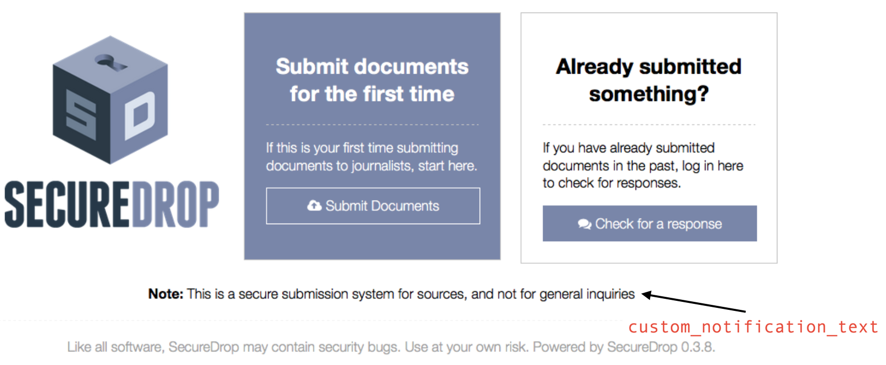

Install SecureDrop
==================

Install Ansible
---------------

SecureDrop uses the Ansible automation tool for installation and maintenance.

To install Ansible on the *Admin Workstation*, first update the ``apt``
package manager's package lists to make sure you get the latest and
greatest version of Ansible. This usually takes a few minutes over
Tor. Once that's done, you can install Ansible:

.. code:: sh

    sudo apt-get update
    sudo apt-get install ansible

.. _configure_securedrop:

Configure the Installation
--------------------------

Make sure you have the following information and files before
continuing:

-  The *Application Server* IP address
-  The *Monitor Server* IP address
-  The SecureDrop Submission Key (from the *Transfer
   Device*)
-  The SecureDrop Submission Key fingerprint
-  The email address that will receive alerts from OSSEC
-  The GPG public key and fingerprint for the email address that will
   receive the alerts
-  Connection information for the SMTP relay that handles OSSEC alerts.
   For more information, see the :doc:`OSSEC Alerts
   Guide <ossec_alerts>`.
-  The first username of a journalist who will be using SecureDrop (you
   can add more later)
-  The username of the system administrator
-  (Optional) An image to replace the SecureDrop logo on the *Source
   Interface* and *Journalist Interface*

   -  Recommended size: ``500px x 450px``
   -  Recommended format: PNG

From the base of the SecureDrop repo, change into the ``ansible-base``
directory: ::

    cd install_files/ansible-base

You will have to copy the following required files to
``install_files/ansible-base``:

-  SecureDrop Submission Key public key file
-  Admin GPG public key file (for encrypting OSSEC alerts)
-  (Optional) Custom header image file

The SecureDrop Submission Key should be located on your *Transfer
Device* from earlier. It will depend on the location where the USB stick
is mounted, but for example, if you are already in the ansible-base
directory, you can just run: ::

    cp /media/[USB folder]/SecureDrop.asc .

Or you may use the copy and paste capabilities of the file manager.
Repeat this step for the Admin GPG key and custom header image.

Now you must edit a couple configuration files. You can do so using
gedit, vim, or nano. Double-clicking will suffice to open them.

Edit the inventory file, ``inventory``, and update the default IP
addresses with the ones you chose for app and mon. When you're done,
save the file.

Run the configuration playbook and answer the prompts with values that
match your environment: ::

    ansible-playbook securedrop-configure.yml

The script will automatically validate the answers you provided, and display
error messages if any problems were detected. The answers you provided will be
written to the file ``group_vars/all/site-specific``, which you can edit
manually to provide further customization.

For example, you can have custom notification text be displayed on the
source interface. The source interface with a custom notification message is
shown here (the custom notification appears after the bolded "Note:"):

|Custom notification|

This custom notification can be configured by providing the desired message in
``custom_notification_text`` in ``group_vars/all/site-specific``. For example,
this can be used to notify potential sources that an instance is for
testing purposes only.

When you're done, save the file and quit the editor.

.. _Run the Ansible playbook:

Run the Ansible playbook
------------------------

Now you are ready to run the playbook! This will automatically configure
the servers and install SecureDrop and all of its dependencies.
``<username>`` below is the user you created during the Ubuntu
installation, and should be the same user you copied the SSH public keys
to. ::

    ansible-playbook -i inventory -u <username> -K --sudo securedrop-prod.yml

You will be prompted to enter the sudo password for the app and monitor
servers (which should be the same).

The Ansible playbook will run, installing SecureDrop plus configuring
and hardening the servers. This will take some time, and it will return
the terminal to you when it is complete. If an error occurs while
running the playbook, please submit a detailed `GitHub
issue <https://github.com/freedomofpress/securedrop/issues/new>`__ or
send an email to securedrop@freedom.press.

Once the installation is complete, the addresses for each Tor Hidden
Service will be available in the following files in
``install_files/ansible-base``:

-  ``app-source-ths``: This is the .onion address of the Source
   Interface
-  ``app-journalist-aths``: This is the ``HidServAuth`` configuration line
   for the Journalist Interface. During a later step, this will be
   automatically added to your Tor configuration file in order to
   exclusively connect to the hidden service.
-  ``app-ssh-aths``: Same as above, for SSH access to the Application
   Server.
-  ``mon-ssh-aths``: Same as above, for SSH access to the Monitor
   Server.

Update the inventory, replacing the IP addresses with the corresponding
onion addresses from ``app-ssh-aths`` and ``mon-ssh-aths``. This will
allow you to re-run the Ansible playbooks in the future, even though
part of SecureDrop's hardening restricts SSH to only being over the
specific authenticated Tor Hidden Services.

