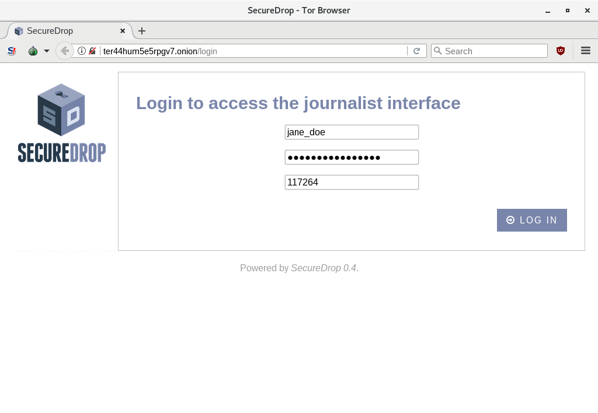
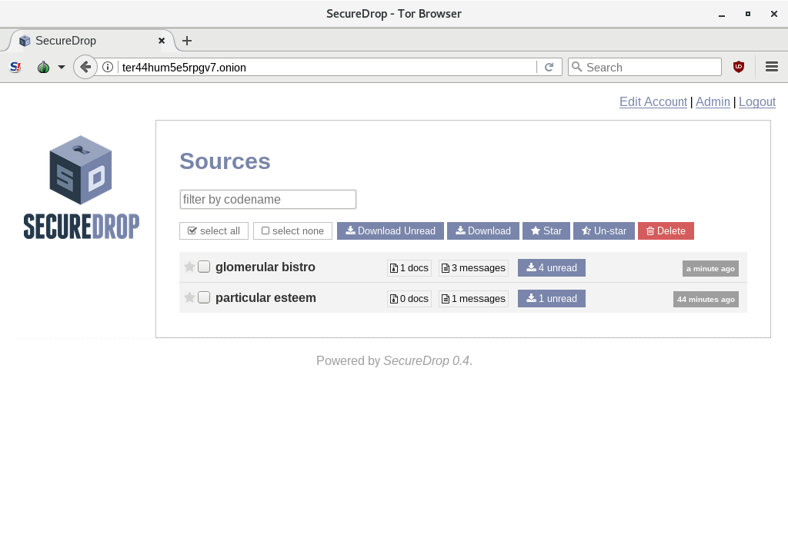
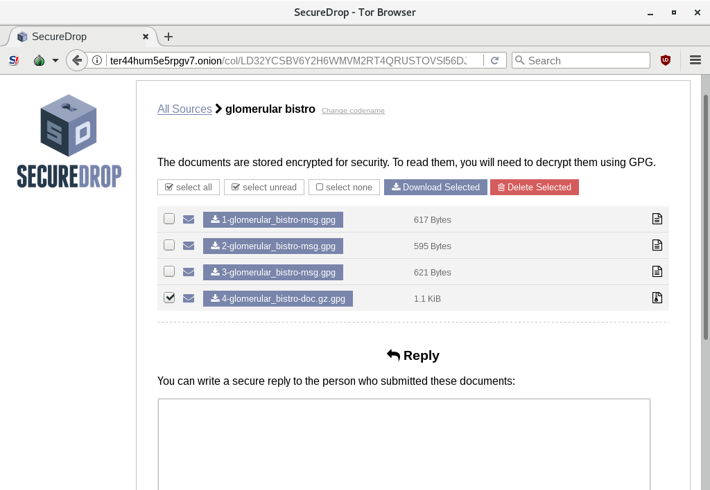
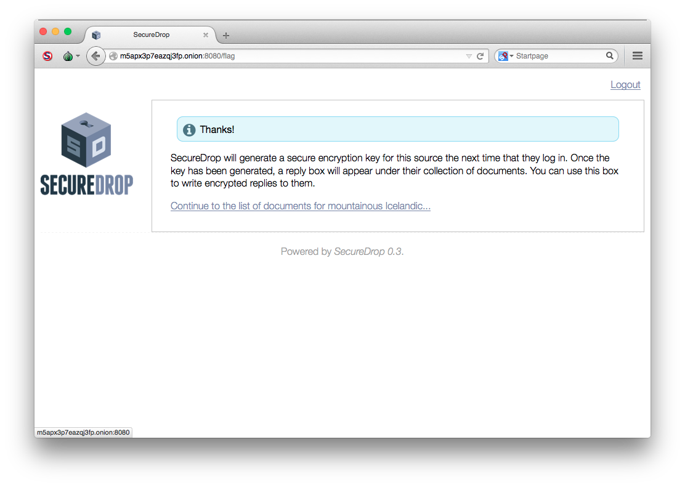

Journalist Guide
================

Journalists viewing documents on SecureDrop must connect to the
respective Source or Journalist Interface using the `Tails operating
system <https://tails.boum.org/>`__, which your administrator should
have already set up for you.

Workflow
--------

.. todo:: This whole document needs to be reworked, it's all over the
          place and does not flow from top to bottom.

Create GPG key for the journalist
---------------------------------

Each journalist must have a personal GPG key that they use for
encrypting files transferred from the Secure Viewing Station to their
Journalist Workstation. The private key, used for decryption, stays on
their Journalist Workstation. The public key, used for encryption, gets
copied to the Secure Viewing Station.

.. todo:: This document recommends transferring documents from the SVS
          to the Journalist Workstation, without any discussion of the
          potential risks or mitigations that should be taken when
          doing so. A section needs to be added on why doing this
          could be risky, and what can be done to make this situation
          better.

If a journalist does not yet have a GPG key, they can follow these
instructions to set one up with GnuPG (GPG).

-  `GNU/Linux <https://www.gnupg.org/gph/en/manual.html#AEN26>`__
-  `Windows <http://gpg4win.org/>`__
-  `Mac OS
   X <https://support.gpgtools.org/kb/how-to/first-steps-where-do-i-start-where-do-i-begin>`__

Connect to the Journalist Interface
---------------------------------

Each journalist has their own authenticated Tor hidden service URL to
login to the ``Journalist Interface``. The journalist needs to use the
browser in the Tails operating system to connect to the
``Journalist Interface``. This will take an extra few steps each time you
want to login, but after practicing a few times, it will become
automatic.

See our guide on setting up :doc:`Tails for the Admin and Journalist
Workstation <tails_guide>` before continuing. We recommend that you
create bookmarks for the Source and Journalist Interfaces.

After clicking on the SecureDrop ``Journalist Interface`` link, you can
log in with your username, password, and two-factor authentication
token, as shown in the first screenshot below.

|Journalist Interface Login|

If any sources have uploaded documents or sent you message, they will be
listed on the homepage by a codename. **Note: The codename the
journalists see is different than the codename that sources see.**

|Journalist Interface|

Move Documents to the Secure Viewing Station
--------------------------------------------

You will only be able to view the documents the source has sent you on
the ``Secure Viewing Station``. After clicking on an individual source
you will see the page below with the messages that source has sent you.
Click on a document or message name to save it, or select a number of
documents and save them at once by clicking "Download Selected".

| |Load external content|
| |Download selected|

In order to protect you from malware, the browser only allows you to
download documents to a special sandbox folder, located at
``/home/amnesia/Tor Browser``.

|Download to sandbox folder|

Once downloaded to the sandbox folder, move the document to the
designated USB stick you will use to transfer the documents from your
Tails ``Journalist Workstation`` to the ``Secure Viewing Station``. This
will be known as your ``Transfer Device``.

| |Move to transfer device 1|
| |Move to transfer device 2|

Eject your ``Transfer Device`` from your ``Journalist Workstation``.

Next, boot up the ``Secure Viewing Station`` using Tails (remember, you
must use a different Tails USB than you use your normal
``Journalist Workstation``) and enter the password for the
``Secure Viewing Station`` the persistent volume. Once you have logged
in, plug in the ``Transfer Device``.

**Copy these documents to the Persistent folder before decrypting them.
This an important step. Otherwise you might accidentally decrypt the
documents on the USB stick, and they could be recoverable in the
future.** You can do this by clicking on the ``Computer`` icon on your
desk top, clicking on the ``Transfer Device``, and then you can drag and
drop the file into your Persistent folder.

|Copy files to Persistent|

Make sure to then return to your ``Transfer Device`` folder, right click
on the file, and then click "Wipe" to securely wipe the file from your
device.

Decrypt and work on the Secure Viewing Station
----------------------------------------------

To decrypt documents, return to your Persistent folder and double-click
on zipped file folder. After you extract the files, click on each file
individually, and it will prompt you for the application PGP key
passphrase to decrypt the document.

|Decrypting|

When you decrypt the file it will have the same filename, but without
the .gpg at the end.

|Decrypted documents|

You can double-click on the decrypted document to open it in its default
application.

|Opened document|

If the default application doesn't work, you can right-click on the
document and choose ``Open with Other Application...`` to try opening
the document with OpenOffice Writer, or Document Viewer. You can
right-click on a file and choose ``Rename...`` to rename a document and
give it a file extension.

Interact With Sources
---------------------

Click on the codename to see the page specifically for that source. 
You will see all of the messages that they have written and documents 
that they have uploaded. If the name of a source is difficult to say 
or remember, you can rename a source using the button next to their 
current codename: 

|Cycle source codename|

Documents and messages are encrypted to the application's GPG public 
key. In order to read the messages or look at the documents you 
will need to transfer them to the ``Secure Viewing Station``.

But first, if you'd like to reply to the source, write your message 
in the text field and click ``Submit``.

|Sent reply|

Once your reply has been successfully submitted, you will be returned to
the source page and see a message confirming that the reply was stored.
The source will see your reply the next time they log in with their
unique codename. To minimize sensitive data retention, the source
interface UI encourages the source to delete the reply after reading it.
If you notice one or more replies disappear from the list of documents,
you may infer that the source read and deleted them. You may also delete
replies if you change your mind after sending them.

Flag for reply
~~~~~~~~~~~~~~

If the server experiences a large number of new sources signing up at
once and is overloaded with submissions, you will need to flag sources
for reply before you can communicate with them. Click the
``Flag this source for reply`` button.

|Read documents|

After clicking the ``Flag this source for reply`` button, you'll see
this confirmation page. Click through to get back to the page that
displays that source's documents and replies.

|Flag source for reply|

You will not be able to reply until after the source logs in again and
sees that you would like to talk to him or her. So you may have to sit
and wait. After the source sees that you'd like to reply, a GPG key pair
will automatically be generated and you can log back in and send a
reply.

Work with Documents
-------------------

As long as you're using the latest version of Tails, you should be able
to open any document that gets submitted to you without the risk of
malicious documents compromising the ``Secure Viewing Station``.
However, if they do compromise it, Tails is designed so that the next
time you reboot the malware will be gone.

Tails comes with lots of applications that will help you securely work
with documents, including `The Tor Browser Bundle <https://www.torproject.org/>`__
, an office suite, graphics tools, desktop publishing tools, audio 
tools, and printing and scanning tools. Journalists should take care 
to research submissions using the Tor Browser, ideally in a new 
Tails session for highly sensitive submissions. For more information, 
visit `Work on sensitive 
documents <https://tails.boum.org/doc/sensitive_documents/index.en.html>`__
on the Tails website.

Tails also comes with the `Metadata Anonymisation
Toolkit <https://mat.boum.org/>`__ (MAT) that is used to help strip
metadata from a variety of types of files, including png, jpg,
OpenOffice/LibreOffice documents, Microsoft Office documents, pdf, tar,
tar.bz2, tar.gz, zip, mp3, mp2, mp1, mpa, ogg, and flac. You can open
MAT by clicking ``Applications`` in the top left corner, Accessories,
Metadata Anonymisation Toolkit.

We recommend that you do as much work as you can inside of Tails before
copying these documents back to your ``Journalist Workstation``,
including stripping metadata with MAT.

When you no longer need documents you can right-click on them and choose
Wipe to delete them.

|Wiping documents|

Encrypt and move documents to Journalist Workstation
----------------------------------------------------

Before you move documents back to the ``Transfer Device`` to copy them
to your workstation you should encrypt them to your personal GPG public
key that you imported when setting up the ``Secure Viewing Station`` to
begin with.

Right-click on the document you want to encrypt and choose
``Encrypt...``

|Encrypting 1|

Then choose the public keys of the journalist you want to encrypt the
documents to and click ``OK``.

|Encrypting 2|

When you are done you will have another document with the same filename
but ending in .gpg that is encrypted to the GPG keys you selected. You
can copy the encrypted documents to the ``Transfer Device`` to transfer
them to your workstation.

|Encrypted document|

Decrypt and prepare to publish
------------------------------

Plug the ``Transfer Device`` into your workstation computer and copy the
encrypted documents to it. Decrypt them with ``gnupg``.

Write articles and blog posts, edit video and audio, and publish. Expose
crimes and corruption, and change the world.

.. |Download selected| image:: images/manual/tbb_Document5.png
.. |Download to sandbox folder| image:: images/manual/tbb_Document6.png
.. |Move to transfer device 1| image:: images/manual/tbb_Document7.png
.. |Move to transfer device 2| image:: images/manual/tbb_Document8.png
.. |Copy files to Persistent| image:: images/manual/viewing1.png
.. |Decrypting| image:: images/manual/viewing2.png
.. |Decrypted documents| image:: images/manual/viewing3.png
.. |Opened document| image:: images/manual/viewing4.png
.. |Cycle source codename| image:: images/manual/change-codename.png
.. |Sent reply| image:: images/manual/document2.png

.. |Wiping documents| image:: images/manual/viewing5.png
.. |Encrypting 1| image:: images/manual/viewing6.png
.. |Encrypting 2| image:: images/manual/viewing7.png
.. |Encrypted document| image:: images/manual/viewing8.png
