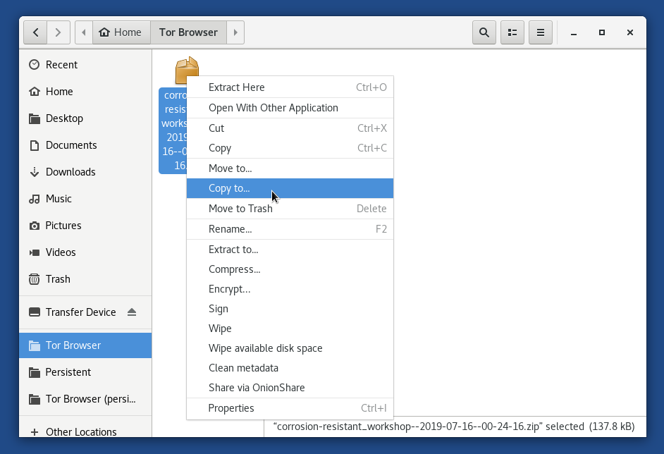
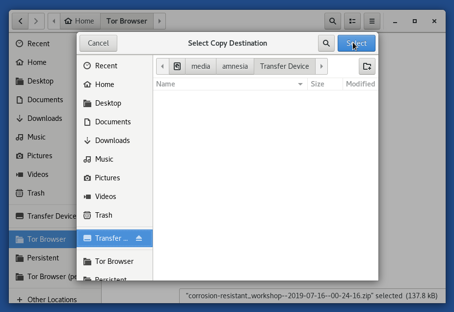
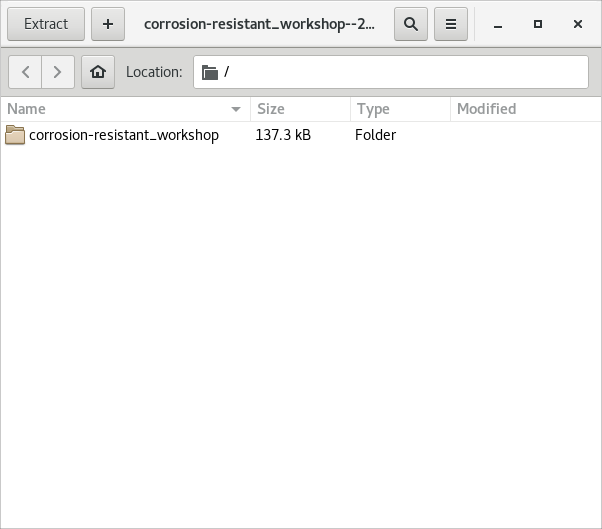
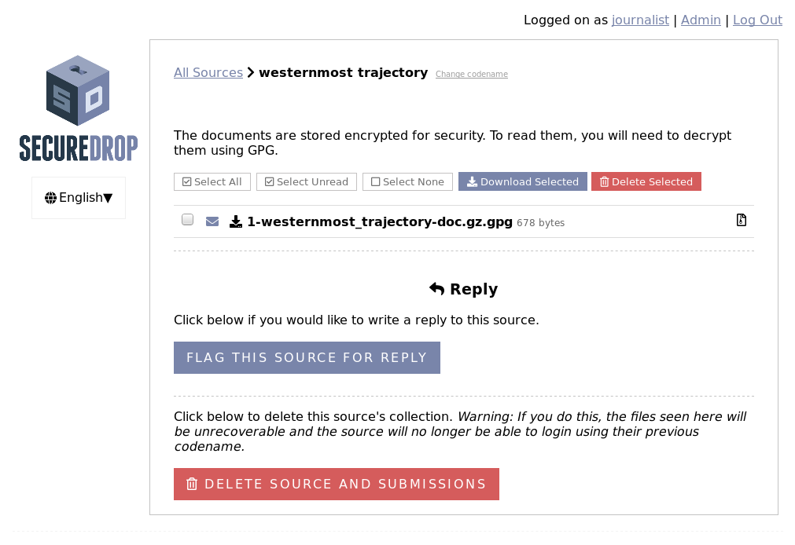

Journalist Guide
================

.. include:: ./includes/provide-feedback.txt

This guide presents an overview of the SecureDrop system for a
journalist. It covers the core functions necessary to start working
with the platform: logging in securely, viewing documents, editing
documents, and interacting with sources.

Updating Your Workstation
-------------------------

You should keep your SecureDrop workstations updated with:

* **Tails updates**
* **SecureDrop workstation updates**

You should apply Tails updates to your Tails drive as they are released, as they
often contain critical security fixes. The *Journalist Workstation* Tails drive, once booted and
connected to Tor, will alert you if upgrades are available. For most Tails
upgrades, you can simply follow the steps in the Tails Upgrader that appears on
screen to update your Tails drive. However, sometimes Tails upgrades are "manual"
which means that you should follow the instructions in
`Tails Upgrade Documentation`_ to upgrade the drives. Talk to your SecureDrop
administrator if you have trouble.

.. include:: includes/update-gui.txt

.. _`Tails
   Upgrade Documentation`: https://tails.boum.org/doc/first_steps/upgrade/index.en.html

Creating a GPG Key
------------------
We recommend creating a personal GPG key for encrypting files before moving
them from the *Secure Viewing Station* to your everyday workstation. A GPG key
has two parts: a *public key* and a *private key*. The private key, used for
decryption, stays on your everyday workstation. The public key, used for
encryption, is copied to the *Secure Viewing Station*.

If you do not yet have a GPG key, follow the instructions for your
operating system to set one up:

- `Windows <https://ssd.eff.org/en/module/how-use-pgp-windows>`__
- `Mac OS <https://ssd.eff.org/en/module/how-use-pgp-mac-os-x>`__
- `GNU/Linux <https://ssd.eff.org/en/module/how-use-pgp-linux>`__

Connecting to the *Journalist Interface*
----------------------------------------
Journalists viewing documents on SecureDrop must connect to the
*Journalist Interface* using the `Tails operating system
<https://tails.boum.org/>`__ on a USB drive. As part of your on-boarding, your
admin should have provided you with a Tails drive configured for this purpose,
known as the *Journalist Workstation* USB drive.

If you do not have a USB drive clearly identified as the *Journalist
Workstation*, ask your administrator for assistance before continuing.

.. note:: The Tails OS makes using SecureDrop very different from
          other computing experiences. The added layers of security
          mean extra steps each time you want to login. With practice,
          you will become increasingly comfortable with the process.

To use the *Journalist Interface*, you will visit a Tor Onion Service address
in the Tor Browser. By design, this Onion Service address is only accessible
from your *Journalist Workstation*; it will not work in Tor Browser on another
computer, unless explicitly configured with an access token.

To visit the *Journalist Interface*, click the *Journalist Interface* icon on the
desktop. This will open Tor Browser to an ".onion" address. Log in with
your username, passphrase, and two-factor authentication token, as
shown in the first screenshot below. (If you have been provided with a YubiKey,
see :doc:`Using YubiKey with the Journalist Interface <yubikey_setup>` for
detailed setup and usage information.)

|Journalist Interface Login|

Reset Passphrase or Two-factor Authentication Token
~~~~~~~~~~~~~~~~~~~~~~~~~~~~~~~~~~~~~~~~~~~~~~~~~~~
If necessary, journalists may reset their user passphrase or two-factor
authentication token in their user profile. To navigate to your user profile,
log in to the *Journalist Interface* and click on the link in the upper right of
the screen where it says **Logged on as <your user name>.**

If you have lost or forgotten your passphrase or two-factor authentication
device, you will need to contact your SecureDrop admin for assistance.

|Journalist account profile|

.. _daily_journalist_alerts:

Daily Journalist Alerts About Submissions
-----------------------------------------

When a SecureDrop has little activity and receives only a few
submissions every other week, checking the *Journalist Interface*
daily only to find there is nothing is a burden. It is more convenient
for journalists to be notified daily via encrypted email about whether
or not there has been submission activity in the past 24 hours.

If the email shows submissions were received, the journalist can
connect to the *Journalist Interface* to get them.

This is an optional feature that must be activated :doc:`by the
administrator <admin>`. In the simplest case a journalist provides
their email and GPG public key to the admin. If a team of journalist
wants to receive these daily alerts, they should share a GPG key and
ask the admin to setup a mail alias (SecureDrop does not provide that
service) so they all receive the alerts and are able to decrypt them.

Interacting With Sources
------------------------

If any sources have uploaded documents or sent messages, they will be
listed on the homepage by codename.

|Journalist Interface|

.. note:: Codenames that journalists see are different than the
          codenames visible to sources.

Click on a codename to see the dedicated page for that source. You
will see all of the messages that they have written and documents that
they have uploaded. If the name of a source is difficult to say or
remember, you can rename a source using the **Change codename** button
next to their current codename.

|Cycle source codename|

.. tip:: You can also **Star** interesting or promising sources to
         easily return to them later. All starred sources will be bumped to the
         top of the list of sources.

If you want to reply to the source, write your message in the text
field and click **Submit**.

|Sent reply|

Once your reply has been successfully submitted, you will be returned
to the source page and see a message confirming that the reply was
stored. The source will see your reply the next time they log in with
their unique codename.

To minimize the impact of a source codename being compromised, the *Source
Interface* encourages the source to delete the reply after reading it. Once a
source has read your reply and deleted it from their inbox, a checkmark will
appear next to the reply in the interface.

.. note:: Prior to SecureDrop 0.9.0, replies when deleted from the source inbox
  would also disappear from the journalist inbox. As such, if there are older
  conversations, there may be discontinuities in the conversation.

You may also delete replies if you change your mind after sending them.

Documents and messages are encrypted to the SecureDrop installation's
*Submission Public Key*. In order to read the messages or look at the documents
you will need to transfer them to the *Secure Viewing Station*, which holds
the *Submission Private Key*. To recall the conversation history between your
organization and sources, you can also download replies and transfer them to the
*Secure Viewing Station* for decryption.

Flag for Reply
~~~~~~~~~~~~~~

If the server experiences a large number of new sources signing up at
once and is overloaded with submissions, you will need to flag sources
for reply before you can communicate with them. Click the **Flag this
source for reply** button.

|Flag for reply button|

After clicking the **Flag this source for reply** button, you will see
this confirmation page. Click through to get back to the page that
displays that source's documents and replies.

|Flag for reply notification|

You will not be able to reply until after the source logs in again and
sees that you would like to talk to them. So you may have to sit and wait. After
the source sees that you'd like to reply, a GPG key pair will automatically be
generated and you can log back in and send a reply.

Moving Documents to the *Secure Viewing Station*
------------------------------------------------

Step 1: Download the encrypted submission
~~~~~~~~~~~~~~~~~~~~~~~~~~~~~~~~~~~~~~~~~~

Documents and messages sent by sources can only be decrypted and viewed on the
*Secure Viewing Station*. After clicking on an individual source, you will see the
page below with any documents or messages the source has sent you. Documents
always end with ``-doc.gz.gpg``, while messages always end with ``-msg.gpg``.

Click on a document or message name to save it, or select a number of documents
and save them all at once by clicking **Download Selected**.

|Load external content|

A dialog box with two choices will appear, **Cancel** and **Save file**:

|Download selected|

Click **Save file**. In the save dialog, select one
of the two folders highlighted in red in the screenshot below:

|Download to sandbox folder|

The difference between these two folders is as follows:

- **Tor Browser**. Downloads saved to this folder will be stored in memory,
  which means that they will only be available for the duration of your current
  Tails session. In the screenshot, this is the currently selected folder.
  The full path to this folder is ``/home/amnesia/Tor Browser``.

- **Tor Browser (persistent)**: Note that the name may be abbreviated, as shown
  in the screenshot; you can view the full name by hovering the mouse over the
  shortcut. Downloads saved to this folder will be stored
  on your Tails USB drive in the special persistent volume that is only
  available if you have unlocked it on the Tails welcome screen. The full path
  to this folder is ``/home/amnesia/Persistent/Tor Browser``.

Unless you have a reason to store encrypted submissions on the
*Journalist Workstation*, we recommend using the non-persistent "Tor Browser"
folder. In the recommended process, you will now move the submission to the
*Secure Viewing Station*, and there is no need to leave a persistent copy
behind.

.. important:: Attempting to download files to any other folder will fail.
  Tails only permits Tor Browser to access these two folders, so that
  even if your browser is compromised by malware, attackers cannot easily gain
  access to other data stored on the same computer.

  See the Tails guide to `Browsing the web with Tor Browser <https://tails.boum.org/doc/anonymous_internet/Tor_Browser/index.en.html>`__
  for more information.

Step 2: Copy the encrypted submission to the *Transfer Device*
~~~~~~~~~~~~~~~~~~~~~~~~~~~~~~~~~~~~~~~~~~~~~~~~~~~~~~~~~~~~~~

Once downloaded to either folder, move the document to the designated
USB stick you intend to use to transfer the documents from your
*Journalist Workstation* to the *Secure Viewing Station*. This storage
device is known as your *Transfer Device*.

You can right-click the file and select **Copy to**, then select the *Transfer
Device*, as shown in the screenshots below.

|Copy to transfer device 1|

|Copy to transfer device 2|

This will leave a redundant copy behind in the Tor Browser folder. If you have
downloaded the file to the non-persistent "Tor Browser" folder (as recommended),
the redundant copy will disappear when the computer is shut down or rebooted.

"Eject" the *Transfer Device* by clicking the eject icon next to its name in
the file manager. Wait for this operation to complete (the eject icon will
disappear), then unplug the *Transfer Device*. "Ejecting" the drive in this manner
ensures that all write operations are completed before you physically unplug it.

Step 3: Decrypt and view the submission on the *Secure Viewing Station*
~~~~~~~~~~~~~~~~~~~~~~~~~~~~~~~~~~~~~~~~~~~~~~~~~~~~~~~~~~~~~~~~~~~~~~~

Next, boot up the *Secure Viewing Station* using Tails and enter the
passphrase for the *Secure Viewing Station* persistent volume. Once you
have logged in, plug in the *Transfer Device*.

.. note:: The *Secure Viewing Station* and *Journalist Workstation*
          are on separate Tails USB drives.

Click on the **Home** icon on your desktop, then on the *Transfer
Device*. Copy the file into your **Persistent** folder. You can do so by opening
a new window with the **Persistent** folder and dragging the file from one
window to another. A faster method is to drag the file to the **Persistent**
shortcut, as in the screenshot below:

|Copy files to persistent|

.. important::

   Always copy submissions to the **Persistent** folder *before* decrypting
   them. Otherwise you might accidentally decrypt them on the USB stick, and
   they could be recoverable in the future.

After successfully copying them to the *Secure Viewing Station*, erase the files
from your *Transfer Device*. Ensure you're viewing the *Transfer Device* folder,
then right click on the files that need removal and click "Wipe" to securely
delete the files from your device:

|Wiping documents|

To decrypt and view documents or messages, return to your **Persistent** folder.
All key actions are initiated by double-clicking:

- Double-clicking archives in ZIP or gzip format will open the "File Roller"
  application, which allows you to extract the contents.

- Double-clicking files that end in ``.gpg`` will attempt to decrypt the contents
  to the same directory. If you have configured a passphrase for your
  *Submission Key*, you will be prompted for it.

- Double-clicking decrypted messages or documents will attempt to open them in a
  default application suitable for the file type.

If the default application does not work, you can right-click on the
document and choose **Open with Other Application...** to try opening
the document with LibreOffice Writer, Document Viewer, or another application.
You might also need to right-click on a file and choose **Rename...** to rename
a document with an incorrect or missing file extension.

.. tip::

   Always extract gzip archives with the "File Roller" application, which is
   the default when double-clicking the archive. Other methods may not preserve
   the filename contained in the archive.

   For example, an archive called ``1-artful_elevation-doc.gz`` might contain a
   file ``secrets.docx``, but if you extract the contents by right-clicking the
   archive and selecting **Extract here**, the extracted file will be called
   ``1-artful_elevation-doc`` instead of ``secrets.docx``. This may result in
   problems when attempting to open the file due to the loss of its file
   extension.

When you double-click an archive to open it, you should see it in the "File
Roller" application. It looks like this:

|Opened archive|

Click the **Extract** button to unpack the archive. Navigate to the folder
containing the encrypted document message or document (ends with ``.gpg``)
and double-click it to decrypt it. The decrypted file it will have the same
filename, but without ``.gpg`` at the end.

|Decrypted documents|

You can now double-click on the decrypted file to open it in its
default application.

|Opened document|

Working with Documents
----------------------

This section describes how to organize submissions, handle unusual file formats,
safely research submissions, remove metadata, and mitigate risks from
submitted malware.

.. tip::

   This is only a very limited introduction. Freedom of the Press Foundation
   publishes and maintains `digital security guides for journalists <https://freedom.press/training/>`__,
   many of which relate to these topics, and offers `digital security training <https://freedom.press/training/request-training/>`__
   for news organization staff.

Organizing submissions
~~~~~~~~~~~~~~~~~~~~~~

Whenever you download submissions using one of the **Download** buttons in the
*Journalist Interface*, they will be organized as a ZIP archive with a built-in
folder structure, which you can use as a template for organizing submissions on
the *Secure Viewing Station*.

Submissions downloaded in this manner from the *list of all sources* will
contain a structure like the following:

.. code:: sh

    all
    ├── recessive accreditation
    │   ├── 1_2019-07-07
    │   │   └── 1-recessive_accreditation-msg.gpg
    │   └── 2_2019-07-07
    │       └── 2-recessive_accreditation-msg.gpg
    └── surviving authentication
        ├── 1_2019-07-07
        │   └── 1-surviving_authentication-doc.gz.gpg
        └── 2_2019-07-07
            └── 2-surviving_authentication-msg.gpg

Submissions downloaded in this manner from the screen for an *individual source*
will contain a similar structure, but without the parent folder ``all``.

A folder like ``1_2019-07-07`` in the example above will always contain exactly
one message or document. The numbers in the folder name (1, 2, etc.) correspond
to the numbering in the *Journalist Interface*. The dates (2019-07-07 in the
example above) are the day (in year/month/day format) of the last activity
related to this source, at the time the archive was downloaded.

If you download messages or documents one at a time in the *Journalist
Interface*, they will not be contained in a ZIP file at all. Instead, you will
be dealing with individual files like ``1-surviving_authentication-doc.gz.gpg``,
without a folder structure.

Handling File Formats
~~~~~~~~~~~~~~~~~~~~~

SecureDrop accepts submissions of any file type. Tails comes with
`pre-installed applications <https://tails.boum.org/doc/about/features/index.en.html>`__
for securely working with documents, including an office suite, graphics
tools, desktop publishing tools, audio tools, and printing and scanning tools.

For more information, visit the Tails guide to `working with sensitive documents`_.

Pre-Encrypted Submissions
~~~~~~~~~~~~~~~~~~~~~~~~~

SecureDrop sources can optionally encrypt prior to submitting to SecureDrop.
This means that once you decrypt the document as you usually do by double
clicking the document in the file manager, there will be another layer of
encryption.

Most often, the file will be encrypted to the SecureDrop key. If the file is
encrypted to your SecureDrop key, you should be able to double click the file as
usual once more in the SVS and it should decrypt.

However, it's also possible the file is encrypted to another key, potentially
your personal key. If this occurs, you will get an error message in Tails that
reads "Decryption failed. You probably do not have the decryption key".
To determine which key was used, if you are comfortable at the command line, you
can open the ``Terminal``, navigate to the file, and use:

.. code:: sh

  gpg --decrypt NAME_OF_FILE

replacing ``NAME_OF_FILE`` with the name of the file you wish to decrypt. This
command will tell you what key was used to encrypt the file. If you are not
comfortable at the command line, contact your SecureDrop admin or
Freedom of the Press Foundation for assistance.

.. warning:: **Do not** transfer source material off the *Secure Viewing Station*
             for decryption. Instead, transfer cryptographic keys *to* the SVS
             device for decryption and metadata removal.

Researching Submissions
~~~~~~~~~~~~~~~~~~~~~~~

Journalists should take care to research submissions using the Tor
Browser, ideally in a new Tails session on your *Journalist Workstation* for
highly sensitive submissions.

Removing Metadata
~~~~~~~~~~~~~~~~~

.. tip:: For detailed information about removing metadata from documents, check out
         this in-depth `guide to removing metadata`_.

Tails comes with the `Metadata Anonymisation Toolkit`_ (MAT) that
is used to help strip metadata from a variety of types of files,
including png, jpg, OpenOffice/LibreOffice documents, Microsoft Office
documents, pdf, tar, tar.bz2, tar.gz, zip, mp3, mp2, mp1, mpa, ogg,
and flac. You can open MAT by clicking **Applications** ▸ **System Tools** ▸
**MAT**.

We recommend always doing as much work as possible inside of Tails
before copying documents back to your *Journalist Workstation*. This
includes stripping metadata with MAT.

.. warning:: MAT is no longer actively maintained and **will not**
             strip all metadata, even when the output claims the
             document is clean. Some metadata are likely to persist:
             you must **never** assume MAT has removed all metadata.

When you no longer need documents, you can right-click on them and
choose **Wipe** to delete them.

|Wiping documents|

.. _`guide to removing metadata`: https://freedom.press/training/everything-you-wanted-know-about-media-metadata-were-afraid-ask/

Risks From Malware
~~~~~~~~~~~~~~~~~~

As long as you are using the latest version of Tails, you should be
able to open submitted documents with a low risk of malicious
files compromising the *Secure Viewing Station*. However, even if a
compromise does occur, Tails is designed so that the next time you
reboot, the malware will be gone.

It is crucial, however, that you have a strategy for dealing with malware before
you move documents off the *Secure Viewing Station* in electronic form.
SecureDrop does not scan for or automatically remove malware. If you copy an
original file you received via SecureDrop to your everyday workstation, and that
file contains malware, you may still end up running the malware on your everyday
workstation.

For this reason, we recommend taking additional precautions. Printing a file
is often safer than exchanging it electronically, and it has the additional
benefits of removing embedded metadata (except for printer codes, watermarks,
or similar identifiers that may not be visible to the naked eye).

Alternatively, you can use the tools provided within Tails to examine
documents, or convert files from one format to another (e.g., export a Word
document as PDF). Fully mitigating the risks of malware is beyond the scope
of this documentation.

`Never scan QR codes`_ from the *Secure Viewing Station* using a network
connected device. These QR codes can contain links that your connected device
will automatically visit. In general, you should take care when opening any
links provided in a SecureDrop submission, as this can leak information to third
parties. If you are unsure if a link is safe to click, you should consult your
digital security staff or Freedom of the Press Foundation for assistance.

.. _`Never scan QR codes`: https://securedrop.org/news/security-advisory-do-not-scan-qr-codes-submitted-through-securedrop-connected-devices
.. _`working with sensitive documents`: https://tails.boum.org/doc/sensitive_documents/index.en.html
.. _`Metadata Anonymisation Toolkit`: https://mat.boum.org/

Risks From Photography
~~~~~~~~~~~~~~~~~~~~~~

It may be tempting to use your smartphone to photograph a submission, in order
to share it with another journalist for quick review. Please note that many
smartphones are configured to back up photographs to cloud services, immediately
or intermittently. Not all backup settings may be visible to you.

Moreover, any digital photograph will include certain metadata
by default, which may reveal sensitive information about your SecureDrop
usage patterns (potentially including GPS coordinates) to anyone who gains access
to the file.

Encrypting and Moving Documents to Your Everyday Workstation
------------------------------------------------------------

Before moving documents back to the *Transfer Device* to copy them to
your everyday workstation, encrypt them to your personal GPG key that you
imported when setting up the *Secure Viewing Station*.

To do this, right-click on the document you want to encrypt and choose
**Encrypt...**.

|Encrypting 1|

Then choose your public key (and, if you choose, any additional keys,
such as an editor's) and click **OK**.

|Encrypting 2|

When you are done encrypting, you will have another document with the
same filename but ending in ``.pgp`` (not ``.gpg``; the ``.pgp`` extension is
just another way to refer to the same format). This file is encrypted to the GPG
keys you selected. You can now copy these encrypted files to the *Transfer
Device* to transfer them to your everyday workstation.

|Encrypted document|

.. important::

   As noted above, SecureDrop does not scan for or remove malware. If the file
   you received contains malware targeting the operating system and applications
   running on your everyday workstation, copying it in its original form carries
   the risk of spreading malware to that computer. Make sure you understand the
   risks, and consider other methods to export the document (e.g., print).

Decrypting and Preparing to Publish
-----------------------------------

Plug the *Transfer Device* into your everyday workstation computer and copy
over the encrypted documents. Decrypt them with GPG.

You are now ready to write articles and blog posts, edit video and
audio, and begin publishing important, high-impact work!

.. tip:: Check out our SecureDrop :doc:`Promotion Guide
         <getting_the_most_out_of_securedrop>` to read about
         encouraging sources to use SecureDrop.

.. |Journalist Interface Login| image:: images/manual/screenshots/journalist-index_with_text.png
.. |Journalist Interface| image:: images/manual/screenshots/journalist-index_javascript.png
.. |Load external content| image:: images/manual/screenshots/journalist-clicks_on_source_and_selects_documents.png
.. |Download selected| image:: images/manual/tbb_Document5.png
.. |Download to sandbox folder| image:: images/manual/tbb_Document6.png

.. |Copy files to persistent| image:: images/manual/viewing1.png

.. |Decrypting| image:: images/manual/viewing2.png
.. |Decrypted documents| image:: images/manual/viewing3.png
.. |Opened document| image:: images/manual/viewing4.png
.. |Cycle source codename| image:: images/manual/change-codename.png
.. |Sent reply| image:: images/manual/screenshots/journalist-composes_reply.png

.. |Flag for reply notification| image:: images/manual/screenshots/journalist-col_flagged.png
.. |Wiping documents| image:: images/manual/viewing5.png
.. |Encrypting 1| image:: images/manual/viewing6.png
.. |Encrypting 2| image:: images/manual/viewing7.png
.. |Encrypted document| image:: images/manual/viewing8.png
.. |Journalist account profile| image:: images/manual/screenshots/journalist-edit_account_user.png
