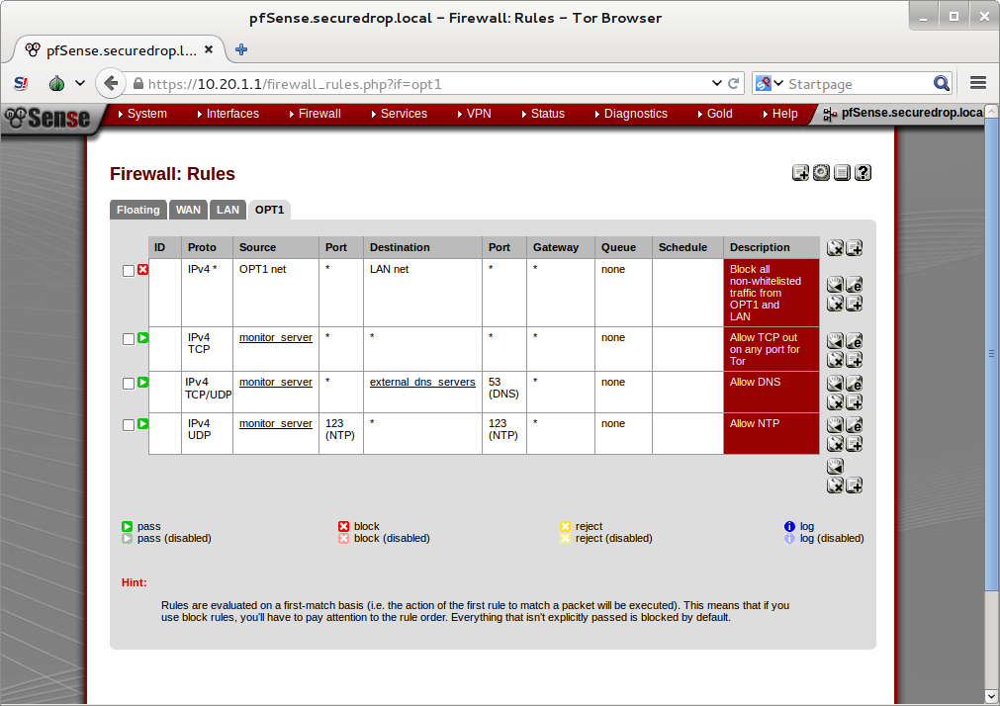

Network Firewall Setup Guide
============================

<!-- START doctoc generated TOC please keep comment here to allow auto update -->
<!-- DON'T EDIT THIS SECTION, INSTEAD RE-RUN doctoc TO UPDATE -->
**Table of Contents**  *generated with [DocToc](http://doctoc.herokuapp.com/)*

- [Before you begin](#before-you-begin)
- [Initial Setup](#initial-setup)
  - [Assign interfaces](#assign-interfaces)
  - [Initial configuration](#initial-configuration)
    - [Connect to the pfSense WebGUI](#connect-to-the-pfsense-webgui)
    - [Setup Wizard](#setup-wizard)
    - [Connect Interfaces and Test Connectivity](#connect-interfaces-and-test-connectivity)
- [SecureDrop-specific Configuration](#securedrop-specific-configuration)
  - [Set up OPT1](#set-up-opt1)
  - [Disable DHCP on the LAN](#disable-dhcp-on-the-lan)
    - [Disabling DHCP](#disabling-dhcp)
    - [Assigning a static IP address to the Admin Workstation](#assigning-a-static-ip-address-to-the-admin-workstation)
  - [Set up the network firewall rules](#set-up-the-network-firewall-rules)
    - [Example Screenshots](#example-screenshots)

<!-- END doctoc generated TOC please keep comment here to allow auto update -->

Unfortunately, due to the wide variety of firewalls that may be used, we do not provide specific instructions to cover every type or variation in software or hardware.

This guide will focus on pfSense, and assumes your firewall has at least three interfaces: WAN, LAN, and OPT1. These are the default interfaces on the recommended Netgate firewall, and it should be easy to configure any pfSense firewall with 3 or more NICs this way.

To avoid duplication, this guide refers to sections of the [pfSense Guide](http://data.sfb.bg.ac.rs/sftp/bojan.radic/Knjige/Guide_pfsense.pdf), so you will want to have that handy.

Before you begin
----------------

First, consider how the firewall will be connected to the Internet. You need to be able to provision two unique subnets for SecureDrop: the app subnet and the monitor subnet. There are a number of possible ways to configure this, and the best way will depend on the network that you are connecting to.

Note that many firewalls, including the recommended Netgate pfSense, automatically set up the LAN interface on 192.168.1.1/24. This is a very common subnet choice for home routers. If you are connecting the firewall to a router with the same subnet (common in a small office, home, or testing environment), you will probably be unable to connect to the network at first. However, you will be able to connect from the LAN to the pfSense WebGUI configuration wizard, and from there you will be able to configure the network so it is working correctly.

The app subnet will need at least three IP addresses: one for the gateway, one for the app server, and one for the admin workstation. The monitor subnet will need at least two IP addresses: one for the gateway and one for the monitor server.

We assume that you have examined your network configuration and have selected two appropriate subnets. We will refer to your chosen subnets as "App Subnet" and "Monitor Subnet" throughout the rest of the documentation. For the examples in the documentation, we have chosen:

* App Subnet: 10.20.1.0/24
* App Gateway: 10.20.1.1
* App Server: 10.20.1.2
* Admin Workstation: 10.20.1.3

* Monitor Subnet: 10.20.2.0/24
* Monitor Gateway: 10.20.2.1
* Monitor Server: 10.20.2.2

Initial Setup
-------------

Unpack the firewall, connect power, and power on.

### Assign interfaces

Section 3.2.3, "Assigning Interfaces", of the pfSense Guide. Some firewalls, like the Netgate recommended in the Hardware Guide, have this set up already, in which case you can skip this step.

### Initial configuration

We will use the pfSense WebGUI to do the initial configuration of the network firewall.

#### Connect to the pfSense WebGUI

1. Boot the Admin Workstation into Tails from the Admin Live USB.
2. Connect the Admin Workstation to the switch on the LAN. After a few seconds, you should see a pop up notification saying "Connection established" in the top right corner of the screen.
3. Launch the Tor Browser, *Applications → Internet → Tor Browser*.
    1. If there is a conflict between your WAN and the default LAN, you will not be able to connect to Tor, and may see a dialog that says "Tor is not ready. Start Tor Browser anyway?". Click "Start Tor Browser" to continue.
4. Navigate to the pfSense GUI in the Tor Browser: https://192.168.1.1
5. The firewall uses a self-signed certificate, so you will see a "This Connection Is Untrusted" warning when you connect. This is expected (see Section 4.5.6 of the pfSense Guide). You can safely continue by clicking "I Understand the Risks", "Add Exception...", and "Confirm Security Exception."
6. You should see the login page for the pfSense GUI. Log in with the default username and password (admin / pfsense).

#### Setup Wizard

If you're setting up a brand new (or recently factory reset) router, pfSense will start you on the Setup Wizard. Click next, then next again. Don't sign up for a pfSense Gold subscription.

On the "General Information" page, we recommend leaving your hostname as the default (pfSense). There is no relevant domain for SecureDrop, so we recommend setting this to "securedrop.local" or something similar. Use whatever DNS servers you wish. If you don't know what DNS servers to use, we recommend using Google's DNS servers: `8.8.8.8` and `8.8.4.4`. Click Next.

Leave the defaults for "Time Server Information". Click Next.

On "Configure WAN Interface", enter the appropriate configuration for your network. Consult your local sysadmin if you are unsure what to enter here. For many environments, the default of DHCP will work and the rest of the fields can be left blank. Click Next.

For "Configure LAN Interface", set the IP address and subnet mask of the Application Subnet for the LAN interface. Click Next.

Set a strong admin password. We recommend generating a random password with KeePassX, and saving it in the Tails Persistent folder using the provided KeePassX database template. Click Next.

Click Reload.

If you changed the LAN Interface settings, you will no longer be able to connect after reloading the firewall and the next request will probably time out. This is not a problem - the firewall has reloaded and is working correctly. To connect to the new LAN interface, unplug and reconnect your network cable to have a new network address assigned to you via DHCP. Note that if you used a subnet with fewer addresses than `/24`, the default DHCP configuration in pfSense may not work. In this case, you should assign the Admin Workstation a static IP address that is known to be in the subnet to continue.

Now the WebGUI will be available on the App Gateway address. Navigate to `https://<App Gateway IP>` in the Tor Browser, and do the same dance as before to log in to the pfSense WebGUI and continue configuring the firewall.

#### Connect Interfaces and Test Connectivity

Now that the initial configuration is completed, you can connect the WAN port without potentially conflicting with the default LAN settings (as explained earlier). Connect the WAN port to the external network. You can watch the WAN entry in the Interfaces table on the pfSense WebGUI homepage to see as it changes from down (red arrow pointing down) to up (green arrow pointing up). The WAN's IP address will be shown once it comes up.

Finally, test connectivity to make sure you are able to connect to the Internet through the WAN. The easiest way to do this is to use ping (Diagnostics → Ping in the WebGUI).

SecureDrop-specific Configuration
---------------------------------

SecureDrop uses the firewall to achieve two primary goals:

1.  Isolating SecureDrop from the existing network, which may be compromised (especially if it is a venerable network in a large organization like a newsroom).
2.  Isolating the app and the monitor servers from each other as much as possible, to reduce attack surface.

In order to use the firewall to isolate the app and monitor servers from each other, we need to connect them to separate interfaces, and then set up firewall rules that allow them to communicate.

### Set up OPT1

We set up the LAN interface during the initial configuration. We now need to set up the OPT1 interface. Start by connecting the Monitor Server to the OPT1 port. Then use the WebGUI to configure the OPT1 interface. Go to `Interfaces → OPT1`, and check the box to "Enable Interface". Use these settings:

-   IPv4 Configuration Type: Static IPv4
-   IPv4 Address: Monitor Gateway

Leave everything else as the default. Save and Apply Changes.

### Disable DHCP on the LAN

pfSense runs a DHCP server on the LAN interface by default. At this stage in the documentation, the Admin Workstation has an IP address assigned via that DHCP server. You can easily check your current IP address by *right-clicking* the networking icon (a blue cable going in to a white jack) in the top right of the menu bar, and choosing "Connection Information".

In order to tighten the firewall rules as much as possible, we recommend disabling the DHCP server and assigning a static IP address to the Admin Workstation instead.

#### Disabling DHCP

To disable DHCP, navigate to "Services → DHCP Server". Uncheck the box to "Enable DHCP servers on LAN interface", scroll down, and click the Save button.

#### Assigning a static IP address to the Admin Workstation

Now you will need to assign a static IP to the Admin Workstation. Use the *Admin Workstation IP* that you selected earlier, and make sure you use the same IP when setting up the firewall rules later.

Start by *right-clicking* the networking icon in the top right of the menu bar, and choosing "Edit Connections...".

Select "Wired connection" from the list and click the "Edit..." button.

Change to the "IPv4 Settings" tab. Change "Method:" from "Automatic (DHCP)" to "Manual". Click the Add button and fill in the static networking information for the Admin Workstation.

Click "Save...". If the network does not come up within 15 seconds or so, try disconnecting and reconnecting your network cable to trigger the change. You will need you have succeeded in connecting with your new static IP when you see a pop-up notification that says "Tor is ready. You can now access the Internet".

### Set up the network firewall rules

Since there are a variety of firewalls with different configuration interfaces and underlying sets of software, we cannot provide a set of network firewall rules to match every use case. Instead, we provide a firewall rules template in `install_files/network_firewall/rules`. This template is written in the iptables format, which you will need to manually translate for your firewall and preferred configuration method.

For pfSense, see Section 6 of the pfSense Guide for information on setting up firewall rules through the WebGUI. Here are some tips on interpreting the rules template for pfSense:

1. Create aliases for the repeated values (IPs and ports).
2. pfSense is a stateful firewall, which means that you don't need corresponding rules for the iptables rules that allow incoming traffic in response to outgoing traffic (`--state ESTABLISHED,RELATED`). pfSense does this for you automatically.
3. You should create the rules on the interface where the traffic originates from. The easy way to do this is look at the sources (`-s`) of each of the iptables rules, and create that rule on the corresponding interface:

	* `-s APP_IP` → `LAN`
	* `-s MONITOR_IP` → `OPT1`

4. Make sure you delete the default "allow all" rule on the LAN interface. Leave the "Anti-Lockout" rule enabled.
5. Any traffic that is not explicitly passed is logged and dropped by default in pfSense, so you don't need to add explicit rules (`LOGNDROP`) for that.
6. Since some of the rules are almost identical except for whether they allow traffic from the App Server or the Monitor Server (`-s MONITOR_IP,APP_IP`), you can use the "add a new rule based on this one" button to save time creating a copy of the rule on the other interface.
7. If you are having trouble with connections, the firewall logs can be very helpful. You can find them in the WebGUI in *Status → System Logs → Firewall*.

We recognize that this process is cumbersome and may be difficult for people inexperienced in managing networks to understand. We are working on automating much of this for the next SecureDrop release.

#### Example Screenshots

Here are some example screenshots of a working pfSense firewall configuration:

Once you've set up the firewall, continue with the instructions in the [Install Guide](/docs/install.md#set-up-the-servers).
