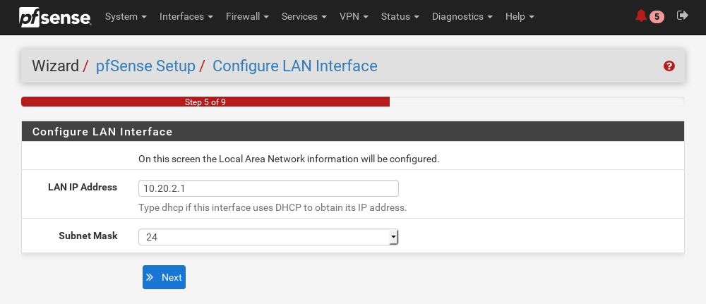
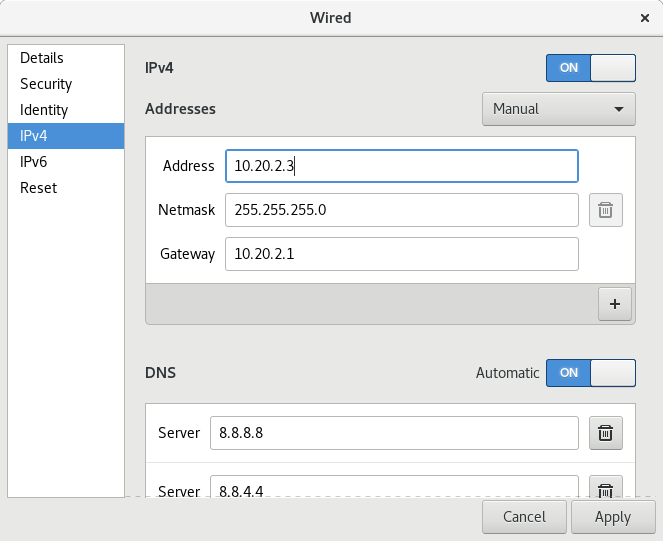
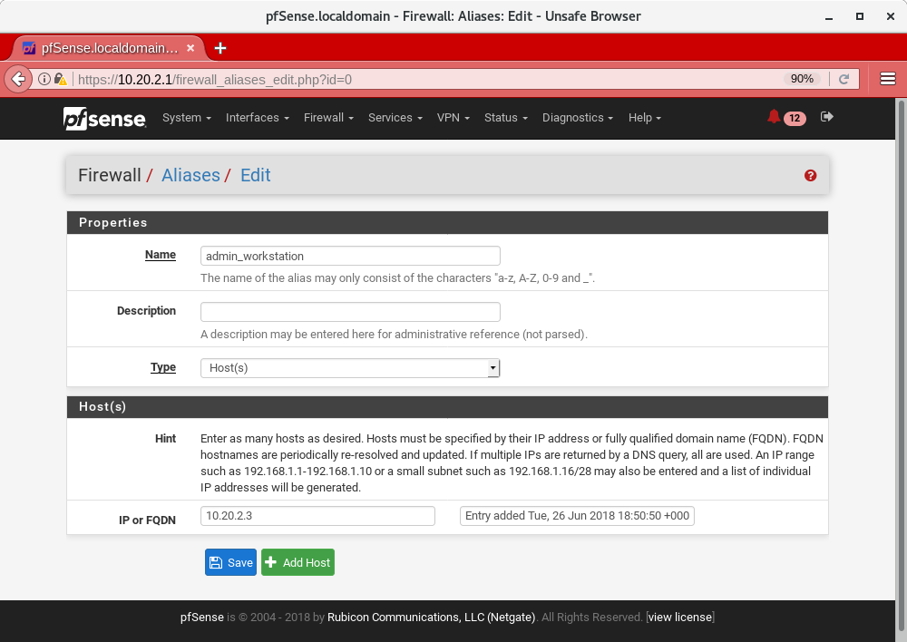
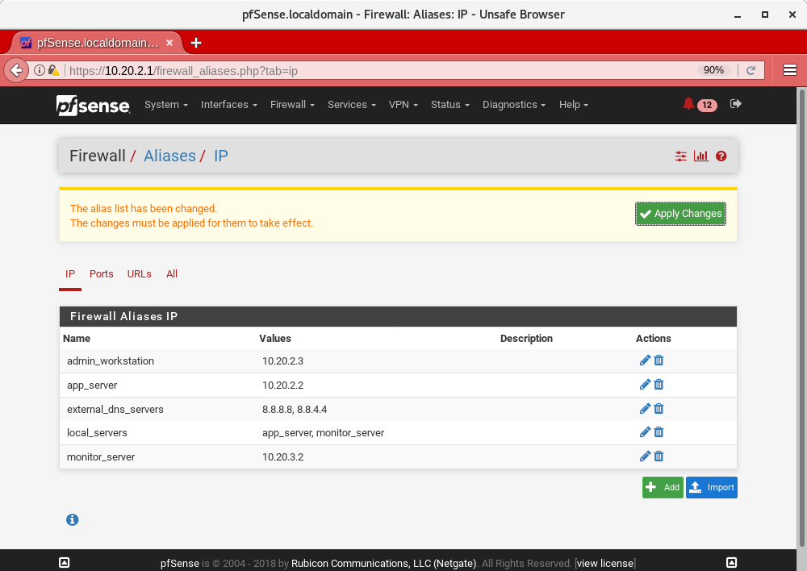
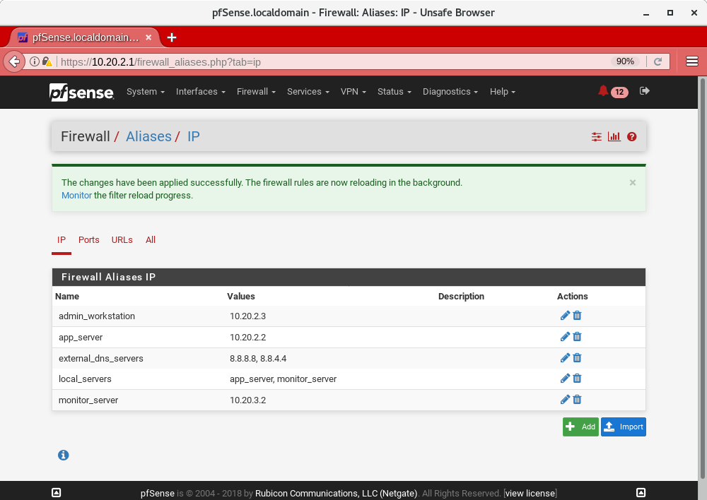
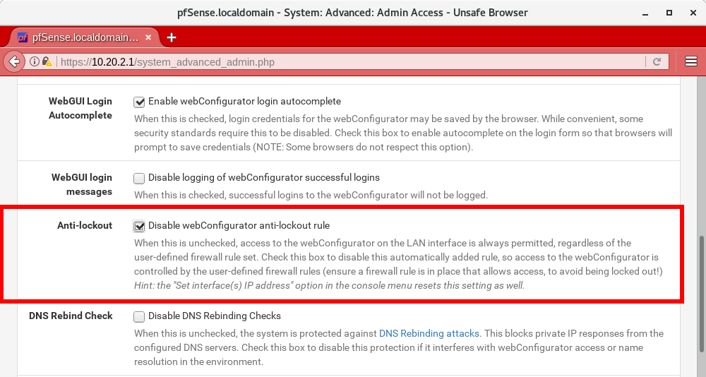
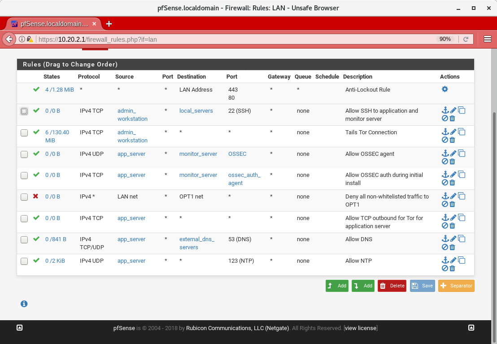
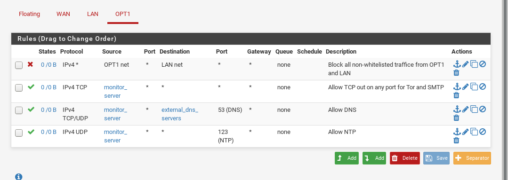
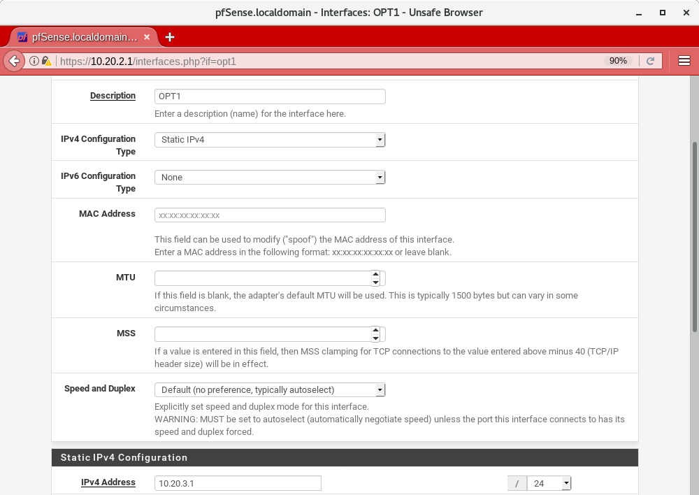
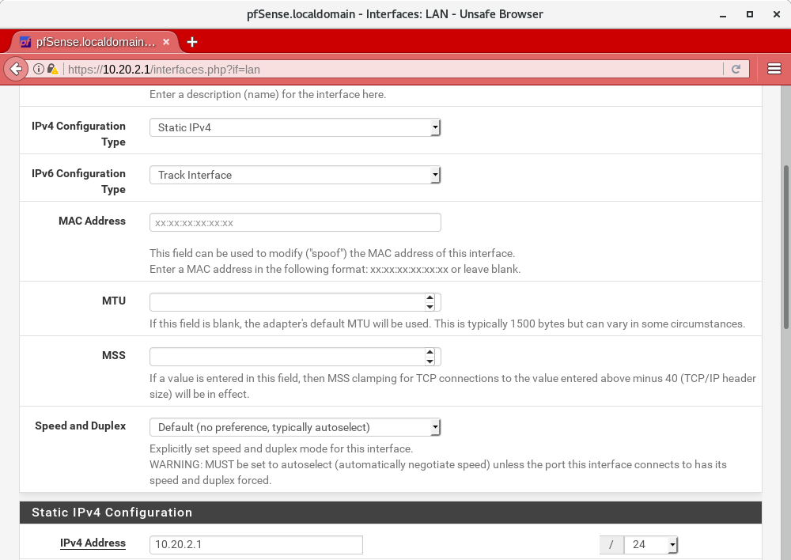

Set Up the Network Firewall
===========================

Now that you've set up your password manager, you can move on to setting up
the Network Firewall. You should stay logged in to the *Admin Workstation* to
access the Network Firewall's web interface for configuration.

Unfortunately, due to the wide variety of firewalls that may be used, we
do not provide specific instructions to cover every type or variation in
software or hardware. However, if you have the necessary expertise, we
provide `abstract firewall rules`_ that can be implemented with iptables, Cisco
IOS etc. This guide is based on pfSense, and assumes your firewall hardware has
at least three interfaces: WAN, LAN, and OPT1. For hardware, you can build
your own network firewall (not covered in this guide) and `install pfSense 
<https://doc.pfsense.org/index.php/Installing_pfSense>`__ on it. For most
installations, we recommend buying a dedicated firewall appliance with
pfSense pre-installed, such as the one recommended in the
:ref:`Hardware Guide <hardware_guide>`.

We currently recommend the `pfSense SG-3100
<https://store.netgate.com/SG-3100.aspx>`__, which has 3 network interfaces
and 6 ports: WAN, OPT1, LAN1, LAN2, LAN3 and LAN4. This firewall comes with
an internal switch on the LAN interface. If yours does not you will need to
obtain a separate switch to connect the *Admin Workstation* for the initial
installation.

If you are new to pfSense or firewall management in general, we
recommend the following resources:

-  `Official pfSense
   Wiki <https://doc.pfsense.org/index.php/Main_Page>`__
-  `pfSense: The Definitive
   Guide <https://www.amazon.com/pfSense-Definitive-Christopher-M-Buechler/dp/0979034280>`__

   -  *Note:* This guide is now slightly out of date, although we found
      it to be a useful reference in the past. To get the latest version of
      this book, you need to become a `pfSense Gold
      Member <https://www.pfsense.org/our-services/gold-membership.html>`__.

If you're using the recommended SG-3100 firewall, then you may find the
following resource useful. In particular, you can find instructions on factory
resetting the firewall in ``Chapter 8``.

-  `SG-3100
   Product Manual <https://docs.netgate.com/manuals/pfsense/en/latest/sg-3100-security-gateway-manual.pdf>`__

Before You Begin
----------------

First, consider how the firewall will be connected to the Internet. You
will need to provision several unique subnets, which should not conflict
with the network configuration on the WAN interface. If you are unsure,
consult your local system administrator.

Many firewalls, including the recommended Netgate pfSense,
automatically set up the LAN interface on ``192.168.1.1/24``. This
particular private network is also a very common choice for home and
office routers. If you are connecting the firewall to a router with the
same subnet (common in a small office, home, or testing environment),
you will probably be unable to connect to the network at first. However,
you will be able to connect from the LAN to the pfSense WebGUI
configuration wizard, and from there you will be able to configure the
network so it is working correctly.

Configuring Your Firewall
~~~~~~~~~~~~~~~~~~~~~~~~~

If your firewall has at least 4 NICs, we will refer to the ports as WAN, LAN,
OPT1, and OPT2. In this case, we can now use a dedicated port on the network
firewall for each component of SecureDrop (*Application Server*,
*Monitor Server*, and *Admin Workstation*).

Depending on your network configuration, you should define the following
values before continuing.

4 NIC Example
'''''''''''''
.. raw:: html

   <!-- -->

-  Admin Subnet: ``10.20.1.0/24``
-  Admin Gateway: ``10.20.1.1``
-  Admin Workstation: ``10.20.1.2``

.. raw:: html

   <!-- -->

-  Application Subnet: ``10.20.2.0/24``
-  Application Gateway: ``10.20.2.1``
-  Application Server (OPT1): ``10.20.2.2``

.. raw:: html

   <!-- -->

-  Monitor Subnet: ``10.20.3.0/24``
-  Monitor Gateway: ``10.20.3.1``
-  Monitor Server (OPT2) : ``10.20.3.2``

3 NIC Example (SG-3100)
'''''''''''''''''''''''

As described earlier, the SG-3100 has an internal switch on the LAN interface
which means we can place the *Application Server* and *Admin Workstation* on
the same subnet and gateway.

.. raw:: html

   <!-- -->

-  Admin Subnet: ``10.20.2.0/24``
-  Admin Gateway: ``10.20.2.1``
-  Admin Workstation (LAN1): ``10.20.2.3``

.. raw:: html

   <!-- -->

-  Application Subnet: ``10.20.2.0/24``
-  Application Gateway: ``10.20.2.1``
-  Application Server (LAN2): ``10.20.2.2``

.. raw:: html

   <!-- -->

-  Monitor Subnet: ``10.20.3.0/24``
-  Monitor Gateway: ``10.20.3.1``
-  Monitor Server (OPT1) : ``10.20.3.2``

Initial Configuration
---------------------

Unpack the firewall, connect the power, and power on the device.

We will use the pfSense WebGUI to do the initial configuration of the
network firewall. [#]_

Connect to the pfSense WebGUI
~~~~~~~~~~~~~~~~~~~~~~~~~~~~~

#. Boot the *Admin Workstation* into Tails from the Admin Live USB.

#. Connect the *Admin Workstation* to the LAN interface. You should see
   a popup notification in Tails that says "Connection Established". If you click
   on the network icon in the upper right of the Tails Desktop, you should see
   "Wired Connected":

   |Wired Connected|

   .. warning:: Make sure your *only* active connection is the one you
      just established with the network firewall. If you are
      connected to another network at the same time (e.g. a
      wireless network), you may encounter problems trying
      to connect the pfSense WebGUI.

#. Launch the **Unsafe Browser** from the menu bar: **Applications ▸ Internet ▸
   Unsafe Browser**.

   |Launching the Unsafe Browser|

   .. note:: The *Unsafe Browser* is, as the name suggests, **unsafe**
        (its traffic is not routed through Tor). However, it is
        the only option because Tails `intentionally disables LAN
        access`_ in the **Tor Browser**.

#. A dialog will ask "Do you really want to launch the Unsafe
   Browser?". Click **Launch**.

   |You really want to launch the Unsafe Browser|

#. You will see a pop-up notification that says "Starting the Unsafe
   Browser..."

   |Pop-up notification|

#. After a few seconds, the Unsafe Browser should launch. The window
   has a bright red border to remind you to be careful when using
   it. You should close it once you're done configuring the firewall
   and use the Tor Browser for any other web browsing you might do on
   the *Admin Workstation*.

   |Unsafe Browser Homepage|

#. Navigate to the pfSense WebGUI in the *Unsafe Browser*:
   ``https://192.168.1.1``

   .. note:: If you have trouble connecting, go to your network settings and
      make sure that you have an IPv4 address in the ``192.168.1.1/24`` range.
      You may need to turn on DHCP, else you can manually configure a static
      IPv4 address of ``192.168.1.x`` with a subnet mask of ``255.255.255.0``.
      However, make sure not to configure your Tails device to have the same IP
      as the firewall (``192.168.1.1``).

#. The firewall uses a self-signed certificate, so you will see a "This
   Connection Is Untrusted" warning when you connect. This is expected.
   You can safely continue by clicking **Advanced**, **Add
   Exception...**, and **Confirm Security Exception**.

   |Your Connection is Insecure|

#. You should see the login page for the pfSense GUI. Log in with the
   default username and passphrase (``admin`` / ``pfsense``).

   |Default pfSense|

.. _intentionally disables LAN access: https://labs.riseup.net/code/issues/7976

Alternate Hostnames
~~~~~~~~~~~~~~~~~~~

Before you can set up the hardware firewall, you will need to set the
**Alternate Hostnames** setting after logging in. You will see the Setup
Wizard but you should exit out of it by navigating to **System** -> **Advanced**.
In the **Alternate Hostnames** dialog box, add ``192.168.1.1`` as well as the
IP address of the *Admin Gateway*. If you decide against using our recommended
defaults for the *Admin Gateway*, you should include that value here. After
saving these settings you should be able to go back to **System** and
select **Setup Wizard**.

4 NIC Example
'''''''''''''

|Alternate Hostnames|

3 NIC Example (SG-3100)
'''''''''''''''''''''''

|3 NIC Alternate Hostnames|

.. note:: If you are using a different IP for the Admin Gateway you should
 enter that IP in the Alternate Hostname field. Failure to do so will result in
 an error with the text "An HTTP_REFERER was detected other than what is
 defined in System -> Advanced". If you see this error you may have to do
 a factory reset of the firewall via the serial console.

Setup Wizard
~~~~~~~~~~~~

#. If you're setting up a brand new (or recently factory reset) router,
   logging in to the pfSense WebGUI will automatically start the Setup
   Wizard. Click **Next**, then **Next** again. Don't sign up for a pfSense Gold
   subscription (unless you want to).

#. On the "General Information" page, we recommend leaving your hostname as
   the default (pfSense). There is no relevant domain for SecureDrop, so we
   recommend setting this to ``securedrop.local`` or something similar. Use
   your preferred DNS servers. If you don't know what DNS servers to use,
   we recommend using Google's DNS servers: ``8.8.8.8`` and ``8.8.4.4``.
   Click Next.

   |pfSense General Info|

#. Leave the defaults for "Time Server Information". Click **Next**.

#. On "Configure WAN Interface", enter the appropriate configuration for
   your network. Consult your local sysadmin if you are unsure what to
   enter here. For many environments, the default of DHCP will work and the
   rest of the fields can be left blank. Click **Next**.

#.

   a. **4 NIC Example:**
   For "Configure LAN Interface", use the IP address of the *Admin Gateway*
   (``10.20.1.1``) and the subnet mask (``/24``) of the *Admin Subnet*. Click
   **Next**.

   |Configure LAN Interface|

   b.  **3 NIC Example (SG-3100):**
   For "Configure LAN Interface", use the IP address of the *Admin Gateway*
   (``10.20.2.1``) and the subnet mask (``/24``) of the *Admin Subnet*. Click
   **Next**.

   |3 NIC Configure LAN Interface|

#. Set a strong admin passphrase. We recommend generating a strong passphrase
   with KeePassX, and saving it in the Tails Persistent folder using the
   provided KeePassX database template. Click **Next**.

#. Click Reload. Once the reload completes and the web page refreshes,
   click the corresponding "here" link to "continue on to the pfSense
   webConfigurator".

At this point, since you (probably) changed the LAN subnet settings from
their defaults, you will no longer be able to connect after reloading
the firewall and the next request will probably time out. This is not an
error - the firewall has reloaded and is working correctly. To connect
to the new LAN interface, unplug and reconnect your network cable to get
a new network address assigned via DHCP. Note that if you used a subnet
with fewer addresses than ``/24``, the default DHCP configuration in
pfSense may not work. In this case, you should assign the Admin
Workstation a static IP address that is known to be in the subnet to
continue.

Now the WebGUI will be available on the Admin Gateway address. Navigate
to ``https://<Admin Gateway IP>`` in the *Unsafe Browser*, and login as
before except with the new passphrase you just set for the pfSense WebGUI.
Once you've logged in to the WebGUI, you are ready to continue configuring
the firewall.

Connect Interfaces and Test
~~~~~~~~~~~~~~~~~~~~~~~~~~~

Now that the initial configuration is completed, you can connect the WAN
port without potentially conflicting with the default LAN settings (as
explained earlier). Connect the WAN port to the external network. You
can watch the WAN entry in the Interfaces table on the pfSense WebGUI
homepage to see as it changes from down (red arrow pointing down) to up
(green arrow pointing up). This usually takes several seconds. The WAN's
IP address will be shown once it comes up.

Finally, test connectivity to make sure you are able to connect to the
Internet through the WAN. The easiest way to do this is to use ping
(**Diagnostics** → **Ping** in the WebGUI). Enter an external hostname or IP
that you expect to be up (e.g. ``google.com``) and click "Ping".

|Ping|

Disable DHCP on the LAN
-----------------------

pfSense runs a DHCP server on the LAN interface by default. At this
stage in the documentation, the *Admin Workstation* likely has an IP address
assigned via that DHCP server.

In order to tighten the firewall rules as much as possible, we recommend
disabling the DHCP server and assigning a static IP address to the Admin
Workstation instead.

Disable DHCP Server on the Firewall
~~~~~~~~~~~~~~~~~~~~~~~~~~~~~~~~~~~

To disable DHCP, navigate to **Services ▸ DHCP Server** in the pfSense
WebGUI. Uncheck the box labeled **Enable DHCP server on LAN
interface**, scroll down, and click the **Save** button.

|Disable DHCP|

.. _assign_static_ip_to_workstation:

Assign a Static IP Address to the *Admin Workstation*
~~~~~~~~~~~~~~~~~~~~~~~~~~~~~~~~~~~~~~~~~~~~~~~~~~~~~

Now you will need to assign a static IP to the *Admin Workstation*.

You can easily check your current IP address by *clicking* the top right of
the menu bar, clicking on the **Wired Connection** and then clicking **Wired
Settings**.

|Wired Settings|

From here you can click on the cog in the lower right of the panel:

|Tails Network Settings|

This will take you to the network settings, where you can click **IPv4** to see
whether or not the **Automatic (DHCP)** or **Manual** (static IP) setting is
turned on.

Change to the **IPv4 Settings** tab. Change **Addresses** from
**Automatic (DHCP)** to **Manual** (if it isn't already).

|IPv4 Settings|

.. note:: The Unsafe Browser will not launch when using a manual
	  network configuration if it does not have DNS servers
	  configured. This is technically unnecessary for our use case
	  because we are only using it to access IP addresses on the
	  LAN, and do not need to resolve anything with
	  DNS. Nonetheless, you should configure some DNS servers here
	  so you can continue to use the Unsafe Browser to access the
	  WebGUI in future sessions.

	  We recommend keeping it simple and using the same DNS
	  servers that you used for the network firewall in the setup
	  wizard.

4 NIC Example
'''''''''''''

Fill in the static networking information for the *Admin Workstation*:

-  Address: ``10.20.1.2``
-  Netmask: ``255.255.255.0``
-  Gateway : ``10.20.1.1``

|Admin Workstation Static IP Configuration|

3 NIC Example (SG-3100)
'''''''''''''''''''''''

Fill in the static networking information for the *Admin Workstation*:

-  Address: ``10.20.2.3``
-  Netmask: ``255.255.255.0``
-  Gateway : ``10.20.2.1``

|3 NIC Admin Workstation Static IP Configuration|

Click **Apply**. If the network does not come up within 15 seconds or
so, try disconnecting and reconnecting your network cable to trigger the
change. You will need you have succeeded in connecting with your new
static IP when you see a pop-up notification that says "Tor is ready.
You can now access the Internet".

Troubleshooting: DNS Servers and the Unsafe Browser
'''''''''''''''''''''''''''''''''''''''''''''''''''

After saving the new network configuration, you may still encounter the
"No DNS servers configured" error when trying to launch the Unsafe
Browser. If you encounter this issue, you can resolve it by
disconnecting from the network and then reconnecting, which causes the
network configuration to be reloaded.

To do this, click the network icon in the system toolbar, and click
**Disconnect** under the name of the currently active network
connection, which is displayed in bold. After it disconnects, click
the network icon again and click the name of the connection to
reconnect. You should see a popup notification that says "Connection
Established", followed several seconds later by the "Tor is ready"
popup notification.

For the next step, SecureDrop Configuration, you will manually configure the
firewall for SecureDrop, using screenshots or XML templates as a reference.

SecureDrop Configuration
------------------------

SecureDrop uses the firewall to achieve two primary goals:

#. Isolating SecureDrop from the existing network, which may be
   compromised (especially if it is a venerable network in a large
   organization like a newsroom).
#. Isolating the *Application Server* and the *Monitor Server* from each other
   as much as possible, to reduce attack surface.

In order to use the firewall to isolate the *Application Server* and the *Monitor
Server* from each other, we need to connect them to separate interfaces, and then set
up firewall rules that allow them to communicate.

Set Up the Firewall Rules
~~~~~~~~~~~~~~~~~~~~~~~~~

Since there are a variety of firewalls with different configuration interfaces
and underlying sets of software, we cannot provide a set of network firewall
rules to match every use case.

The easiest way to set up your firewall rules is to look at the screenshots of
a correctly configured firewall and edit the interfaces, aliases, and firewall
rules on your firewall to match them.

4 NIC Example
~~~~~~~~~~~~~

If you are using a firewall that has a dedicated interface for each component of
SecureDrop, you can follow the below screenshots for setting up your firewall
rules.

Set Up OPT1
'''''''''''

We set up the LAN interface during the initial configuration. We now
need to set up the OPT1 interface for the *Application Server*. Start by
connecting the *Application Server* to the OPT1 port. Then use the WebGUI
to configure the OPT1 interface. Go to **Interfaces ▸ OPT1**, and check
the box to **Enable Interface**. Use these settings:

-  IPv4 Configuration Type: Static IPv4
-  IPv4 Address: ``10.20.2.1`` (Application Gateway IP)

Make sure that the CIDR routing prefix is correct (``/24``). Leave everything else
as the default. **Save** and **Apply Changes**.

|OPT1|

Set Up OPT2
'''''''''''

Next, you will have to enable the OPT2 interface. Go to
**Interfaces ▸ OPT2**, and check the box to **Enable Interface**. OPT2
interface is set up similarly to how we set up OPT1 in the previous
section. Use these settings:

-  IPv4 Configuration Type: Static IPv4
-  IPv4 Address: ``10.20.3.1`` (Monitor Gateway IP)

Make sure that the CIDR routing prefix is correct (``/24``). Leave everything else
as the default. **Save** and **Apply Changes**.

|OPT2|

Use Screenshots of Firewall Configuration
'''''''''''''''''''''''''''''''''''''''''

Here are some example screenshots of a working pfSense firewall
configuration. You will add the firewall rules until they match what is
shown on the screenshots.

First, we will configure IP and port aliases. Navigate to **Firewall ▸ Aliases**
and you should see a screen with no currently defined IP aliases:

|Blank IP Aliases|

Next you will click **Add** to add each IP alias.
You should leave the **Type** as **Host**.
Make aliases for the following:

- ``admin_workstation``: ``10.20.1.2``
- ``app_server``: ``10.20.2.2``
- ``external_dns_servers``: ``8.8.8.8, 8.8.4.4``
- ``monitor_server``: ``10.20.3.2``
- ``local_servers``: ``app_server, monitor_server``

|Add Firewall Alias|

Click **Save** to add the alias.

Keep adding aliases until the screenshot matches what is shown here:

|Firewall IP Aliases Pre Save|

Finally, click **Apply Changes**. This will save your changes. You should see a
message "The changes have been applied successfully":

|Firewall IP Aliases Post Save|

Next click "Ports" for the port aliases, and add the following ports:

- OSSEC: ``1514``
- ossec_agent_auth: ``1515``

Your configuration should match this screenshot:

|Port Aliases|

Next we will configure firewall rules for each interface. Navigate to **Firewall ▸
Rules** to add firewall rules for the LAN, OPT1, and OPT2 interfaces.

.. warning:: Be sure not to delete the Anti-Lockout Rule on the LAN interface.
    Deleting this rule will lock you out of the pfSense WebGUI.

Add or remove rules until they match the following screenshots by clicking **Add**
to add a rule.

**LAN interface:**

|Firewall LAN Rules|

**OPT1 interface:**

|Firewall OPT1 Rules|

**OPT2 interface:**

|Firewall OPT2 Rules|

Finally, click **Apply Changes**. This will save your changes. You should see a
message "The changes have been applied successfully". Once you've set up the
firewall, exit the Unsafe Browser, and continue with the "Keeping pfSense up
to date" section below.

3 NIC Example (SG-3100)
~~~~~~~~~~~~~~~~~~~~~~~

The below guide assumes you are using a 3 NIC firewall such as the SG-3100.
While the SG-3100 has an integrated switch, you may need to add a switch to
the LAN interface if you use a different firewall.

Set Up LAN
''''''''''

Although we set up the LAN interface during the Setup Wizard we need to make
a few revisions. Navigate in the WebGUI to configure the LAN interface. Go to
**Interfaces ▸ LAN**, and ensure the **Enable Interface** box is checked. Use
these settings:

-  IPv4 Configuration Type: Static IPv4
-  IPv4 Address: ``10.20.2.1`` (Application Gateway IP)

Make sure that the CIDR routing prefix is correct (``/24``). Leave everything else
as the default. **Save** and **Apply Changes**.

|3 NIC LAN Interface|

Disable Anti-Lockout Rule
'''''''''''''''''''''''''

In order to further lockdown communication we will disable the rule that allows
traffic to the firewall over the local network. Navigate to
**System ▸ Advanced** and find the "Anti-lockout" rule. Ensure the box is
checked and save the configuration.

|Disable Anti-Lockout Rule|

.. warning:: Do not reboot the firewall until after you have set the firewall
 rules based on the screenshots below. If you get locked out of the firewall
 you may have to factory reset it by connecting to it over the serial console.

Set Up OPT1
'''''''''''

Next, you will have to enable the OPT1 interface. Go to
**Interfaces ▸ OPT1**, and check the box to **Enable Interface**. Use these
settings:

-  IPv4 Configuration Type: Static IPv4
-  IPv4 Address: ``10.20.3.1`` (Monitor Gateway IP)

Make sure that the CIDR routing prefix is correct (``/24``). Leave everything else
as the default. **Save** and **Apply Changes**.

|3 NIC Firewall OPT1 Interface|

Use Screenshots of Firewall Configuration
'''''''''''''''''''''''''''''''''''''''''

Here are some example screenshots of a working pfSense firewall
configuration. You will add the firewall rules until they match what is
shown on the screenshots.

First, we will configure IP and port aliases. Navigate to **Firewall ▸ Aliases**
and you should see a screen with no currently defined IP aliases:

|Blank IP Aliases|

Next you will click **Add** to add each IP alias.
You should leave the **Type** as **Host**.
Make aliases for the following:

- ``admin_workstation``: ``10.20.2.3``
- ``app_server``: ``10.20.2.2``
- ``external_dns_servers``: ``8.8.8.8, 8.8.4.4``
- ``monitor_server``: ``10.20.3.2``
- ``local_servers``: ``app_server, monitor_server``

|3 NIC Firewall Alias|

Click **Save** to add the alias.

Keep adding aliases until the screenshot matches what is shown here:

|3 NIC Firewall IP Aliases Pre Save|

Finally, click **Apply Changes**. This will save your changes. You should see a
message "The changes have been applied successfully":

|3 NIC Firewall IP Aliases Post Save|

Next click "Ports" for the port aliases, and add the following ports:

- OSSEC: ``1514``
- ossec_agent_auth: ``1515``

Your configuration should match this screenshot:

|Port Aliases|

Next we will configure firewall rules for each interface. Navigate to
**Firewall ▸ Rules** to add firewall rules for the LAN and OPT1
interfaces.

.. warning:: Be sure not to delete the Anti-Lockout Rule on the LAN interface.
    Deleting this rule will lock you out of the pfSense WebGUI.

Add or remove rules until they match the following screenshots by clicking **Add**
to add a rule.

**LAN interface:**

|3 NIC Firewall LAN Rules|

**OPT1 interface:**

|3 NIC Firewall OPT1 Rules|

Finally, click **Apply Changes**. This will save your changes. You should see a
message "The changes have been applied successfully". Once you've set up the
firewall, exit the Unsafe Browser, and continue with the "Keeping pfSense up
to date" section below.

Configuration Reference Templates
~~~~~~~~~~~~~~~~~~~~~~~~~~~~~~~~~

As an alternative to the provided screenshots, you can examine the provided
``.xml`` templates as a reference:

- Interfaces config: ``install_files/network_firewall/interfaces-config-pfSense.xml``
- Aliases: ``install_files/network_firewall/aliases-config-pfSense.xml``
- Firewall rules: ``install_files/network_firewall/filter-config-pfSense.xml``

.. note:: These will not load using pfSense Restore and are here as a reference
          only. See `GitHub #2282`_ for more info.

.. _`GitHub #2282`: https://github.com/freedomofpress/securedrop/pull/2282

Tips for Setting Up pfSense Firewall Rules
------------------------------------------

Here are some general tips for setting up pfSense firewall rules:

#. Create aliases for the repeated values (IPs and ports).
#. pfSense is a stateful firewall, which means that you don't need
   corresponding rules to allow incoming traffic in response to outgoing
   traffic (like you would in, e.g. iptables with
   ``--state ESTABLISHED,RELATED``). pfSense does this for you
   automatically.
#. You should create the rules *on the interface where the traffic
   originates*.
#. Make sure you delete the default "allow all" rule on the LAN
   interface. Leave the "Anti-Lockout" rule enabled.
#. Any traffic that is not explicitly passed is logged and dropped by
   default in pfSense, so you don't need to add explicit rules (iptables
   ``LOGNDROP``) for that.
#. Since some of the rules are almost identical except for whether they
   allow traffic from the *Application Server* or the *Monitor Server*, you can use
   the "add a new rule based on this one" button to save time creating a
   copy of the rule on the other interface.
#. If you are troubleshooting connectivity, the firewall logs can be
   very helpful. You can find them in the WebGUI in *Status → System
   Logs → Firewall*.

.. _Keeping pfSense up to date:

Keeping pfSense up to Date
--------------------------

Periodically, the pfSense project maintainers release an update to the
pfSense software running on your firewall. You will be notified by the
appearance of text saying that there is a new version in the **Version**
section of the "Status: Dashboard" page (the home page of the WebGUI).

|Update available|

If you see that an update is available, we recommend installing it. Most
of these updates are for minor bugfixes, but occasionally they can
contain important security fixes. You should keep apprised of updates
yourself by checking the `pfSense Blog posts with the "releases"
tag <https://www.netgate.com/blog/category.html#releases>`__.

.. note:: Protip: Subscribe to the `RSS feed`_.

.. _RSS feed: https://www.netgate.com/feed.xml

To install the update, click the Download icon next to the update then click
the "Confirm" button:

|Firewall Update Confirmation|

You will see a page with a progress bar while pfSense performs the upgrade:

|Firewall Update Progress|

.. note:: This may take a while, so be patient!

Once it is complete, you will see a notification of successful upgrade:

|Firewall Update Complete|

.. |Wired Connected| image:: images/firewall/wired_connected.png
.. |Your Connection is Insecure| image:: images/firewall/your_connection_is_insecure.png
.. |Launching the Unsafe Browser| image:: images/firewall/launching_unsafe_browser.png
.. |You really want to launch the Unsafe Browser| image:: images/firewall/unsafe_browser_confirmation_dialog.png
.. |Pop-up notification| image:: images/firewall/starting_the_unsafe_browser.png
.. |Unsafe Browser Homepage| image:: images/firewall/unsafe_browser.png
.. |Default pfSense| image:: images/firewall/default_pfsense.png
.. |Alternate Hostnames| image:: /images/firewall/alternate_hostnames.png
.. |3 NIC Alternate Hostnames| image:: /images/firewall/three_nic_alternate_hostnames.png
.. |Configure LAN Interface| image:: images/firewall/configure_lan_interface.png

.. |pfSense General Info| image:: images/firewall/pfsense_general_information.png
.. |Ping| image:: images/firewall/pfsense_diagnostics_ping.png
.. |Admin Workstation Static IP Configuration| image:: images/firewall/admin_workstation_static_ip_configuration.png

.. |Firewall Port Aliases| image:: images/firewall/port_aliases.png
.. |Firewall IP Aliases| image:: images/firewall/ip_aliases_with_opt2.png
.. |Firewall LAN Rules| image:: images/firewall/lan_rules.png
.. |Firewall OPT1 Rules| image:: images/firewall/opt1_firewall_rules.png
.. |Firewall OPT2 Rules| image:: images/firewall/opt2_firewall_rules.png

.. |Update available| image:: images/firewall/pfsense_update_available.png

.. |Wired Settings| image:: images/firewall/wired_settings.png
.. |Tails Network Settings| image:: images/firewall/tails_network_settings.png
.. |IPv4 Settings| image:: images/firewall/IPv4_settings.png
.. |Disable DHCP| image:: images/firewall/disable_DHCP.png
.. |OPT1| image:: images/firewall/opt1.png
.. |OPT2| image:: images/firewall/opt2.png

.. |Blank IP Aliases| image:: images/firewall/pfsense_blank_ip_aliases.png
.. |Add Firewall Alias| image:: images/firewall/add_firewall_alias.png
.. |Firewall IP Aliases Pre Save| image:: images/firewall/ip_aliases_pre_save.png
.. |Firewall IP Aliases Post Save| image:: images/firewall/ip_aliases_post_save.png
.. |Port Aliases| image:: images/firewall/port_aliases.png
.. |Firewall Update Confirmation| image:: images/firewall/system_update.png
.. |Firewall Update Progress| image:: images/firewall/system_is_updating.png
.. |Firewall Update Complete| image:: images/firewall/system_update_complete.png

.. [#] Tails screenshots were taken on Tails 3.0~beta4. Please make an issue on
       GitHub if you are using the most recent version of Tails and the
       interface is different from what you see here.

.. _abstract firewall rules:

Abstract Firewall Rules
-----------------------

The pfSense instructions using the web interface can also be precisely
described as follows:

* Disable DHCP (in case the firewall is providing a DHCP server by default)
* Disallow all traffic by default (inbound or outbound)
* Allow UDP OSSEC (port 1514) from *Application Server* to *Monitor Server*
* Allow TCP ossec agent auth (port 1515) from *Application Server* to *Monitor Server*
* Allow TCP/UDP DNS from *Application Server* and *Monitor Server* to the IPs of known name servers
* Allow UDP NTP from *Application Server* and *Monitor Server* to all
* Allow TCP any port from *Application Server* and *Monitor Server* to all (this is needed for making connections to the Tor network)
* Allow TCP 80/443 from *Admin Workstation* to all (in case there is a need to access the web interface of the firewall)
* Allow TCP ssh from *Admin Workstation* to *Application Server* and *Monitor Server*
* Allow TCP any port from *Admin Workstation* to all

This can be implemented with iptables, Cisco IOS etc. if you have the necessary
expertise.
