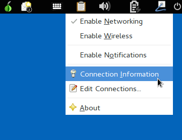
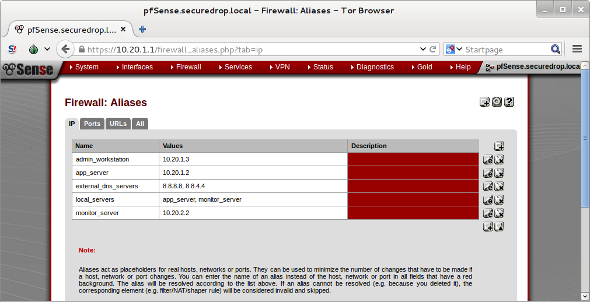
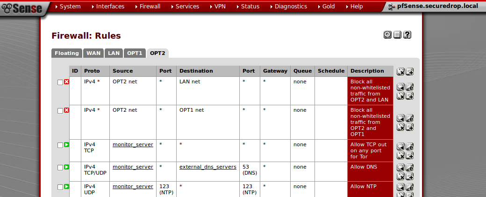

Set up the Network Firewall
===========================

Now that you've set up your password manager, you can move on to setting
up the Network Firewall. You should stay logged in to your *admin Tails
USB* to access the Network Firewall's web interface for configuration.

Unfortunately, due to the wide variety of firewalls that may be used, we
do not provide specific instructions to cover every type or variation in
software or hardware. This guide is based on pfSense, and assumes your
firewall hardware has at least three interfaces: WAN, LAN, and OPT1. For
hardware, you can build your own network firewall (not covered in this
guide) and `install
pfSense <https://doc.pfsense.org/index.php/Installing_pfSense>`__ on it.
For most installations, we recommend buying a dedicated firewall
appliance with pfSense pre-installed, such as the one recommended in the
Hardware Guide.

We used to recommend the 3-NIC `Netgate APU
2 <http://store.netgate.com/NetgateAPU2.aspx>`__, but it has since been
discontinued. We currently recommend the `pfSense
SG-2440 <http://store.pfsense.org/SG-2440/>`__, which has 4 interfaces:
WAN, LAN, OPT1, and OPT2. This guide covers both the old 3-NIC
configuration, for existing installs that are still using it, and the
4-NIC configuration recommended for new installs.

If your firewall only has 3 NICs (WAN, LAN, and OPT1), you will need to
use a switch on the OPT1 interface to connect the Admin Workstation for
the initial installation. If your firewall has 4 NICs (WAN, LAN, OPT1,
and OPT2), a switch is not necessary.

If you are new to pfSense or firewall management in general, we
recommend the following resources:

-  `Official pfSense
   Wiki <https://doc.pfsense.org/index.php/Main_Page>`__
-  `pfSense: The Definitive
   Guide <http://www.amazon.com/pfSense-Definitive-Guide-Christopher-Buechler-ebook/dp/B004OYTMPC>`__

   -  *Note:* This guide is now slightly out of date, although we found
      it to be a useful reference approximately 1 year ago. To get the
      latest version of this book, you need to become a `pfSense Gold
      Member <https://www.pfsense.org/our-services/gold-membership.html>`__.

Before you begin
----------------

First, consider how the firewall will be connected to the Internet. You
will need to provision several unique subnets, which should not conflict
with the network configuration on the WAN interface. If you are unsure,
consult your local sysadmin.

Note that many firewalls, including the recommended Netgate pfSense,
automatically set up the LAN interface on ``192.168.1.1/24``. This
particular private network is also a very common choice for home and
office routers. If you are connecting the firewall to a router with the
same subnet (common in a small office, home, or testing environment),
you will probably be unable to connect to the network at first. However,
you will be able to connect from the LAN to the pfSense WebGUI
configuration wizard, and from there you will be able to configure the
network so it is working correctly.

3 NIC configuration
~~~~~~~~~~~~~~~~~~~

If your firewall has 3 NICs, we will refer to them as WAN, LAN, and
OPT1. WAN is used to connect to the external network. LAN and OPT1 are
used for the Application and Monitor Servers, respectively. Putting them
on separate interfaces allows us to use the network firewall to filter
and monitor the traffic *between* them.

In addition, you will need to be able to connect the Admin Workstation
to this setup for the initial installation. Before SecureDrop is
installed, the only way to connect to the servers is via SSH over the
local network, so the Admin Workstation needs to be directly connected.
Once it is installed, SSH will be available remotely (as an
authenticated Tor Hidden Servce) and you will not necessarily need to
connect the Admin Workstation directly to adminster the servers -
although you will still need to connect it directly to administer the
network firewall. Since there isn't another NIC to connect the Admin
Workstation to, we recommend using a small switch on the LAN (the
specific choice of interface doesn't matter, but we recommend using the
LAN to stay consistent with the rest of this guide) so you can connect
both the Admin Workstation and the Application Server.

Depending on your network configuration, you should define the following
values before continuing. For the examples in this guide, we have
chosen:

-  Admin/App Gateway: ``10.20.1.1``
-  Admin/App Subnet: ``10.20.1.0/24``
-  App Server: ``10.20.1.2``
-  Admin Workstation: ``10.20.1.3``

.. raw:: html

   <!-- -->

-  Monitor Subnet: ``10.20.2.0/24``
-  Monitor Gateway: ``10.20.2.1``
-  Monitor Server: ``10.20.2.2``

4 NIC configuration
~~~~~~~~~~~~~~~~~~~

If your firewall has 4 NICs, we refer to them as WAN, LAN, OPT1, and
OPT2. In this case, we can now use a dedicated port on the network
firewall for each component of SecureDrop (Application Server, Monitor
Server, and Admin Workstation), so you do not need a switch like you do
for the 3-NIC configuration.

Depending on your network configuration, you should define the following
values before continuing. For the examples in this guide, we have
chosen:

-  Admin Subnet: ``10.20.1.0/24``
-  Admin Gateway: ``10.20.1.1``
-  Admin Workstation: ``10.20.1.2``

.. raw:: html

   <!-- -->

-  App Subnet: ``10.20.2.0/24``
-  App Gateway: ``10.20.2.1``
-  App Server: ``10.20.2.2``

.. raw:: html

   <!-- -->

-  Monitor Subnet: ``10.20.3.0/24``
-  Monitor Gateway: ``10.20.3.1``
-  Monitor Server: ``10.20.3.2``

Initial Configuration
---------------------

Unpack the firewall, connect power, and power on.

We will use the pfSense WebGUI to do the initial configuration of the
network firewall.

Connect to the pfSense WebGUI
~~~~~~~~~~~~~~~~~~~~~~~~~~~~~

#. Boot the Admin Workstation into Tails from the Admin Live USB.

#. Connect the Admin Workstation to the LAN interface. You should see
   a popup notification in Tails that says "Connection Established".

   .. warning:: Make sure your *only* active connection is the one you
		just established with the network firewall. If you are
		connected to another network at the same time (e.g. a
		wireless network), you may encounter problems trying
		to connect the pfSense WebGUI.

#. Launch the **Unsafe Browser** from the menu bar: **Applications ▸ Internet ▸ Unsafe
   Browser**.

   |Launching the Unsafe Browser|

   .. note:: The *Unsafe Browser* is, as the name suggests, **unsafe**
	     (its traffic is not routed through Tor). However, it is
	     the only option because Tails `intentionally disables LAN
	     access`_ in the **Tor Browser**.

#. A dialog will ask "Do you really want to launch the Unsafe
   Browser?". Click **Launch**.

   |You really want to launch the Unsafe Browser|

#. You will see a pop-up notification that says "Starting the Unsafe
   Browser..."

   |Pop-up notification|

#. After a few seconds, the Unsafe Browser should launch. The window
   has a bright red border to remind you to be careful when using
   it. You should close it once you're done configuring the firewall
   and use the Tor Browser for any other web browsing you might do on
   the Admin Workstation.

   |Unsafe Browser Homepage|

#. Navigate to the pfSense WebGUI in the *Unsafe Browser*:
   ``https://192.168.1.1``

#. The firewall uses a self-signed certificate, so you will see a "This
   Connection Is Untrusted" warning when you connect. This is expected.
   You can safely continue by clicking **I Understand the Risks**, **Add
   Exception...**, and **Confirm Security Exception**.

#. You should see the login page for the pfSense GUI. Log in with the
   default username and password (``admin`` / ``pfsense``).

.. _intentionally disables LAN access: https://labs.riseup.net/code/issues/7976

Setup Wizard
~~~~~~~~~~~~

If you're setting up a brand new (or recently factory reset) router,
logging in to the pfSense WebGUI will automatically start the Setup
Wizard. Click next, then next again. Don't sign up for a pfSense Gold
subscription (unless you want to).

On the "General Information" page, we recommend leaving your hostname as
the default (pfSense). There is no relevant domain for SecureDrop, so we
recommend setting this to ``securedrop.local`` or something similar. Use
your preferred DNS servers. If you don't know what DNS servers to use,
we recommend using Google's DNS servers: ``8.8.8.8`` and ``8.8.4.4``.
Click Next.

Leave the defaults for "Time Server Information". Click Next.

On "Configure WAN Interface", enter the appropriate configuration for
your network. Consult your local sysadmin if you are unsure what to
enter here. For many environments, the default of DHCP will work and the
rest of the fields can be left blank. Click Next.

For "Configure LAN Interface", use the IP address and subnet mask of the
*gateway* for the **Admin Subnet**. Click Next.

Set a strong admin password. We recommend generating a strong password
with KeePassX, and saving it in the Tails Persistent folder using the
sprovided KeePassX database template. Click Next.

Click Reload. Once the reload completes and the web page refreshes,
click the corresponding "here" link to "continue on to the pfSense
webConfigurator".

At this point, since you (probably) changed the LAN subnet settings from
their defaults, you will no longer be able to connect after reloading
the firewall and the next request will probably time out. This is not an
error - the firewall has reloaded and is working correctly. To connect
to the new LAN interface, unplug and reconnect your network cable to get
a new network address assigned via DHCP. Note that if you used a subnet
with fewer addresses than ``/24``, the default DHCP configuration in
pfSense may not work. In this case, you should assign the Admin
Workstation a static IP address that is known to be in the subnet to
continue.

Now the WebGUI will be available on the Admin Gateway address. Navigate
to ``https://<Admin Gateway IP>`` in the *Unsafe Browser*, and do the
same dance as before to log in to the pfSense WebGUI. Once you've logged
in to the WebGUI, you are ready to continue configuring the firewall.

Connect Interfaces and Test
~~~~~~~~~~~~~~~~~~~~~~~~~~~

Now that the initial configuration is completed, you can connect the WAN
port without potentially conflicting with the default LAN settings (as
explained earlier). Connect the WAN port to the external network. You
can watch the WAN entry in the Interfaces table on the pfSense WebGUI
homepage to see as it changes from down (red arrow pointing down) to up
(green arrow pointing up). This usually takes several seconds. The WAN's
IP address will be shown once it comes up.

Finally, test connectivity to make sure you are able to connect to the
Internet through the WAN. The easiest way to do this is to use ping
(Diagnostics → Ping in the WebGUI). Enter an external hostname or IP
that you expect to be up (e.g. ``google.com``) and click "Ping".

SecureDrop Configuration
------------------------

SecureDrop uses the firewall to achieve two primary goals:

#. Isolating SecureDrop from the existing network, which may be
   compromised (especially if it is a venerable network in a large
   organization like a newsroom).
#. Isolating the app and the monitor servers from each other as much as
   possible, to reduce attack surface.

In order to use the firewall to isolate the app and monitor servers from
each other, we need to connect them to separate interfaces, and then set
up firewall rules that allow them to communicate.

Disable DHCP on the LAN
~~~~~~~~~~~~~~~~~~~~~~~

pfSense runs a DHCP server on the LAN interface by default. At this
stage in the documentation, the Admin Workstation has an IP address
assigned via that DHCP server. You can easily check your current IP
address by *right-clicking* the networking icon (a blue cable going in
to a white jack) in the top right of the menu bar, and choosing
**Connection Information**.

|Connection Information|

In order to tighten the firewall rules as much as possible, we recommend
disabling the DHCP server and assigning a static IP address to the Admin
Workstation instead.

Disable DHCP
^^^^^^^^^^^^

To disable DHCP, navigate to **Services ▸ DHCP Server** in the pfSense
WebGUI. Uncheck the box labeled **Enable DHCP server on LAN
interface**, scroll down, and click the **Save** button.

Assign a static IP address to the Admin Workstation
^^^^^^^^^^^^^^^^^^^^^^^^^^^^^^^^^^^^^^^^^^^^^^^^^^^

Now you will need to assign a static IP to the Admin Workstation. Use
the *Admin Workstation IP* that you selected earlier, and make sure you
use the same IP when setting up the firewall rules later.

Start by *right-clicking* the networking icon in the top right of the
menu bar, and choose **Edit Connections...**.

|Edit Connections|

Select the name of the current connection from the list and click
**Edit...**.

|Edit Wired Connection|

Change to the **IPv4 Settings** tab. Change **Method:** from
**Automatic (DHCP)** to **Manual**. Click **Add** and fill in the
static networking information for the Admin Workstation.

.. note:: The Unsafe Browser will not launch when using a manual
	  network configuration if it does not have DNS servers
	  configured. This is technically unnecessary for our use case
	  because we are only using it to access IP addresses on the
	  LAN, and do not need to resolve anything with
	  DNS. Nonetheless, you should configure some DNS servers here
	  so you can continue to use the Unsafe Browser to access the
	  WebGUI in future sessions.

	  We recommend keeping it simple and using the same DNS
	  servers that you used for the network firewall in the setup
	  wizard.

|Admin Wokstation Static IP Configuration|

Click **Save...**. If the network does not come up within 15 seconds or
so, try disconnecting and reconnecting your network cable to trigger the
change. You will need you have succeeded in connecting with your new
static IP when you see a pop-up notification that says "Tor is ready.
You can now access the Internet".

Troubleshooting: DNS servers and the Unsafe Browser
'''''''''''''''''''''''''''''''''''''''''''''''''''

After saving the new network configuration, you may still encounter the
"No DNS servers configured" error when trying to launch the Unsafe
Browser. If you encounter this issue, you can resolve it by
disconnecting from the network and then reconnecting, which causes the
network configuration to be reloaded.

To do this, click the network icon in the system toolbar, and click
**Disconnect** under the name of the currently active network
connection, which is displayed in bold. After it disconnects, click
the network icon again and click the name of the connection to
reconnect. You should see a popup notification that says "Connection
Established", followed several seconds later by the "Tor is ready"
popup notification.

Set up OPT1
~~~~~~~~~~~

We set up the LAN interface during the initial configuration. We now
need to set up the OPT1 interface for the Application Server. Start by
connecting the Application Server to the OPT1 port. Then use the WebGUI
to configure the OPT1 interface. Go to **Interfaces ▸ OPT1**, and check
the box to **Enable Interface**. Use these settings:

-  IPv4 Configuration Type: Static IPv4
-  IPv4 Address: Application Gateway

Make sure that the CIDR routing prefix is correct. Leave everything else
as the default. **Save** and **Apply Changes**.

Set up OPT2
~~~~~~~~~~~

If you have 4 NICs, you will have to enable the OPT2 interface. Go to
**Interfaces ▸ OPT2**, and check the box to **Enable Interface**. OPT2
interface is set up similarly to how we set up OPT1 in the previous
section. Use these settings:

-  IPv4 Configuration Type: Static IPv4
-  IPv4 Address: Monitor Gateway

Make sure that the CIDR routing prefix is correct. Leave everything else
as the default. **Save** and **Apply Changes**.

Set up the Firewall Rules
~~~~~~~~~~~~~~~~~~~~~~~~~

Since there are a variety of firewalls with different configuration
interfaces and underlying sets of software, we cannot provide a set of
network firewall rules to match every use case.

This document is currently geared towards pfSense configured using the
WebGUI; as a result, the easiest way to set up your firewall rules is to
look at the screenshots of a correctly configured firewall below and
edit the interfaces, aliases, and firewall rules on your firewall to
match them.

Here are some general tips for setting up pfSense firewall rules:

#. Create aliases for the repeated values (IPs and ports).
#. pfSense is a stateful firewall, which means that you don't need
   corresponding rules to allow incoming traffic in response to outgoing
   traffic (like you would in, e.g. iptables with
   ``--state ESTABLISHED,RELATED``). pfSense does this for you
   automatically.
#. You should create the rules *on the interface where the traffic
   originates*.
#. Make sure you delete the default "allow all" rule on the LAN
   interface. Leave the "Anti-Lockout" rule enabled.
#. Any traffic that is not explicitly passed is logged and dropped by
   default in pfSense, so you don't need to add explicit rules (iptables
   ``LOGNDROP``) for that.
#. Since some of the rules are almost identical except for whether they
   allow traffic from the App Server or the Monitor Server, you can use
   the "add a new rule based on this one" button to save time creating a
   copy of the rule on the other interface.
#. If you are troubleshooting connectivity, the firewall logs can be
   very helpful. You can find them in the WebGUI in *Status → System
   Logs → Firewall*.

We recognize that this process is cumbersome and may be difficult for
people inexperienced in managing a firewall. We are working on
automating much of this for an upcoming SecureDrop release. If you're
unsure how to set up your firewall, use the screenshots in the next
section as your guide.

For more experienced pfSense users, we have included a copy of the
``.xml`` backup from a correctly configured example firewall (SG-2440)
in ``install_files/network_firewall/pfsense_full_backup.xml``. Note that
this file has been edited by hand to remove potentially sensitive
information (admin password hashes and the test server's TLS private
key, among other things, were replaced with ``REDACTED``), so you
probably won't be able to import it directly (we haven't tried). The
main sections of the file that you should be interested in are
``interfaces``, ``filter`` (the firewall rules), and ``aliases``
(necessary to parse the firewall rules).

Example Screenshots
^^^^^^^^^^^^^^^^^^^

Here are some example screenshots of a working pfSense firewall
configuration.

3 NICs Configuration
''''''''''''''''''''

|Firewall IP Aliases|
|Firewall Port Aliases|
|Firewall LAN Rules|
|Firewall OPT1 Rules|

4 NICs Configuration
''''''''''''''''''''

|Firewall IP Aliases with OPT2|
|Firewall Port Aliases|
|Firewall LAN Rules with OPT2|
|Firewall OPT1 Rules with OPT2|
|Firewall OPT2 Rules|

Once you've set up the firewall, exit the Unsafe Browser, and continue
with the next step of the installation instructions.

Keeping pfSense up to date
--------------------------

Periodically, the pfSense project maintainers release an update to the
pfSense software running on your firewall. You will be notified by the
appearance of bold red text saying "Update available" in the **Version**
section of the "Status: Dashboard" page (the home page of the WebGUI).

|Update available|

If you see that an update is available, we recommend installing it. Most
of these updates are for minor bugfixes, but occasionally they can
contain important security fixes. If you are receiving support from
Freedom of the Press Foundation, we will inform you when an important
security update is available for your pfSense firewall. Alternatively,
you can keep appraised of updates yourself by checking the `pfSense Blog posts with the "releases"
tag <https://blog.pfsense.org/?tag=releases>`__.

.. note:: Protip: Subscribe to the `RSS feed`_.

.. _RSS feed: https://blog.pfsense.org/?feed=rss2&tag=releases

To install the update, click the "click here" link next to "Update
available". We recommend checking the "perform full backup prior to
upgrade" box in case something goes wrong. Click "Invoke auto upgrade".

|Invoke auto upgrade|

You will see a blank page with a spinning progress indicator in the
browser tab while pfSense performs the backup prior to upgrade. This
typically takes a few minutes. Once that's done, you will see a page
with a progress bar at the top that will periodically update as the
upgrade progresses. Wait for the upgrade to complete, which may take a
while depending on the speed of your network.

.. note:: In a recent test, the progress page did not successfully
	  update itself as the upgraded progressed. After waiting for
	  some time, we refreshed the page and found that the upgrade
	  had completed successfully. If your upgrade is taking longer
	  than expected or not showing any progress, try refreshing
	  the page.

.. |Launching the Unsafe Browser| image:: images/firewall/launching_unsafe_browser.png
.. |You really want to launch the Unsafe Browser| image:: images/firewall/unsafe_browser_confirmation_dialog.png
.. |Pop-up notification| image:: images/firewall/starting_the_unsafe_browser.png
.. |Unsafe Browser Homepage| image:: images/firewall/unsafe_browser.png

.. |Edit Connections| image:: images/firewall/edit_connections.png
.. |Edit Wired Connection| image:: images/firewall/edit_network_connection.png
.. |Admin Wokstation Static IP Configuration| image:: images/firewall/admin_workstation_static_ip_configuration.png

.. |Firewall Port Aliases| image:: images/firewall/port_aliases.png
.. |Firewall LAN Rules| image:: images/firewall/lan_rules.png
.. |Firewall OPT1 Rules| image:: images/firewall/opt1_rules.png
.. |Firewall IP Aliases with OPT2| image:: images/firewall/ip_aliases_with_opt2.png

.. |Update available| image:: images/firewall/pfsense_update_available.png
.. |Invoke auto upgrade| image:: images/firewall/invoke_auto_upgrade.png
