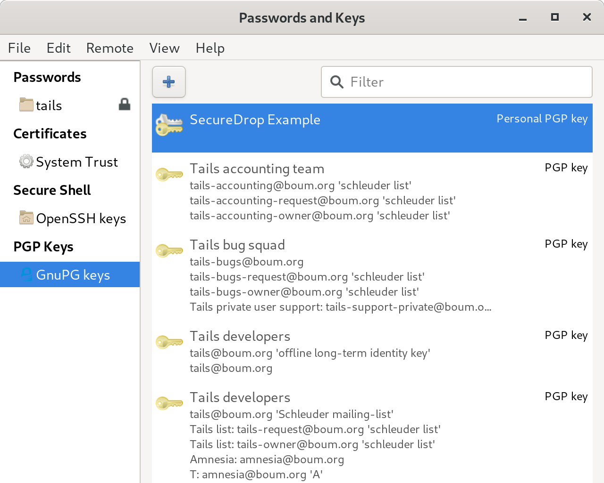
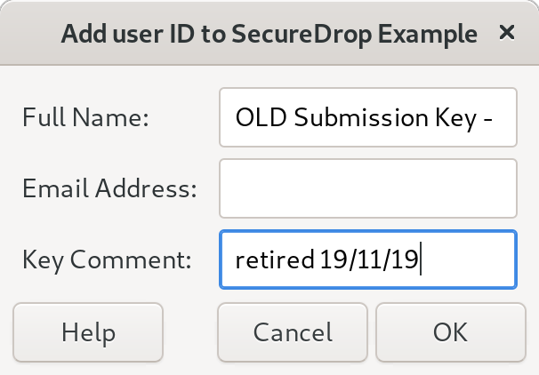
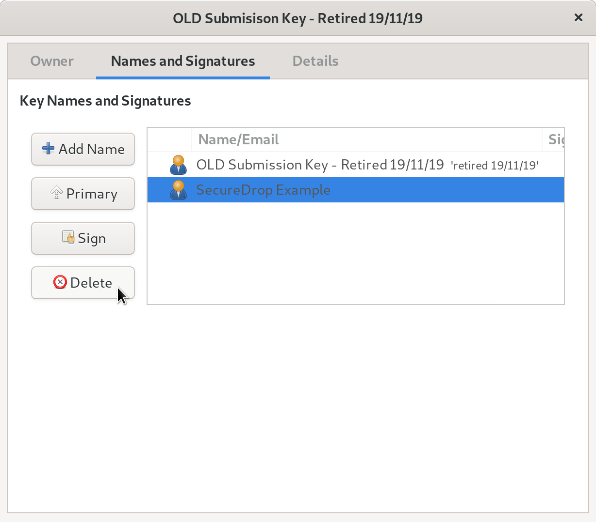
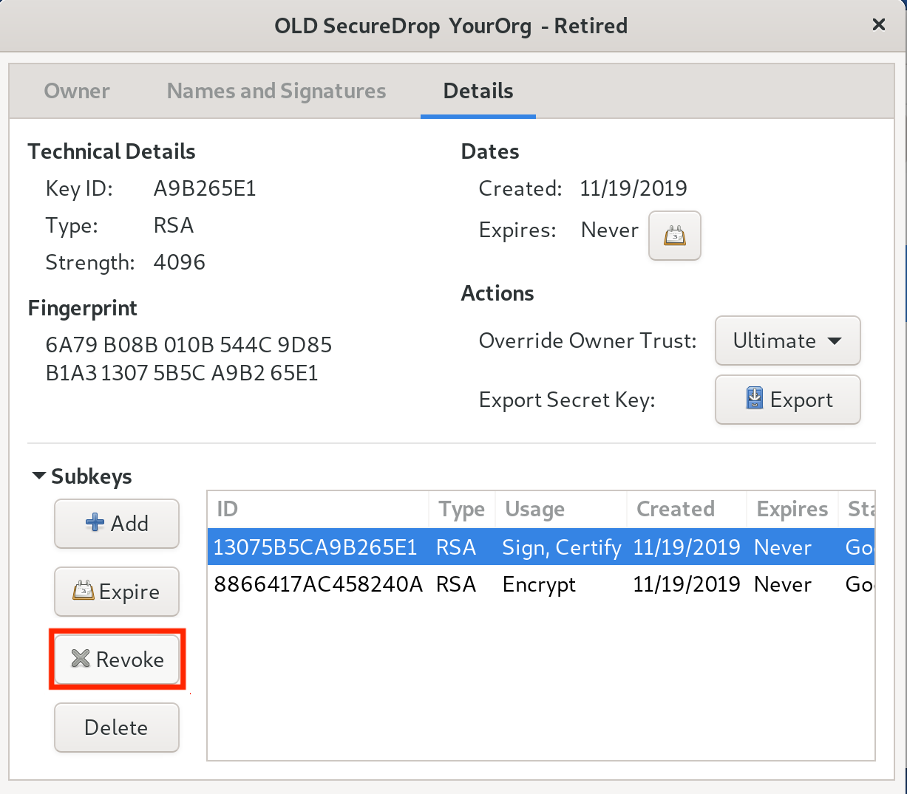

Off-board Administrators and Journalists
========================================

When journalists and SecureDrop administrators leave your organization, it is
important to off-board them from SecureDrop.

**What you need:**

- An *Admin Workstation*. :ref:`Contact SecureDrop Support <getting_support>` or
  follow our :doc:`guide to rebuilding an Admin Workstation <rebuild_admin>` if
  you do not have one.
- An admin account on the Journalist Interface

.. important:: Additional measures may need to be taken if the
   user's departure is on unfriendly terms. These measures will vary
   depending on the circumstances and your own internal incident response
   procedures, and may include doing a full reinstall of SecureDrop.
   If you are in such a situation, feel free to
   :ref:`contact us <getting_support>` for further assistance.

Off-boarding checklist
----------------------

- :ref:`Inform the SecureDrop Support <getting_support>` team that the user's
  support portal account should be deactivated, and indicate if any new staff
  members should be added.
- Delete the user's account on the *Journalist Interface*.
- Retrieve *Admin Workstation* or *Journalist Workstation* USB drive(s),
  *Transfer*, *Export*, and *Backup* drive(s), and any other SecureDrop
  hardware or materials.
- If the user receives email alerts (OSSEC alerts or daily submission
  notifications), either directly or as a member of an email alias, remove them
  from those alerts and :ref:`set up someone new <ossec_guide>` to
  :ref:`receive those alerts <daily_journalist_alerts>`.
- (Circumstance-dependent) If you have specific concerns that the *Submission
  Key* has been compromised, you should consider a full reinstall of
  SecureDrop. At minimum, you should :ref:`rotate the Submission Key
  <rotate_submission_key>`.

Additional steps for off-boarding administrators
------------------------------------------------

- If the departing user was your primary SecureDrop admin, designate the next
  person who will take over their function. Ideally, your outgoing
  administrator will be able to provide as much training as possible on the use
  and maintenance of the system, as well as on your organizational policies
  (such as backup strategies, and so on) before they leave; if this is not the
  case, :ref:`contact the SecureDrop Support team <getting_support>`.
- We do not recommend enabling remote management for SecureDrop's network
  firewall. However, if your SecureDrop firewall can be accessed remotely, even
  if only from within your organization's network, you may want to rotate its
  login credentials.
- Back up and :ref:`rotate the Admin Workstation SSH key <rotate_ssh_key>` to
  prevent unauthorized SSH access to the *Application* and *Monitor Servers* in
  the event that this user has retained their Admin SSH credentials.

.. _rotate_ssh_key:

Rotate SSH keys on the SecureDrop Servers
~~~~~~~~~~~~~~~~~~~~~~~~~~~~~~~~~~~~~~~~~

If you are concerned that the user may have a copy of the *Admin
Workstation* USB or that they may have kept a copy of the *Admin Workstation*
SSH key, you should rotate the key in the following manner.

#.  Create a new SSH keypair.
    From an *Admin Workstation*, run

    .. code:: sh

      ssh-keygen -t rsa -b 4096

    and make sure to change the key name. This is the only parameter you need
    to change. For example, instead of ``/home/amnesia/.ssh/id_rsa``, call the
    key ``/home/amnesia/.ssh/newkey``. You don't need a passphrase for the key.

#.  Copy new public key to the SecureDrop Servers.
    Copy the public portion of the key to the *Application* and *Monitor
    Servers* by running

    .. code:: sh

      scp /home/amnesia/.ssh/newkey.pub scp://app

    and

    .. code:: sh

      scp /home/amnesia/.ssh/newkey.pub scp://mon

#.  Add this key to the list of authorized keys.
    SSH to the *Application Server* and append this new key to the list of
    authorized keys by using

    .. code:: sh

      cat newkey.pub >> ~/.ssh/authorized_keys

    Be sure to use the command as above so that you append the key, instead of replacing the file. While you are still on the *Application Server*, you can then delete the file ``newkey.pub`` from wherever you scp'd it to (i.e. your home directory). Repeat this process with the *Monitor Server*.

#.  Rename SSH keys.
    Exit all SSH sessions and, on your *Admin Workstation*, rename ``id_rsa`` and ``id_rsa.pub`` (the old SSH keys) to something else. For example,

    .. code:: sh

      mv /home/amnesia/.ssh/id_rsa /home/amnesia/.ssh/id_rsa_old
      mv /home/amnesia/.ssh/id_rsa.pub /home/amnesia/.ssh/id_rsa_old.pub

    Then, rename your ``newkey`` and ``newkey.pub`` to ``id_rsa`` and ``id_rsa.pub``.

#.  Test SSH connection.
    Test that you can still ssh into the *Application and Monitor Servers* (you
    can test with ``ssh app host`` and ``ssh mon host``).

#.  Restrict SSH access to the new key.

      .. important:: If you have other users who also have SSH access to the
         *Application* and *Monitor Servers*, the next step will revoke their
         access. Their public keys will have to be re-appended to the
         ``authorized_keys`` file on each server, as in step 3.

   From an *Admin Workstation*, run

    .. code:: sh

      ~/Persistent/securedrop/securedrop-admin reset_admin_access

   This removes all other SSH keys, except for the new key that you are
   currently using, from the list of authorized keys on the *Application* and
   *Monitor Servers*.

.. _rotate_submission_key:

Rotate the *Submission Key*
---------------------------

The *Submission Private Key* is held on the airgapped *Secure Viewing Station*,
and is not normally accessed by SecureDrop users anywhere but on the *SVS*.
Therefore, we recommend rotating the *Submission Key* under the following
circumstances:

- If the user's departure was not amicable
- If the user is still holding on to any *Secure Viewing Station* USB drive or
  backup
- If you have any other reason to believe the *Submission Private Key* or the
  entire *Secure Viewing Station* USB may have been copied or compromised.

You should still keep the old key on the *Secure Viewing Station*, or else you
will not be able to decrypt submissions that were sent to you while that key
was in effect.

**You will need:**

- The *Admin Workstation*
- The *Secure Viewing Station*
- A *Transfer Device* (LUKS-encrypted USB drive)

On the Secure Viewing Station
~~~~~~~~~~~~~~~~~~~~~~~~~~~~~

#. First, change the UID of the current SecureDrop submission key to avoid
   mixing up the old and new keys.

   From the *Secure Viewing Station* Applications Menu, choose **Utilities ▸
   Passwords and Keys**, and select the SecureDrop Application Key from the
   list of available keys.

   |select securedrop key|

#. Double-click the key, and in the **Names and Signature** tab, add a name
   such as "OLD <Your Organization> SecureDrop Submission Key - Do Not Delete
   - Retired <Date>". (This is a local-only change to stop you from mixing up
   the old and new keys).

   |edit key name|

#. Once you have done that, you can delete the original name for the key (but
   not the key itself!), so that the only name you see is "OLD <Your
   Organization> Submission Key - Do Not Delete - Retired <Date>".

   |delete key name|

#. Now :doc:`follow the instructions <generate_submission_key>` to create a
   PGP key on the *Secure Viewing Station*. This will be your new *Submission
   Key.* Copy the fingerprint and new *Submission Public Key* to your
   *Transfer Device*.

On the Admin Workstation
~~~~~~~~~~~~~~~~~~~~~~~~

 .. important:: Ensure that your *Admin Workstation* is
    :doc:`up-to-date <update_tails_usbs>` before performing these steps.

#. Take the *Transfer Device* with the new *Submission Public Key* and
   fingerprint to your *Admin Workstation*. As you did during the initial
   install, copy the public key, ``SecureDrop.asc``, to the
   ``install_files/ansible_base/`` directory, replacing the existing public
   key file that is there.

#. From the ``~/Persistent/securedrop`` directory, run

    .. code:: sh

      ./securedrop-admin sdconfig

   If the new public key that you placed in ``install_files/ansible_base``
   has the same name as the old public key, ``SecureDrop.asc``, the
   only part of the configuration you will change is the SecureDrop
   *Submission Key* fingerprint, which you will update with the fingerprint
   of your new key.

#. Once you have completed the above, run

    .. code:: sh

     ./securedrop-admin install

   to push the changes to the server.

   You may want to immediately create a test submission, then use a
   Journalist account to log into the *Journalist Interface*, download
   your submission, and take it to the *Secure Viewing Station*.

Return to the Secure Viewing Station
~~~~~~~~~~~~~~~~~~~~~~~~~~~~~~~~~~~~

#. On the *Secure Viewing Station,* decrypt the test submission you made to
   ensure that your new key is working properly.

#. **Do not delete your old submission key!** You'll want to maintain it on
   the *SVS* so that you can still decrypt old submissions that were made
   before you changed keys. If you like, you can revoke the key by
   selecting the key in the **Passwords and Keys** application, opening the
   **Details** tab, highlighting the first key entry and clicking
   **Revoke**. This also makes local-only changes and does not stop you or
   anyone else from using the key, but it is a reminder that your key has
   changed.

   |revoke key|

#. If you have any other *Admin Workstations*, make sure that you have copied
   the new *Submission Public Key* into the ``install_files/ansible_base``
   directory, replacing the old public key file, and updated the *Submission
   Public Key* fingerprint by running

   .. code:: sh

    ./securedrop-admin sdconfig

   and updating the fingerprint when prompted. You do not have to run
   ``./securedrop-admin install`` again, since you have already pushed the
   changes to the server.

.. _getting_support:

Getting Support
---------------

If you have any questions about the steps in this guide, we're here to help:

.. include:: includes/getting-support.txt
