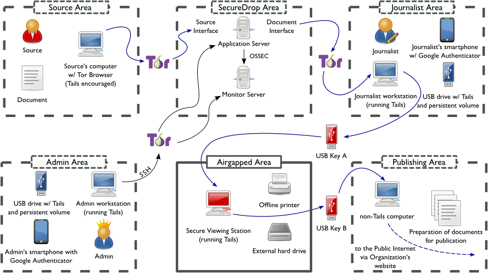

Overview
========

SecureDrop is an open-source whistleblower submission system that media
organizations can use to securely accept documents from and communicate with
anonymous sources. It was originally created by the late Aaron Swartz and is
currently managed by `Freedom of the Press Foundation
<https://freedom.press>`__.

.. tip:: Check out
          :doc:`What makes SecureDrop Unique <what_makes_securedrop_unique>`
          to read more about SecureDrop's approach to keeping sources safe.

Technical Summary
-----------------

SecureDrop is a tool for sources to communicate securely with journalists. The
SecureDrop application environment consists of three dedicated computers:

- *Secure Viewing Station*: 
   A physically-secured and air-gapped laptop running 
   the `Tails operating system`_ from a USB stick, that journalists use to
   decrypt and view submitted documents.
- *Application Server*: 
   An Ubuntu server running two segmented Tor hidden
   services. The source connects to the *Source Interface*, a public-facing Tor
   hidden service, to send messages and documents to the journalist. The
   journalist connects to the *Journalist Interface*, an `authenticated Tor
   hidden service
   <https://gitweb.torproject.org/torspec.git/tree/rend-spec-v2.txt#n851>`__, to
   download encrypted documents and respond to sources.
- *Monitor Server*: 
   An Ubuntu server that monitors the *Application Server*
   with `OSSEC <https://ossec.github.io/>`__ and sends email alerts.

These computers should all physically be in your organization's office.

In addition to these dedicated computers, each journalist will also need a 
computer to connect to SecureDrop:

- *Journalist Workstation:*
   The computer used by the journalist to connect to
   the *Journalist Interface* to download encrypted documents that they will
   transfer to the *Secure Viewing Station*. The *Journalist Workstation*
   is also used to respond to sources via the *Journalist Interface*. 

Depending on the news organization's threat model, the *Journalist Workstation*
can either be the journalist's every-day laptop or a dedicated computer. In 
either case, it is recommended that journalists always use the 
`Tails operating system`_ on their *Journalist Workstation* when connecting
to the *Journalist Interface*. 

SecureDrop administrators will also require a computer to connect to SecureDrop
and perform administrative tasks via SSH or the *Journalist Interface*.
This computer is referred to as the *Admin Workstation*, and must be capable of 
running the `Tails operating system`_. The *Admin Workstation* may also be used
as a *Journalist Workstation* if necessary.

.. note:: The SecureDrop installation guide includes documentation on setting up 
          Tails-based `Admin Workstation` and `Journalist Workstation` USB 
          sticks. It is strongly recommended that these be used in preference to
          other undocumented solutions.

.. _`Tails operating system`: https://tails.boum.org

.. _securedrop_architecture_diagram:

Infrastructure
--------------

There are four main components of SecureDrop: the servers, the admins,
the sources, and the journalists.

|SecureDrop architecture overview diagram|

Servers
~~~~~~~

At SecureDrop's heart is a pair of severs: the *Application (“App”) Server*,
which runs the core SecureDrop software, and the *Monitor (“Mon”) Server*,
which keeps track of the *Application Server* and sends out alerts if there's a
problem. These two servers run on dedicated hardware connected to a dedicated
firewall appliance. They are typically located physically inside the newsroom.

Admins
~~~~~~

The SecureDrop servers are managed by a systems admin; for larger
newsrooms, there may be a team of systems admins. The admin
uses a dedicated *Admin Workstation* running `Tails <https://tails.boum.org>`__,
connects to the *Application* and *Monitor Servers* over authenticated `Tor Hidden Services
<https://www.torproject.org/docs/hidden-services.html>`__, and manages them
using `Ansible <http://www.ansible.com/>`__.

Sources
~~~~~~~

A source submits documents and messages by using `Tor Browser
<https://www.torproject.org/projects/torbrowser.html>`__ (or Tails) to access
the *Source Interface*: a public Tor Hidden Service. Submissions are encrypted
in place on the *Application Server* as they are uploaded.

Journalists
~~~~~~~~~~~

Journalists working in the newsroom use two machines to interact with
SecureDrop. First, they use a *Journalist Workstation* running Tails to connect
to the *Journalist Interface*, an authenticated Tor Hidden Service. Journalists
download `GPG <https://www.gnupg.org/>`__-encrypted submissions and copy them
to a *Transfer Device* (a thumb drive or DVD). Those submissions are then
connected to the airgapped *Secure Viewing Station* (*SVS*) which holds the key
to decrypt them. Journalists can then use the *SVS* to read, print, and
otherwise prepare documents for publication. Apart from those deliberately
published, decrypted documents are never accessed on an Internet-connected
computer.

.. note:: The terms in italics are terms of art specific to SecureDrop. The
	  :doc:`Glossary <glossary>` provides more-precise
          definitions of these and other terms. SecureDrop is designed against
          a comprehensive :doc:`threat_model/threat_model`, and has a specific
          notion of the :doc:`roles <glossary>` that are involved in its
          operation.

Operation
---------

Planning & Preparation
~~~~~~~~~~~~~~~~~~~~~~

Setting up SecureDrop is a multi-step process. Before getting started, you
should make sure that you're prepared to operate and maintain it. You'll need
a systems admin who's familiar with Linux, the GNU utilities, and the
Bash shell. You'll need the :doc:`hardware <hardware>` on which SecureDrop
runs — this will normally cost $2000-$3000. The journalists in your
organization will need to be trained in the operation of SecureDrop, and
you'll need to publish and promote your new SecureDrop instance afterwards —
using your existing websites, mailing lists, and social media.

It is recommended that you have all of this planned out before you get started.
If you need help, contact the `Freedom of the Press Foundation
<https://securedrop.org/help>`__ who will be glad to help walk you through
the process and make sure that you're ready to proceed.

Technical Setup
~~~~~~~~~~~~~~~

Once you are familiar with the architecture and have all the hardware,
:doc:`setting up SecureDrop <install>` will take at least a day's work for your
admin. We recommend that you set aside at least a week to
:ref:`complete and test <Deployment>` your setup.

Provisioning & Training
~~~~~~~~~~~~~~~~~~~~~~~

Once SecureDrop is installed, journalists will need to be provided with
accounts, two-factor tokens, workstations, and so on — and then
:doc:`trained <training_schedule>` to use these tools safely and reliably. You
will probably also need to train additional backup admins so that you
can be sure that your SecureDrop setup keeps running even when your main
admin is on holiday.

Introducing staff to SecureDrop takes half a day. Training a group to use
SecureDrop proficiently takes at least a day — and a single trainer can only
work with so many people at once. You will probably need to run several
training sessions to instruct an entire newsroom. Depending on staff
availability, training and provisioning may take a week or more. If you have
multiple offices, training will need to happen at each location. Again, the
`Freedom of the Press Foundation <https://securedrop.org/help>`__ are happy to
help you plan and train your team.

Going Public
~~~~~~~~~~~~

Once you have a SecureDrop instance and your team knows how to use it, you
should test it thoroughly and then tell the world. The `Freedom of the Press
Foundation <https://securedrop.org/help>`__ are happy to help you check that
your SecureDrop setup is up-to-code and properly grounded. After that you'll want
to check out the :ref:`best practices <Landing Page>` for your
SecureDrop *Landing Page* and our guide to
:doc:`promoting your SecureDrop instance <getting_the_most_out_of_securedrop>`.

