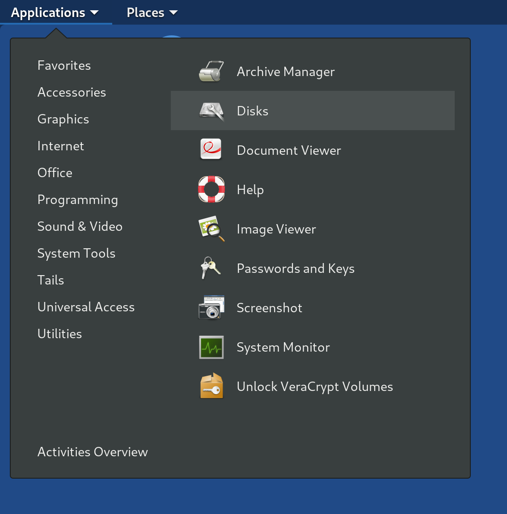
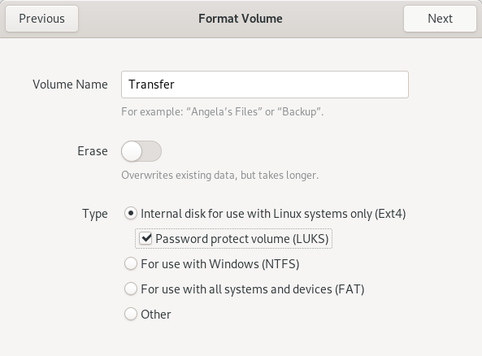

Set Up the *Transfer Device* and the *Export Device*
====================================================

Journalists copy submissions from their *Journalist Workstation* to the
*Secure Viewing Station* using the *Transfer Device*.

For exporting submissions from the *Secure Viewing Station*, we recommend using
a secure printer or a similar analog conversion process wherever possible. For
cases where an electronic file transfer is necessary, we recommend setting up
an *Export Device*, separate from the *Transfer Device*.

.. important::

   **Understand the security risks of working with files in digital form**

   After downloading a submission on the *Journalist Workstation*, a journalist
   will copy it to the *Transfer Device* and carry it to the air-gapped
   *Secure Viewing Station* to decrypt and review it. If the journalist then
   copies the decrypted file in its original form to an Internet-connected
   computer, they may expose themselves, their colleagues, or their sources to
   significant risks, e.g.:

   - A submission may be infected with malware targeting your newsroom.

   - If your *Secure Viewing Station* has not been updated in a while, it may have
     software vulnerabilities an attacker can exploit, e.g., to exfiltrate the
     *Submission Private Key* alongside a legitimate submission.

   - The submission may contain metadata identifying the source which has not
     yet been cleaned up.

   These risks are not specific to SecureDrop. They're inherent to dealing with
   tips sent in digital form.

   This is why we place the strongest emphasis on always picking the most secure
   available export method for a given submission. Printing documents or
   re-recording audio and video files can eliminate most categories of malware
   and metadata (`QR code malware <https://securedrop.org/news/security-advisory-do-not-scan-qr-codes-submitted-through-securedrop-connected-devices/>`__
   and `tracking dots <https://en.wikipedia.org/wiki/Machine_Identification_Code>`__
   being the most notable exceptions).

   If and when you do need to copy decrypted files in electronic form, the
   recommendations below are intended to establish a baseline of security.
   Please consider these recommendations in the context of your own threat
   model, and do not hesitate to contact us via securedrop@freedom.press
   (`GPG encrypted <https://securedrop.org/sites/default/files/fpf-email.asc>`__)
   if we can help.

Choose media types and encryption
---------------------------------
You will need to decide what storage media to use for the *Transfer Device* and
the *Export Device*, and which encryption scheme to apply to each device. There
are many options to consider: USB flash drives, write-once media like CD-Rs and
DVD-Rs, external hard drives, and so on.

The following recommendation is intended to balance security, usability and cost
considerations, and you may want to modify it based on your threat model:

- Use USB flash drives for both the *Transfer Device* and the *Export Device*.

- Encrypt the *Transfer Device* using LUKS, which works in the Tails environment
  and in other Linux environments.

- Encrypt the *Export Device* using VeraCrypt, which works across platforms.

If you follow this recommendation, it is important that the contents of the
*Transfer Device* and the *Export Device* are always wiped after a copy operation
is completed.

.. note::

   You may want to purchase a USB device with a physical write protection switch
   for the *Export Device*, to enforce write protection whenever it is attached
   to an Internet-connected everyday workstation. This ensures that malware
   cannot spread from infected computers in your network to the *Secure Viewing
   Station*.

   Another option is to purchase a hardware USB `write blocker <https://forensicswiki.xyz/wiki/index.php?title=Write_Blockers>`__
   as used in forensics, and enforce its usage whenever the *Export Device* is
   attached to an Internet-connected workstation.

Write-once media like CDs and DVDs can be a reasonable alternative to this
setup. If you implement a workflow based on CDs or DVDs, it is crucial that they
are destroyed immediately after use. While you can find CD/DVD destroyers at a
relatively low cost, those built to the highest standards of security sell in
the $2,500 to $3,000 price range as of 2019.

Decide how to manage encryption passphrases
-------------------------------------------
Because files are copied between multiple computers, KeePassXC in Tails is not
necessarily the most convenient option for managing the encryption passphrases for
your *Transfer Device* or your *Export Device*. While Tails itself gives you the
option to "remember" passphrases, this option does not work across reboots.

A simple alternative is to make sure that every journalist stores the
*Transfer Device* and *Export Device* passphrases in their own password manager,
which ideally will synchronize to their smartphone. See the Freedom of the Press
Foundation guide for `choosing a password manager <https://freedom.press/training/blog/choosing-password-manager/>`__
if you are not currently using one.

.. tip::

   The user will have to enter this passphrase repeatedly. For this reason, we
   recommend using `diceware <https://en.wikipedia.org/wiki/Diceware>`__ instead
   of random character sequences that are difficult to type. If your password
   manager does not support generating diceware passphrases, see the
   `EFF guide <https://ssd.eff.org/en/module/creating-strong-passwords#1>`__
   for information on how to do it yourself.

Create USB *Transfer Device*
----------------------------

The easiest and recommended option for a *Transfer Device* is a USB
drive. If you have a large team of journalists you may want to :doc:`create
several <onboarding>` of these. Here we'll just walk through
making one *Transfer Device* [#]_.

.. note:: This process will destroy all data currently on the drive.

First, label your USB drive “SecureDrop Transfer Device”.

On the *Secure Viewing Station*, open the
**Applications** menu in the top left corner and select
**Utilities** then |Disk Utility icon| **Disks**:

|screenshot of the Applications menu in Tails, highlighting Disk
Utility|

Connect your *Transfer Device* then pick your device in the menu on
the left. Since we're going to destroy all the data on this drive, it's
important that you pick the right drive. It should be named something
that sounds similar to the manufacturer's label on the outside of the
drive, and it will only appear after you plug it in. Double check that
you have clicked on the correct drive:

|screenshot of Disk Utility application|

Once you're sure you have the right drive, click the interlocking gears, then
**Format Partition...**.

.. note:: If there are multiple existing partitions on the drive, you should
          first click the "-" icon on the left of the interlocking gears icon to
          delete each partition, and then create another partition that fills
          all free space with the options as shown below.

|screenshot of the menu to create a new partition in the Disk Utility
application|

Give the partition on your *Transfer Device* a descriptive name
like “Transfer Device” and select the options as in the following screenshot:

|screenshot of partition format options|

You will then be prompted to set a password. As noted earlier, we recommend
storing this passphrase in the password manager for every user who will copy files
using the *Transfer Device*, not in KeePassXC. Because users will have to type in
this passphrase every time they mount the *Transfer Device* in Tails, we recommend
using a `diceware <https://en.wikipedia.org/wiki/Diceware>`__ passphrase.

|screenshot of passphrase selection prompt in the Disk Utility
application|

After typing in the passphrase, click **Format** to continue. The Disks utility
will ask you if you are sure: click **Format** to continue. After a few seconds,
your new *Transfer Device* should be ready for use. If you haven't already, make
sure to label it.

.. |Disk Utility icon| image:: images/icons/disk-utility.png

.. |screenshot of Disk Utility application| image:: images/screenshots/disk-utility.png
.. |screenshot of the menu to create a new partition in the Disk Utility application| image:: images/screenshots/create-partition.png

.. |screenshot of passphrase selection prompt in the Disk Utility application| image:: images/screenshots/create-passphrase.png

.. [#] Tails screenshots were taken on Tails 4.0.0. Please make an issue on
       GitHub if you are using the most recent version of Tails and the
       interface is different from what you see here.

Create a USB *Export Device*
----------------------------
We recommend using a fully encrypted USB drive for copying files off the
*Secure Viewing Station*. This is even more important than for the
*Transfer Device*, as the risk of accidentally leaving decrypted files on the
*Export Device* is significant.

Because the *Export Device* will need to be mounted on both Tails and the
journalist's everyday workstation, you will need to use an encryption scheme
that works on both operating systems.

We recommend the use of VeraCrypt. It is actively maintained cross-platform
software that has been independently audited and is free to use.

VeraCrypt-encrypted media can be opened in the Tails operating system and on
common Linux distributions without installing additional software. To open
VeraCrypt media on Windows or Mac workstations, or to create VeraCrypt drives,
you need to install the VeraCrypt software. The `guide by Freedom of the Press
Foundation <https://freedom.press/training/encryption-toolkit-media-makers-veracrypt-guide/>`__
provides instructions for encrypting storage media using VeraCrypt.

Keep in mind that each journalist using a Windows or Mac workstation will need
to have the VeraCrypt software installed on their computer to access the encrypted
*Export Device*.

.. note::

   We recommend against installing the VeraCrypt software on the
   *Journalist Workstation*, the *Admin Workstation* or the *Secure Viewing Station*.
   The software installed in the persistent volume of these Tails drives should
   be kept to a minimum. You do not need to install the software to *decrypt*
   VeraCrypt drives on these workstations, and you can *create* them from
   another computer.

   Larger organizations may want to consider setting up a controlled environment
   for creating VeraCrypt-encrypted *Export Devices* and providing them to
   journalists, to ensure that each drive is provisioned in a secure manner.

As with the *Transfer Device*, we recommend storing the passphrase in the
password manager of each user who will use a given *Export Device*.

Hardware-encrypted USB drives can be a reasonable alternative to VeraCrypt.
We cannot currently offer a specific recommendation, but please bear in mind
that the drive must work across platforms (including Tails). We recommend
selecting a vendor that has fully opened the source code and specifications of
their devices and encouraged third party audits.

Limiting write access
~~~~~~~~~~~~~~~~~~~~~
If you re-use the same *Export Device* for multiple copy operations, there is
the risk of introducing malware to the *Secure Viewing Station* from your
network. Depending on your threat model, there are steps you may want to take to
mitigate that risk.

One option is to restrict write access to the *Export Device* before it is
plugged into a device other than the *Secure Viewing Station*. Some USB flash
drives come with a physical write protection switch, and `write blockers <https://forensicswiki.xyz/wiki/index.php?title=Write_Blockers>`__
are used in forensics to ensure storage media are not modified during
examination.

Full-size SD cards also come with physical write protection switches. However,
this write protection is fully host-based (the host operating system can choose
to ignore it), and should therefore be considered less secure against
sophisticated malware.

.. tip::

   For defense in depth, consider implementing a similar write protection
   strategy for the *Transfer Device* (enabling write protection before
   attaching the *Transfer Device* to the *Secure Viewing Station*).

Please see our :ref:`guide to working with documents <working_with_documents>`
for additional recommendations regarding malware mitigation.
