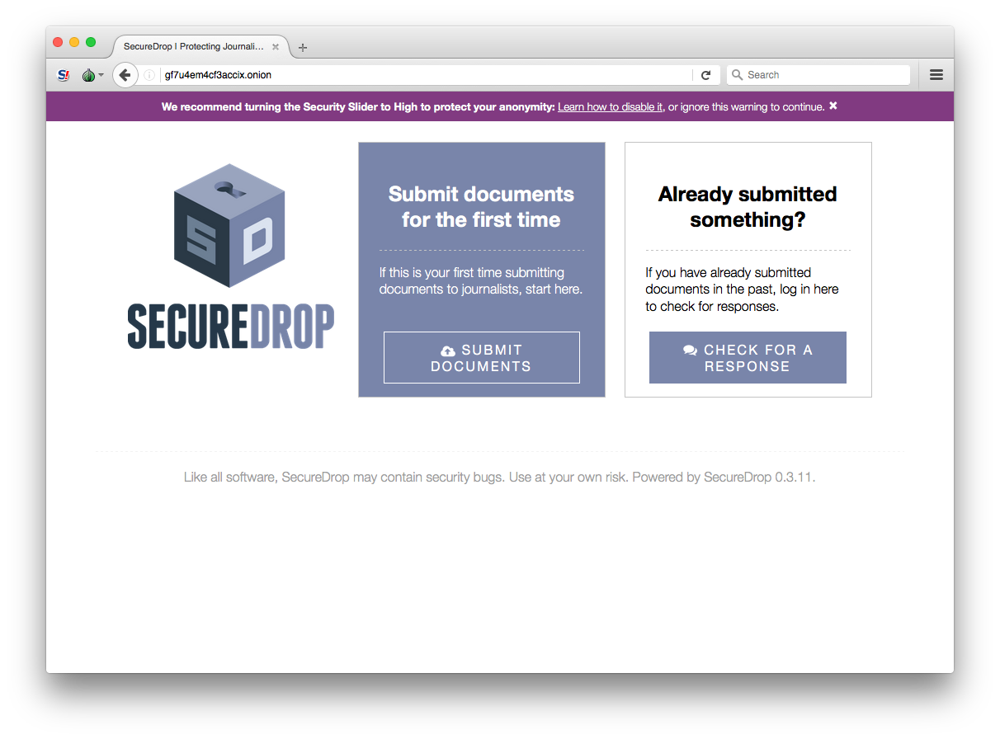
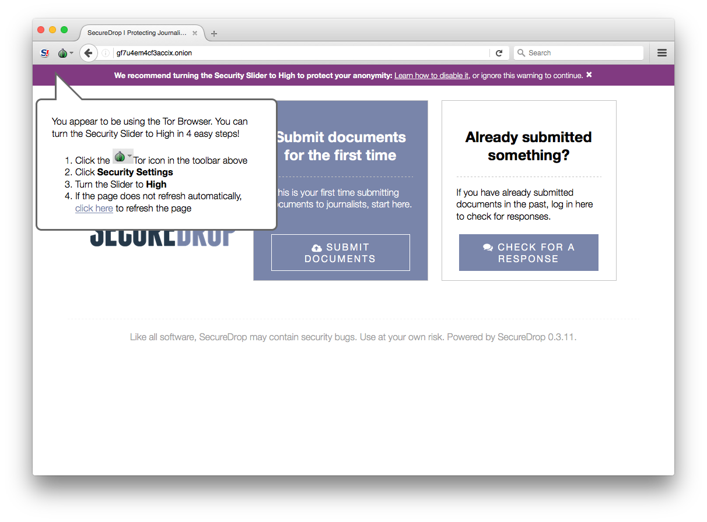
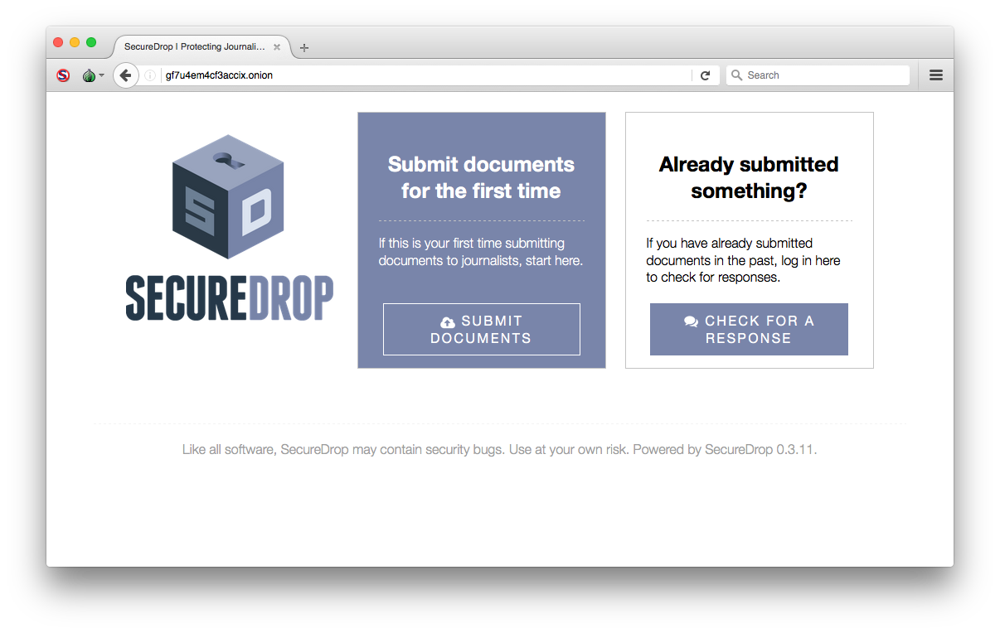
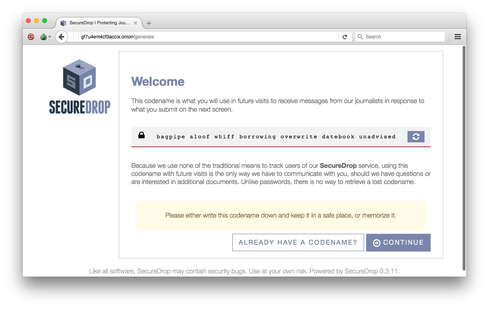
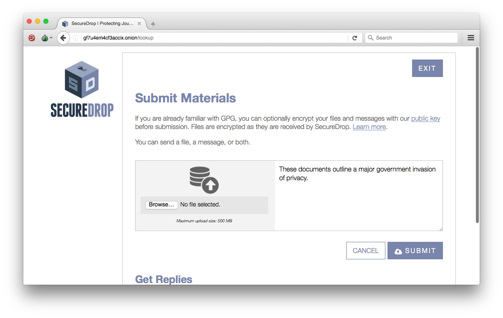
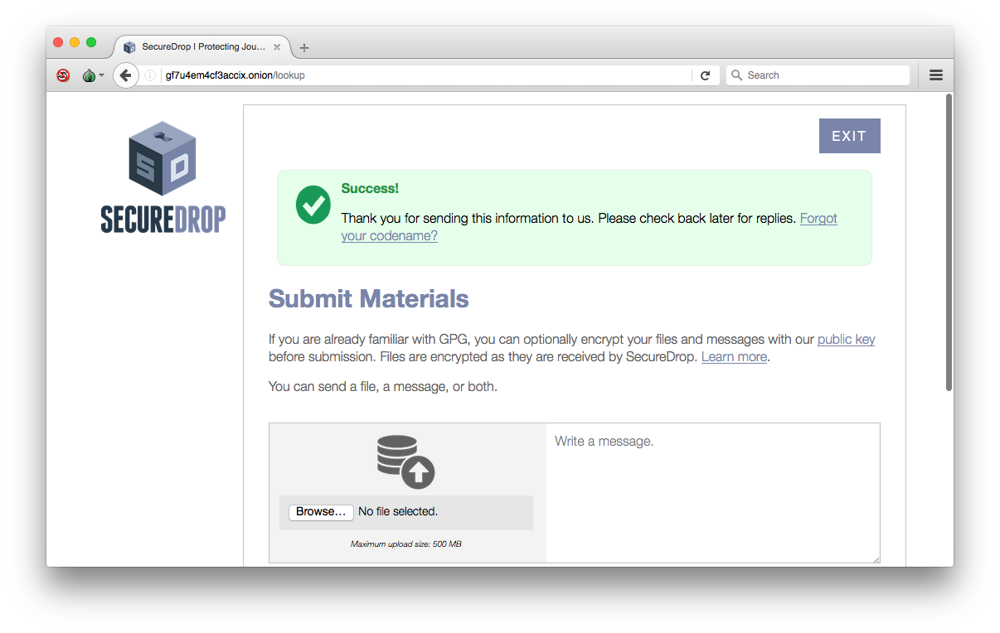
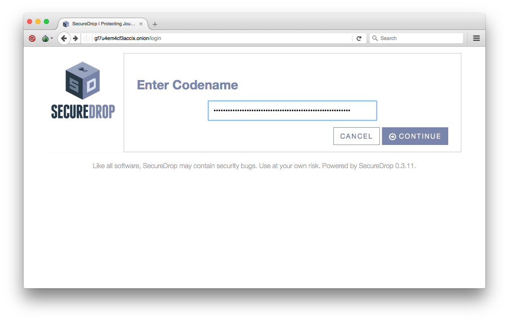
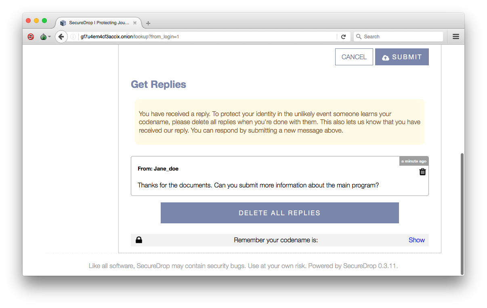
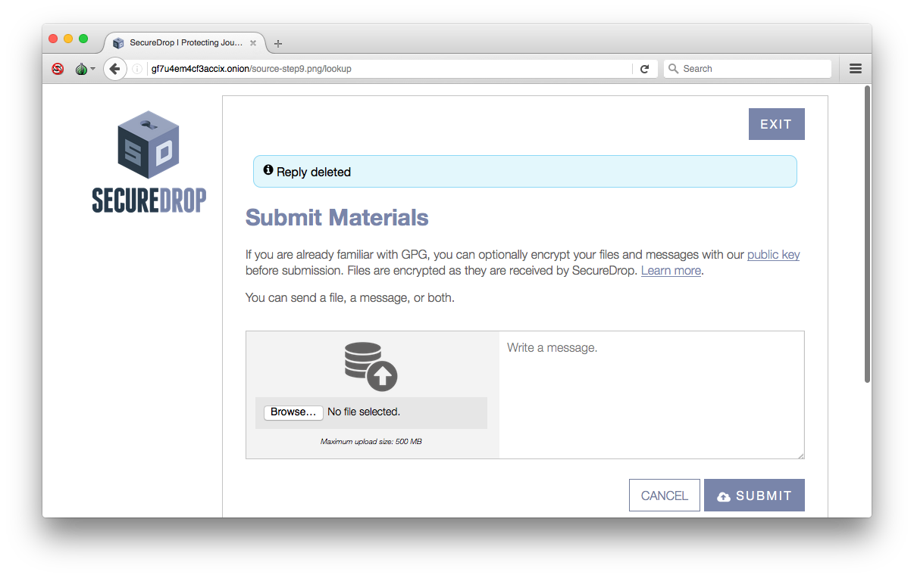
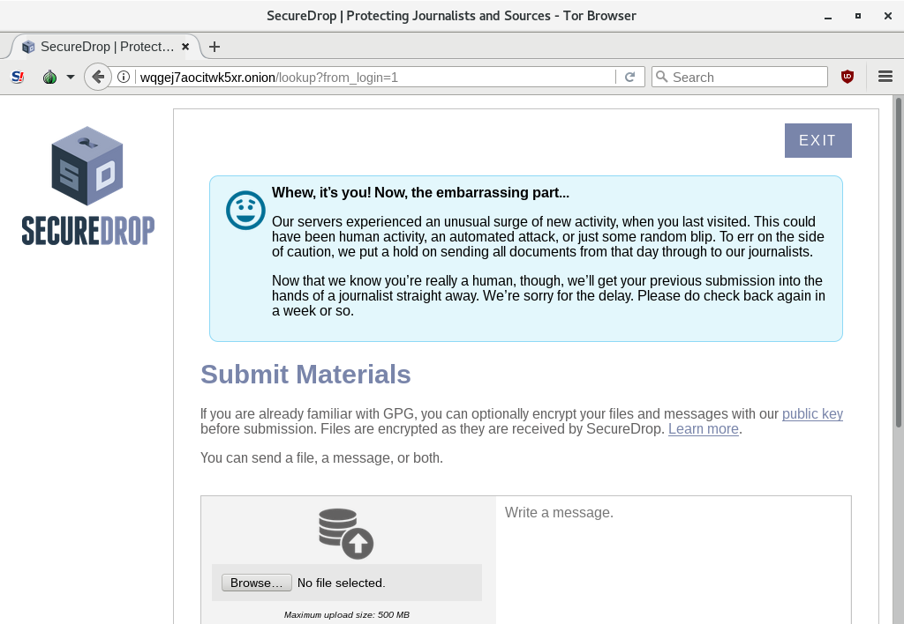

Source Guide
============

.. todo:: There's a lot more to it than this, but then we begin to
          duplicate content from individual organization's landing
          pages and Micah's Intercept article. For example: what
          computer should you use? what network should you be on? etc.

	  
Choose who to submit to
-----------------------

There are currently over 20 organizations running SecureDrop. Each instance is totally independent, and submissions to that instance are only available to journalists associated with that organization.

All organizations have a *landing page* that provides their own organization-specific recommendations for using SecureDrop. We encourage you to consider an organization's landing page before submitting to them.

Most organizations make their landing page prominently accessible from their main website's homepage. You can also find an incomplete list of organizations accepting submissions through SecureDrop on the `SecureDrop Directory`_ maintained by Freedom of the Press Foundation.

.. _`SecureDrop Directory`: https://securedrop.org/directory

Get the Tor Browser
-------------------

.. todo:: There is a classic chicken and egg problem with encouraging
   sources to use Tor. If their network traffic is already being
   monitored (e.g. at their workplace by the IT department, at their
   home by their ISP, anywhere by FVEY...), and they don't know to use
   Tor from the start (like Snowden did), then their initial interest
   in using SecureDrop might be enough to make them a target. One
   partial mitigation might be to make this section the first section
   in this document, and encourage them to "stop, drop, and Tor
   Browser" before continuing or clicking any more links.

Each SecureDrop instance has a publicly available *Source Interface*: a website where sources can create anonymous accounts, submit files and messages, and check back for replies.

Each Source Interface is only available as a *Tor Hidden Service*, which is a special type of website with an address ending in ".onion" that is only accessible through Tor. Tor is an anonymizing network that makes it difficult for anybody observing the network to associate a user's identity (e.g. their computer's IP address) with their activity (e.g. uploading information to SecureDrop).

The easiest and most secure way to use Tor is to download the Tor Browser Bundle from the `Tor Project website`_. This bundle includes the Tor Browser, a modified version of the Firefox web browser designed to protect your security and anonymity while using Tor.

Once you have the Tor Browser, launch it and enter the ".onion" address for the Source Interface of the organization that you wish to submit to. You can find this address on the organization's landing page, or listed on the SecureDrop Directory.

While using the Tor Browser on your personal computer helps hide your activity on the network, it leaves traces (of its own installation) on your local machine. For even more deniability, we recommend booting into a live system such as `Tails`_ for a higher level of security. Tails is specifically designed to run on your computer without leaving traces of your activity, and automatically routes all of your Internet browsing through Tor so you can easily access SecureDrop safely.

.. _`Tor Project website`: https://www.torproject.org/
.. _`Tails`: https://tails.boum.org/

Making your First Submission
----------------------------

Open the Tor Browser and navigate to the .onion address for the SecureDrop Source Interface you wish to make a submission to. The page should look similar to the screenshot below, although it will probably have a logo specific to the organization you are submitting to.

|Source Interface With Javascript Enabled|

If this is the first time you're using the Tor browser, it's likely that you have Javascript enabled. If you do, there will be a red warning banner at the top of the page that encourages you to disable it.

Click the ``Learn how to disable it`` link in the warning banner and a message bubble will pop up explaining how to disable Javascript. Follow the instructions and the page should refresh automatically. Note that this will disable Javascript for every page in your Tor Browser, and this setting will persist across browser sessions.

|Fix Javascript warning|

The page should now look similar to the screenshot below. If this is the first time you are using SecureDrop, click the ``Submit Documents`` button.

|Source Interface with Javascript Disabled|

You should now see a screen that shows the unique codename that SecureDrop has generated for you. In the example screenshot below the codename is ``sink los radium bcd nab privy nadir``, but yours will be different. It is extremely important that you both remember this code and keep it secret. After submitting documents, you will need to provide this code to log back in and check for responses.

The best way to protect your codename is to memorize it. If you cannot memorize it right away, we recommend writing it down and keeping it in a safe place at first, and gradually working to memorize it over time. Once you have memorized it, you should destroy the written copy.

SecureDrop allows you to choose the length of your codename, in case you want to create a longer codename for extra security. Once you have generated a codename and put it somewhere safe, click ``Continue``.

|Memorizing your codename|

You will next be brought to the submission interface, where you may
upload a document, enter a message to send to journalists, or both. You
can only submit one document at a time, so you may want to combine
several files into a zip archive if necessary. The maximum submission
size is currently 500MB. If the files you wish to upload are over that
limit, we recommend that you send a message to the journalist explaining
this, so that they can set up another method for transferring the
documents.

When your submission is ready, click ``Submit``.

|Submit a document|

After clicking ``Submit``, a confirmation page should appear, showing
that your message and/or documents have been sent successfully. On this
page you can make another submission or view responses to your previous
messages.

|Confirmation page|

Continuing the Conversation
---------------------------

If you have already submitted a document and would like to check for
responses, click the ``Check for a Response`` button on the media
organization's SecureDrop homepage.

|Source Interface with Javascript Disabled|

The next page will ask for your secret codename. Enter it and click
``Continue``.

|Check for response|

If a journalist has responded, his or her message will appear on the
next page. This page also allows you to upload another document or send
another message to the journalist. Be sure to delete any messages here
before navigating away.

|Check for a reply|

After you delete the message from the journalist, make sure you see the
below message.

|Delete received messages|

If the server experiences a large number of new sources signing up at
once and is overloaded with submissions, the journalist will flag your
message on their end and you will see the message below. They can't
write a reply to you until you've seen this message for security
reasons. This will only happen the first time a journalist replies and
with subsequent replies you will skip this step. Click ``Refresh`` or
log in again to see if a journalist has responded.

|Check for an initial response|

Repeat these steps to continue communicating with the journalist.

