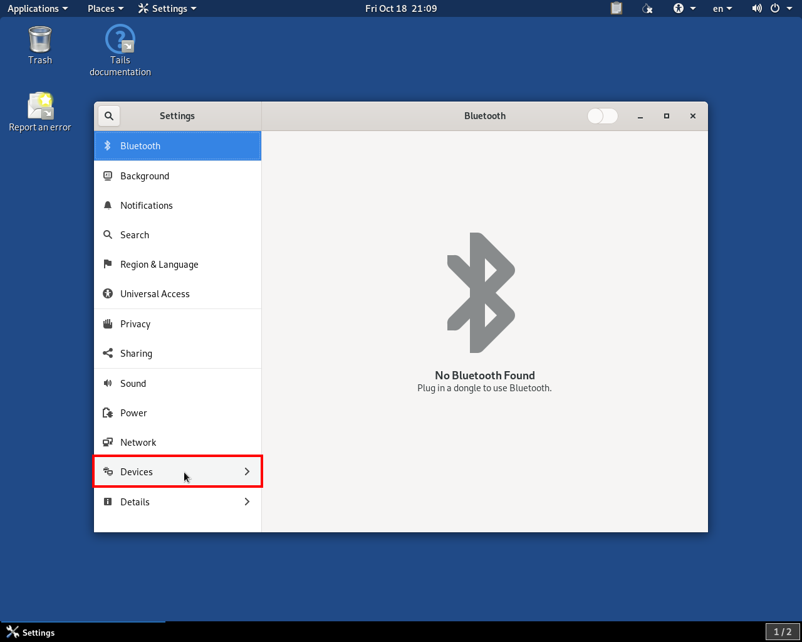

.. _printer_setup_in_tails:

Setting Up a Printer in Tails
=============================

Because Tails is supposed to be as **amnesiac** as possible, you want to
shield your Tails stick from any extra inputs from, and outputs to, a
potentially untrusted network. This is why **we strongly recommend using
a printer that does not have WiFi or Bluetooth**, and connecting to it
using a regular USB cable to print.

Finding a printer that works with Tails can be challenging because Tails is
based on the Linux operating system, which often has second-class hardware
support in comparison to operating systems such as Windows or macOS.

We :ref:`maintain a list of printers <printers_tested_by_fpf>` that we have
personally tested and gotten to work with Tails, in the Hardware guide; if
possible, we recommend using one of those printers. The Linux Foundation also
maintains the `OpenPrinting database <https://www.openprinting.org/printers>`_,
which documents the compatibility, or lack thereof, of numerous printers from
almost every manufacturer.

.. note:: The latest generations of printers might or might not be represented
          by the OpenPrinting database; also, the database does not document
          whether or not a printer is wireless, so this will involve manually
          checking models of interest, if you wish to use this resource as a
          guide for purchasing a non-wireless printer suitable for use with
          SecureDrop.

With that in mind, this database is arguably the best resource for researching
the compatibility of printers with Linux. As a tip for narrowing down your
search, look for printers that are compatible with Debian, or Debian-based
distributions like Ubuntu, since Tails itself is also Debian-based. This might
increase the chances for a seamless installation experience in Tails.

In any case, this document outlines the usual set of steps that we follow when
attempting to use a new printer with Tails.

Installing and Printing via the Tails GUI
-----------------------------------------

Let's look at the flow in Tails 4 for installing a USB-connected printer.
On the Tails welcome screen, unlock your persistent volume, and
`set an admin password <https://tails.boum.org/doc/first_steps/startup_options/administration_password/index.en.html>`__.
This ensures that you won't have to reinstall the printer each time you start
Tails.

Connect the printer to your Tails-booted computer via USB, then turn the printer
on.

Now, you'll want to single-click your way through **Applications** ▸
**System Tools** ▸ **Settings** ▸ **Devices** ▸ **Printers**. The screenshot
below highlights the "Devices" section in which the printer settings can be
found:

|select devices from settings|

If this is the first time you've tried to install a printer, the "Printers"
section will look like this:

|add printer|

Click **Add a Printer**. After a brief period during which Tails searches for
printers, you should see a list of printers that Tails has auto-detected:

|select printer to add|

In this example, we've connected an HP ENVY-5530 (not a model we recommend for
production use). Clicking on this printer will select it for installation. The
installation can take a few seconds, during which it looks like nothing is
happening.

Assuming you receive no errors in this process, you will then see a screen like
the following one, which indicates that the printer is ready for printing.

|printer ready|

Printing from the Command Line
------------------------------

After you have configured your printer, you can also easily print from the
command line using the ``lp`` command. If you haven't already set your installed
printer as default in the GUI, you can quickly do so by adding this line to your
``~/.bashrc`` file, or entering this directly into the terminal:

.. code:: sh

   export PRINTER=Printer-Name-Here

If you need to find the name of the printer, you can use ``lpstat`` to get a
list of installed printers, as such:

.. code:: sh

   lpstat -a

Once you've set your default printer, you can easily print from the terminal by
using the following syntax:

.. code:: sh

   lp filename.extension

While printing from the GUI is much easier, once you've got everything set up,
it's equally straightforward from the command line, if you prefer that
environment.

.. |select printer to add| image:: images/printer_setup_guide/select_printer_to_add.png

.. |printer ready| image:: images/printer_setup_guide/printer_ready.png
.. |add printer| image:: images/printer_setup_guide/add_printer.png
