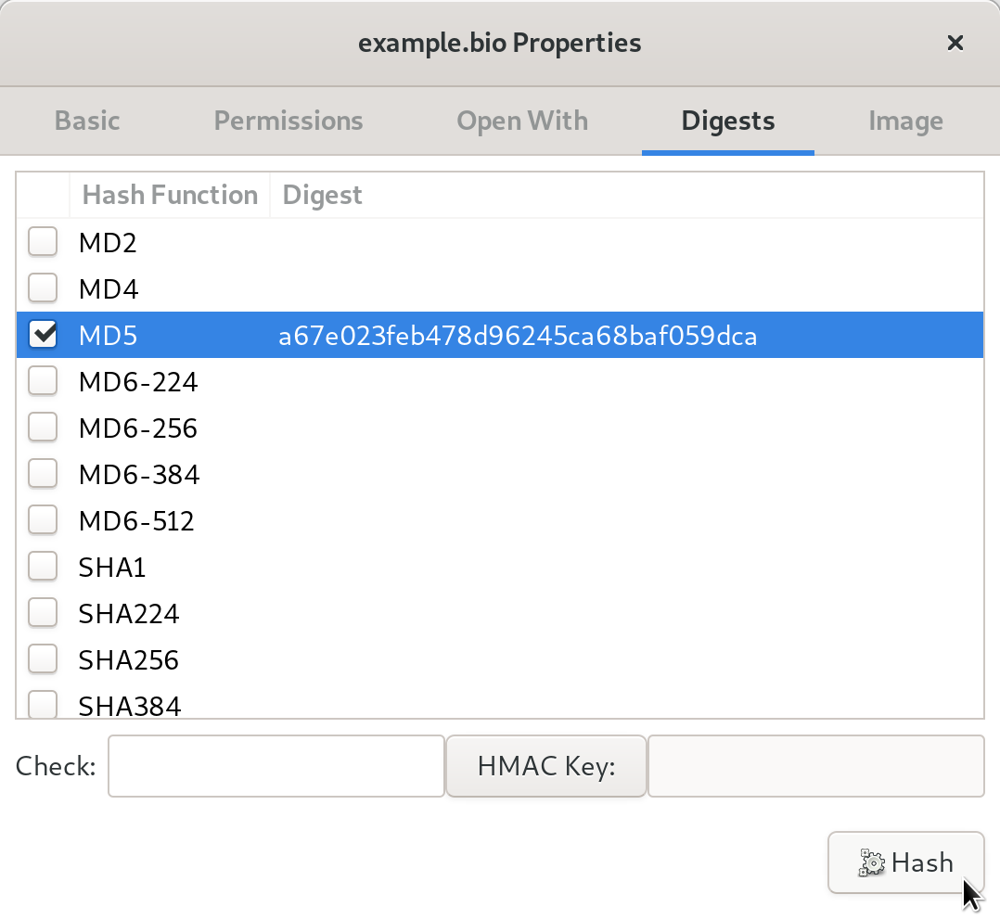

BIOS Updates on the Servers
===========================

Below are the steps for updating the BIOS on the *Application* and *Monitor
Servers*. We provide instructions for Intel NUC devices, in accordance with
:ref:`our hardware recommendations <Hardware Recommendations>`. You should also
update the BIOS on other computers such as the *Admin Workstation,* but those
instructions will vary depending on the manufacturer and model of your device.

What you need
~~~~~~~~~~~~~

  #. A clean USB device to download the ``.bio`` file
  #. An internet-connected workstation, such as the *Admin Workstation*
  #. A UPS (uninterrupted power supply), such as a surge-protecting power supply with a backup battery (This is not required, but strongly recommended)
  #. A keyboard and monitor

Perform Backups
~~~~~~~~~~~~~~~

Before performing any updates on the servers, we recommend you :doc:`back up the Application Server <backup_and_restore>`.

Prepare the USB Stick
~~~~~~~~~~~~~~~~~~~~~~~

Using the Disks application, delete existing partitions on the USB device, if applicable, and reformat the entire device with one FAT32 partition. Note that you will lose access to all existing data on this USB stick.

Download and Verify Appropriate .bio Files
~~~~~~~~~~~~~~~~~~~~~~~~~~~~~~~~~~~~~~~~~~

For Intel NUC Devices
``````````````````````
Check the make and model of your servers.

  .. note:: We will be following the F7 BIOS update method, `as documented by Intel (available as a PDF)`_.

Proceed to the Intel Download Centre to download the correct file. Each make and model of Intel NUC will offer various file types; select the ``.bio`` option.

  .. warning:: Do not download BIOS updates from anywhere other than the manufacturer's website. Be sure that you are `on the correct website`_ and that it has a valid SSL Certificate. Intel's SSL Certificate is issued to \*.intel.com and signed by DigiCert. Be sure you download the files specific to the model of your servers.

Intel provides an md5 checksum on the download page. Once you have downloaded the ``.bio file``, using the **Files** application, browse to the file, right click and select **Properties** ▸ **Digests**, select MD5, and click Hash. Compare the result in the Digest column to the md5 sum listed on Intel's website. If these two values do not match, do not proceed, and contact support@freedom.press. Tails `provides a detailed explanation of this process`_. (Note that the hash in the screenshot below is an example only, and will not match your specific ``.bio`` file.)

|gtkhash tails|

Once you have verified the hash, copy the .bio file to your USB device.

.. _`as documented by Intel (available as a PDF)`: https://www.intel.com/content/dam/support/us/en/documents/mini-pcs/Visual-BIOS-Update-NUC.pdf

.. _`provides a detailed explanation of this process`: https://tails.boum.org/doc/encryption_and_privacy/checksums/index.en.html

.. _`on the correct website`: https://downloadcenter.intel.com/




Update the BIOS
~~~~~~~~~~~~~~~

Power off the *Monitor Server*. We recommend plugging it into an uninterrupted power supply (UPS). Plug in the keyboard, monitor, and USB key, and power on the server, then press F7 when prompted to enter the BIOS Update tool.

Select the USB device and navigate to the ``.bio`` file you have downloaded, then hit **Enter**. The update will take several minutes--do not interrupt the update or unplug the server during this time.

Repeat these steps on the *Application Server*. These steps are also available `on Intel's website (PDF)`_.

.. _`on Intel's website (PDF)`: https://www.intel.com/content/dam/support/us/en/documents/mini-pcs/Visual-BIOS-Update-NUC.pdf
