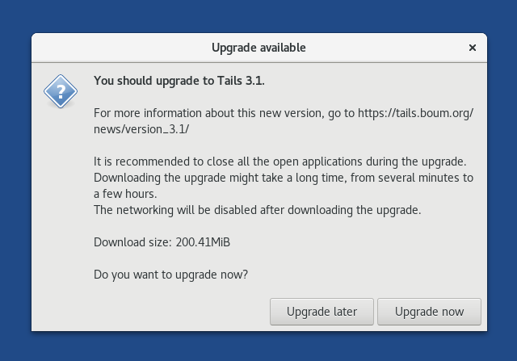

Updating Tails USBs
===================

There are 3 components of SecureDrop that use Tails USBs:

  #. The *Admin Workstation* (allowed to connect to the Internet)
  #. The *Journalist Workstation* (allowed to connect to the Internet)
  #. The *Secure Viewing Station* (airgapped, never allowed to connect to any network)

You are responsible for keeping your Tails USBs updated. This guide will
explain that process.

One-Click Updates
-----------------

For the Internet-connected Tails workstations (the *Admin Workstation* and
the *Journalist Workstation*), you'll see a notification when a new version
of Tails is available. We recommend that you `back up your existing
configuration`_ and upgrade as soon as possible.

|Upgrade Notification|

It usually takes some time for updates to download, so keep that in mind when choosing when to upgrade.

.. _back up your existing configuration: https://docs.securedrop.org/en/stable/backup_workstations.html

Manual Updates
--------------

Because the *Secure Viewing Station (SVS)* is airgapped, it cannot
receive upgrade notifications, so it will need to be updated manually.

.. important:: 
        The *SVS* stores some of SecureDrop's most sensitive data (decrypted submissions, the *Submission Private Key*), so we **strongly** encourage you to manually upgrade the *SVS* whenever a new version of Tails is released.

The Tails project releases updates `every 6 to 8 weeks`_. Occasionally they
release a new version ahead of the normal cycle in order to address a
security issue. For regular Tails OS and security information, check out the
Tails `Security page`_ and subscribe to the Tails RSS/Atom feed.

.. _every 6 to 8 weeks: https://tails.boum.org/contribute/calendar/
.. _Security page: https://tails.boum.org/security/index.en.html

Tails Manual Update Process at a Glance
^^^^^^^^^^^^^^^^^^^^^^^^^^^^^^^^^^^^^^^
For simplicity, we'll refer to the Tails USB you want to upgrade as the *Secure Viewing Station* USB, although this process would work on any of your Tails USBs.

The process for manually updating the *Secure Viewing Station* USB is:

  #. Recommended: :ref:`Make a backup of the *Secure Viewing Station* USB <Step 1>`. 
  #. Install the :ref:`latest version of Tails <Step 2>` on your *primary Tails USB*.
  #. Use the primary Tails USB to :ref:`perform a manual update of the *Secure Viewing Station* USB <Step 3>` on your offline (airgapped) *Secure Viewing Station* computer.

What you need
^^^^^^^^^^^^^

  #. Your *Admin Workstation* computer
  #. A *primary Tails USB* stick (you may still have one; it was used to create the *Admin Workstation*, *Secure Viewing Station*, and *Journalist Workstation* Tails USBs during the initial SecureDrop install process)
  #. Your *Secure Viewing Station* USB (or whichever Tails USB you want to update manually)
  #. A backup USB stick or other storage device to back up the data on your existing Tails USBs
  #. Your airgapped *Secure Viewing Station* computer

.. _Step 1:

1. Back up the Secure Viewing Station USB
^^^^^^^^^^^^^^^^^^^^^^^^^^^^^^^^^^^^^^^^^

`Follow the docs`_ to back up your existing *SVS* USB.

.. _Follow the docs: https://docs.securedrop.org/en/stable/backup_workstations.html

.. _Step 2:

2. Get the latest version of Tails
^^^^^^^^^^^^^^^^^^^^^^^^^^^^^^^^^^

If you have an existing *primary Tails USB*, boot into it on your *Admin
Workstation* computer and follow the graphical updater prompts that guide you through the `automatic update process`_.

Alternatively, you can also download and `install the newest version of Tails from scratch`_ (as you did when you first installed SecureDrop), being sure to verify the checksums of any files you download. This may be faster if your *primary Tails USB* has not been updated in a while.

.. _automatic update process: https://tails.boum.org/doc/first_steps/upgrade/index.en.html

.. _install the newest version of Tails from scratch: https://docs.securedrop.org/en/stable/set_up_tails.html#install-tails

.. _Step 3:

3. Perform airgapped update
^^^^^^^^^^^^^^^^^^^^^^^^^^^

In this step, use the up-to-date *primary Tails USB* to upgrade your
*Secure Viewing Station* Tails USB.

.. warning::
        The entire *Secure Viewing Station* is designed to be airgapped, so
        the *SVS* Tails USB should **never** be plugged into a computer with
        a network connection.

        Use the *Secure Viewing Station* computer to perform the steps in this
        section.

Plug your *primary Tails USB* into the *Secure Viewing Station* computer and boot into Tails.

You can then perform the `manual upgrade steps`_.

.. _manual upgrade steps: https://tails.boum.org/upgrade/clone-overview/index.en.html

If you encounter issues
^^^^^^^^^^^^^^^^^^^^^^^

If you run into issues, you can always restore your data from the Backup
device following the instructions
`here`_.

If you continue to have problems, you can contact us through the
`SecureDrop Support Portal`_.

.. _SecureDrop Support Portal: https://securedrop-support.readthedocs.io/en/latest/

.. _here: https://docs.securedrop.org/en/release-0.14.0/backup_workstations.html#restoring-a-workstation-from-a-backup
