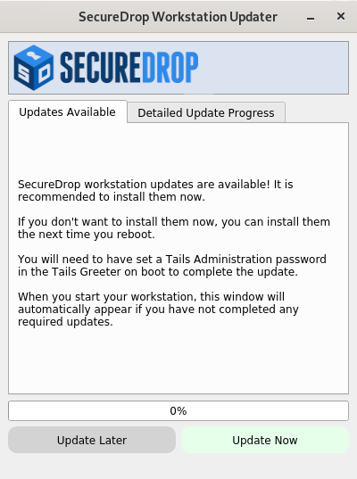

Upgrade from 1.4.1 to 1.5.0
===========================

Automatic server upgrades
-------------------------
As with previous releases, your servers will be upgraded to the latest version
of SecureDrop automatically within 24 hours of the release.

Updating Workstations to SecureDrop 1.5.0
-----------------------------------------

Using the graphical updater
~~~~~~~~~~~~~~~~~~~~~~~~~~~
On the next boot of your SecureDrop *Journalist* and *Admin Workstations*,
the *SecureDrop Workstation Updater* will alert you to workstation updates. You
must have `configured an administrator password <https://tails.boum.org/doc/first_steps/startup_options/administration_password/>`_
on the Tails welcome screen in order to use the graphical updater.

Perform the update to 1.5.0 by clicking "Update Now":

Performing a manual update
~~~~~~~~~~~~~~~~~~~~~~~~~~
If the graphical updater fails and you want to perform a manual update instead,
first delete the graphical updater's temporary flag file, if it exists (the
``.`` before ``securedrop`` is not a typo): ::

  rm ~/Persistent/.securedrop/securedrop_update.flag

This will prevent the graphical updater from attempting to re-apply the failed
update and has no bearing on future updates. You can now perform a manual
update by running the following commands: ::

  cd ~/Persistent/securedrop
  git fetch --tags
  gpg --keyserver hkps://keys.openpgp.org --recv-key \
   "2224 5C81 E3BA EB41 38B3 6061 310F 5612 00F4 AD77"
  git tag -v 1.5.0

The output should include the following two lines: ::

    gpg:                using RSA key 22245C81E3BAEB4138B36061310F561200F4AD77
    gpg: Good signature from "SecureDrop Release Signing Key"

Please verify that each character of the fingerprint above matches what is
on the screen of your workstation. If it does, you can check out the
new release: ::

    git checkout 1.5.0

.. important:: If you do see the warning "refname '1.5.0' is ambiguous" in the
  output, we recommend that you contact us immediately at securedrop@freedom.press
  (`GPG encrypted <https://securedrop.org/sites/default/files/fpf-email.asc>`__).

Finally, run the following commands: ::

  ./securedrop-admin setup
  ./securedrop-admin tailsconfig

Upgrading Tails
---------------
If you have already upgraded your workstations to the Tails 4 series, follow the
graphical prompts to update to the latest version.

.. important::

   If you are still running Tails 3.x on any workstation, we urge you to update
   to the Tails 4 series as soon as possible. Tails 3.x is no longer receiving
   security updates, and is no longer supported by the SecureDrop team.
   Please see our
   :doc:`instructions for upgrading to Tails 4 <../upgrade_to_tails_4>`.

   These instructions will be removed from a future version of this
   documentation.

.. include:: ../includes/always-backup.txt

Troubleshooting Kernel Issues
-----------------------------
SecureDrop 1.5.0 includes a kernel update on the *Application* and *Monitor
Servers*, from version 4.14.175 to version 4.14.188. As with all kernel updates,
we have extensively tested this update against
:ref:`recommended hardware <Specific Hardware Recommendations>`.

If you are running SecureDrop on hardware that is not officially supported, you
may encounter compatibility issues with the new kernel. For example, the servers
may not boot, or you may lose network connectivity. If this happens, you can
temporarily downgrade to the previous kernel version.

.. important::

   To ensure continued secure operation of your SecureDrop instance, it is of
   critical importance to resolve any compatibility issues with the new kernel
   as quickly as possible. If you encounter problems with this update, please
   get in touch with us urgently, so we can help you run the latest supported
   kernel version.

For information on how to downgrade to the previous kernel, and for additional
troubleshooting information, please see our :doc:`Kernel Troubleshooting Guide <../kernel_troubleshooting>`.
   
Getting Support
---------------

Should you require further support with your SecureDrop installation, we are
happy to help!

.. include:: ../includes/getting-support.txt
