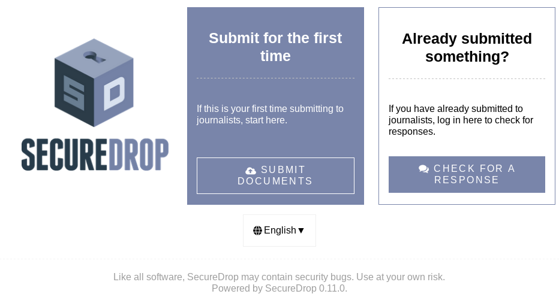

Ubuntu 16.04 LTS (Xenial) migration - Preparatory steps
=======================================================
On 30 April 2019, Ubuntu 14.04 LTS (Trusty) will reach End of Life. After this date, no new security updates to the base operating system will be provided. It is therefore of critical importance for the security of all SecureDrop instances to upgrade to Ubuntu 16.04 LTS (Xenial) before April 30.

SecureDrop servers provisioned before February 26 use Ubuntu 14.04 LTS as the base operating system. Support for Ubuntu 16.04 LTS (which will receive security updates until April 2021) is scheduled to be included with the next release of SecureDrop, version 0.12.0, on February 26. The operating system update itself must be performed manually.

We recommend that you plan two working days (after your instance has been updated to SecureDrop 0.12.0) to backup your instance, perform the upgrade, and test your instance once it is upgraded. We recommend scheduling this maintenance window no earlier than March 6.

Anytime before then, we suggest taking some simple preparatory steps to ensure your SecureDrop instance can be upgraded smoothly.

Preparation Procedure
---------------------

In summary, the preparation procedure consists of:

 #. ensuring your instance is running the latest version of SecureDrop;
 #. ensuring your *Admin Workstation* and *Journalist Workstations* are up to date;
 #. ensuring you have a recent backup of the Securedrop servers;
 #. verifying that you still have SSH access to the servers.

Each of these steps are described below.

Checking your Server Securedrop version
---------------------------------------

The simplest way to check your SecureDrop version is to load the .onion address of your Source Interface in the Tor Browser. The version number will be in the footer of the Source Interface. 

 
If you have already confirmed that you have :ref:`SSH access <verify_ssh_access>` to the servers,  you can also check the application version from the command line on the *Application Server* by running the command:

.. code:: sh

 apt-cache policy securedrop-app-code

SecureDrop servers are updated automatically with the latest release version (0.11.1 as of January 24, 2019). Recently, some long-running SecureDrop instances were affected by a bug which will cause any updates after 0.10.0 to fail. If your instance is still running 0.10.0, please `consult our advisory <https://securedrop.org/news/advisory-automatic-update-failure-version-0100-0110-some-securedrop-instances/>`_ to update to the latest version.

.. important::
 If your instance is affected by this bug, it will no longer receive automatic updates. This is a major security risk and we urge you to take manual action as soon as possible to update SecureDrop. Please do not hesitate to :ref:`contact us <contact_us>` if we can help.

Ensuring your Admin Workstation is up-to-date
-----------------------------------------------

First, back up your *Admin Workstation*. using the process described here: 
:doc:`Back up the Workstations <../backup_workstations>`.

Next, ensure you are running the latest version of the Tails OS. You can do this by starting up your *Admin Workstation*. and selecting **Activities > Tails > About Tails**. If you are running a version prior to 3.11, you will need to upgrade to version 3.11. For more information on upgrading your Tails USB, see `Upgrading a Tails USB stick <https://tails.boum.org/doc/first_steps/upgrade/index.en.html>`_.

To check the version of the SecureDrop code installed on your *Admin Workstation*, start the *Admin Workstation* with its persistent volume unlocked and an administration password set.  Then open a terminal window and run the following commands:

.. code:: sh

  cd ~/Persistent/securedrop
  git status

The output from ``git status`` should include the following text:

.. code-block:: none
  
  HEAD detached at <version>

where ``<version>`` is  the version of the workstation code that is installed.

If the *Admin Workstation* is at version 0.11.1, it is up-to-date, and you can proceed with :ref:`making a backup of the instance <backup_instance>` and :ref:`verifying SSH connectivity <verify_ssh_access>`. If the *Admin Workstation* is running an earlier version, you will need to upgrade it, using the appropriate steps for your version:

 - 0.9.1 to 0.10.0: `Upgrading from version 0.9.1 or later`_.
 - 0.4 to 0.9.0: `Upgrading from versions 0.4-0.9.0`_.
 - Earlier than 0.4: `Upgrading from version 0.3.x - reprovisioning your Admin Workstation`_.

Upgrading from version 0.9.1 or later
^^^^^^^^^^^^^^^^^^^^^^^^^^^^^^^^^^^^^

If the workstation is at least at version 0.9.1 and up to version 0.10.0, you should see a graphical updater informing you about the availability of a new version. The graphical updater looks like this:

.. image:: ../images/0.6.x_to_0.7/securedrop-updater.png                        

Follow the graphical prompts to complete the update. If you don’t see the graphical updater, make sure that you start up the *Admin Workstation* with both an Administration password set and the persistent volume unlocked.

If you still can’t see the graphical prompt, then you can update manually by following the instructions for :ref:`upgrading from versions 0.4 to 0.9.0 <upgrade_04x>`. 

.. _upgrade_04x:

Upgrading from versions 0.4-0.9.0
^^^^^^^^^^^^^^^^^^^^^^^^^^^^^^^^^

If your workstation code version is between 0.4 and 0.9.0, then you will need to update to the latest version manually. First, open a terminal window and run the following commands:

.. code:: sh

  cd ~/Persistent/securedrop
  git fetch --tags
  gpg --recv-key "2224 5C81 E3BA EB41 38B3 6061 310F 5612 00F4 AD77"
  git tag -v 0.11.1

The output should include the following two lines:

.. code-block:: none 

  gpg:                using RSA key 22245C81E3BAEB4138B36061310F561200F4AD77
  gpg: Good signature from "SecureDrop Release Signing Key"

Please verify that each character of the fingerprint above matches what is on the screen of your workstation. If it does, you can check out the new release:

.. code:: sh

  git checkout 0.11.1

.. important::
  If you see the warning ``refname ‘0.11.1’ is ambiguous`` in the output, we recommend that you contact us immediately at securedrop@freedom.press (GPG encrypted).

Finally, run the following commands:

.. code:: sh

  ./securedrop-admin setup
  ./securedrop-admin tailsconfig

.. _upgrade_03x:

Upgrading from version 0.3.x - reprovisioning your Admin Workstation
^^^^^^^^^^^^^^^^^^^^^^^^^^^^^^^^^^^^^^^^^^^^^^^^^^^^^^^^^^^^^^^^^^^^

If your *Admin Workstation* has not been updated since version 0.3 of SecureDrop was released, its Tails version is most likely also out-of-date. In this case, we recommend provisioning a new *Admin Workstation* using the configuration information from the old workstation.

First, prepare a new Tails USB stick with a persistent volume, using the latest version of Tails. For more information on this process, see :ref:`Create Tails USBs <set_up_tails>`. This will be your new *Admin Workstation*.

Start up your new *Admin Workstation* with its persistent volume unlocked and an administration password set.

Open a terminal and run the following commands to install the SecureDrop app code:

.. code:: sh 

  gpg --recv-key "2224 5C81 E3BA EB41 38B3 6061 310F 5612 00F4 AD77"

  cd ~/Persistent
  git clone https://github.com/freedomofpress/securedrop.git
  cd ~Persistent/securedrop
  git tag -v 0.11.1

.. note:: 
  The SecureDrop application code must be installed in the `~/Persistent/securedrop` directory in order to complete the reprovisioning process successfully. Do not install it in a different location.

The output should include the following two lines:                              
                                                                                
.. code-block:: none                                                            
                                                                                
  gpg:                using RSA key 22245C81E3BAEB4138B36061310F561200F4AD77    
  gpg: Good signature from "SecureDrop Release Signing Key"                     
                                                                                
Please verify that each character of the fingerprint above matches what is on the screen of your workstation. If it does, you can check out the new release.
If it does not, signature verification has failed and you should not proceed with the installation. If this happens, please contact us at securedrop@freedom.press.

Now, check out the current release with the following command:

.. code:: sh
  
  git checkout 0.11.1

Next, mount the persistent volume of the old *Admin Workstation* in order to retrieve instance-specific files that you’ll need to set up the new workstation. To do so:

 1. Plug your old *Admin Workstation* into a free USB port
 2. Browse to **Places > Computer** in the Tails top navigation bar
    |Places Menu|  
 3. Click the encrypted volume in the left-hand panel of the file browser, and enter the decryption passphrase for the volume to mount it.
    |Volume Decryption Dialog|

.. |Places Menu| image:: ../images/upgrade_to_tails_3x/browse_to_places_computer.png
.. |Volume Decryption Dialog| image:: ../images/upgrade_to_tails_3x/fill_in_passphrase.png

Next, copy the files that you’ll need for the new *Admin Workstation*. Open a terminal and run the following commands:

.. code:: sh

  cp /media/amnesia/TailsData/openssh-client/* ~/.ssh/

  export SRC="/media/amnesia/TailsData/Persistent/securedrop/install_files/ansible_base"
  export DST="~/Persistent/securedrop/install_files/ansible-base"

  cp $SRC/{app,mon}* $DST/
  cp $SRC/prod-specific.yml $DST/

  # Next, you’ll need to copy over the instance’s submission public key and OSSEC 
  # public key. Their filenames may vary, but you can check them in the 
  # instance configuration file using the following command:

  grep "_public_key" $DST/prod-specific.yml

  # Assuming that their names are ``Securedrop.asc`` and ``ossec.asc`` 
  # respectively, you should then copy them across by running the following 
  # commands:

  cp $SRC/Securedrop.asc $DST/
  cp $SRC/ossec.asc $DST/

If you use Tails’ KeepassX password manager to store instance-specific passwords, you should also copy over the old workstation’s KeepassX database. 
The default location for the KeepassX database is ``/media/amnesia/TailsData/Persistent/securedrop-keepassx.kdbx``. Copy it to the new *Admin Workstation*'s persistent volume with the following command:

.. code:: sh

  cp /media/amnesia/TailsData/Persistent/securedrop-keepassx.kdbx ~/Persistent/

Once the instance-specific files have been copied across, unmount the old *Admin Workstation*.s persistent volume by clicking its Eject icon in the file browser.

Next, you’ll need to configure the new *Admin Workstation* using the copied files. In a terminal, run the following commands:

.. code:: sh

  cd ~/Persistent/securedrop
  ./securedrop-admin setup
  ./securedrop-admin tailsconfig

You can now proceed to :ref:`back up your instance <backup_instance>` and :ref:`test SSH connectivity <verify_ssh_access>`, as described below.

.. _backup_instance:

Backing up your instance
------------------------

Once your *Admin Workstation* is up-to-date, you should delete any previously-downloaded submissions and sources via the Journalist Interface before backing up the instance servers. In general, this should be done by or in coordination with the editorial staff responsible for the instance!

.. important::
 Deleting old submissions is good security practice. It’s also important in order to control the size of backups, as the backup files are transferred to the *Admin Workstation* over the Tor network. 

To back up your instance servers, open a terminal on the *Admin Workstation* and run the following commands:

.. code:: sh

  cd ~/Persistent/securedrop
  ./securedrop-admin setup
  ./securedrop-admin backup

Once the command is completed, you will find the backup files in the ``~/Persistent/securedrop/install_files/ansible-base`` directory. We recommend that you store those on an encrypted volume on a separate USB stick for safe keeping. For more information on the backup process, see :doc:`Backup, Restore, Migrate<../backup_and_restore>`.

.. _verify_ssh_access:

Verifying SSH access
--------------------

Check to see if you can still access the servers via SSH. To do this, start up your *Admin Workstation* (with persistent storage unlocked) and run the following commands.

.. code:: sh

  ssh app hostname     # command output should be 'app'
  ssh mon hostname     # command output should be 'mon'

If you are having trouble accessing the servers via SSH, try the following:

 - creating a new Tor network circuit by disconnecting and reconnecting your Internet link, and repeating the check;
 - running the ``./securedrop-admin tailsconfig`` command and repeating the check;
 - verifying that the Source and Journalist Interfaces are available via their desktop shortcuts;
 - verifying that the Application and Monitor servers are up;
 - :ref:`contacting us <contact_us>` for assistance.

Upgrading Journalist Workstations
---------------------------------

You should keep your *Journalist Workstations* in sync with the SecureDrop version in use on your *Admin Workstation*.. You can check the SecureDrop code versions on a *Journalist Workstation* using the procedure described above.

 - If your *Journalist Workstation* code version is 0.9.1 or later, you can upgrade it using the graphical updater.
 - If its code version is later than 0.4 and earlier than 0.9.1, you can use the process described above for an *Admin Workstation* with the same code version to upgrade it.
 - If its code version is less than 0.4, we recommend provisioning a new *Journalist Workstation* instead, after upgrading your *Admin Workstation*.

.. _contact_us:

Contact us
----------

If you have questions or comments regarding the coming upgrade to Ubuntu 16.04 LTS or the preparatory procedure outlined above, please don't hesitate to reach out:

 - via our `Support Portal <https://support.freedom.press>`_, if you are a member (membership is approved on a case-by-case basis);
 - via securedrop@freedom.press (GPG encrypted) for sensitive security issues (please use judiciously);
 - via our `community forums <https://forum.securedrop.org>`_.

