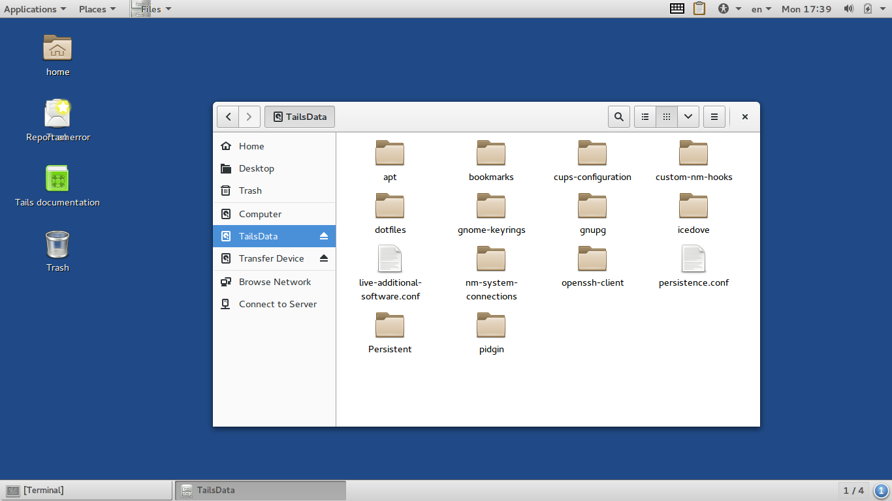

Upgrade Tails from 1.x to 2.x
=============================

Newer versions of SecureDrop leverage improvements to the Tails OS since the introduction of Tails 2.0 (and subsequent versions). It is critical to upgrade all Tails USBs to the latest version before upgrading SecureDrop. For some admins, this might be complicated, since the upgrade from 1.x to 2.x must be done manually. Please follow this guide to updating the entire system, and special attention to only use the Secure Viewing Station computer so you benefit from its airgap while transfering sensitive data.

.. note::
	You will need:

	#. A "master" Tails USB
	#. Transfer device
	#. Your existing SecureDrop Tails USB sticks (Admin/Journo/Secure Viewing Station)

1. Prepare the "master" Tails USB
-------------------------------------

Because Tails 2.x is incompatible with older versions, you must create a new "master" Tails USB stick for subsequent installations and upgrades to the USB sticks already in-use by your organization.

To create this brand-new "master" Tails, follow the same :doc:`directions for provisioning the first USB sticks <set_up_tails>`.

You may now boot into this new Tails from your airgapped Secure Viewing Station to perform the next step. At the Tails Greeter screen, be sure to enable admin privileges.

2. Prepare the Transfer Device
------------------------------

While it's recommended to use a fresh USB stick for any backup operation, to cut down on cost and/or waste, you may also repurpose older USB sticks to function as Transfer Devices.

Open the Disks Utility by navigating to Applications ▸ Utilities ▸ Disks.

Insert your Transfer Device into a USB port and select it from the left column. Brand new devices sometimes have pre-configured partitions, which you will need to remove. Select any block of partitioned data, and click the minus (``-``) button to remove any unwanted partitions.

|Unwanted Bloatware Partition|

Click the plus (``+``) button to register a new partition to cover the entire available space. This should automatically be filled out for you in the wizard.

Be sure to do a full wipe of the existing data during this step, especially if you choose to repurpose an older USB stick. Select "Overwrite existing data with zeroes (Slow)" from the "Erase" options. This does mean that the reformatting step will take some extra time, but it is the best way to insure that previous data from older transfers, or manufacturer bloatware, is removed from the Transfer Device.

Give your new partition a complex, diceware-generated passphrase. 

|Create Partition|

.. tip:: If you plan on using this USB stick as a permanent backup, you will be responsible for retaining this passphrase for the long-haul. If you only want to use this USB as an intermediary backup, and plan on discarding the data after a successful migration, you may discard the passphrase once everything is completed.

3. Backup a Tails USB
--------------------------------------------

Insert the Tails USB you want to back up into a free USB port, and mount it by navigating to Places ▸ Computer, and clicking on the encrypted disk. You will be prompted to enter the passphrase to unlock the disk (the same passphrase you normally use to log into Tails on this USB stick).

Open a Nautilus window with admin priviledges by navigating to Applications ▸ System Tools ▸ Root Terminal. At the terminal prompt, simply type ``nautilus``.

|Root Terminal|

The Nautilus window should show both the Transfer Device and the TailsData partition as mounted.

|Migrate Data 1|

Copy the all data from the TailsData partition onto the Transfer Device **except**:

-	``persistence.conf``: in older versions of Tails, this file might have slightly different directives in it that could temporarily brick a Tails 2.x USB.
-	``claws-mail`` folder: Claws Mail is no longer included in Tails. The OS uses Icebird instead. Some users might not have this folder, so if you don't see it there, do not be alarmed.

|Migrate Data 2|

Insure that all critical data has been successfully copied.  Specifically, be sure the the ``gnupg``, ``bookmarks``, and ``Persistent`` folders are completely copied.  Any loss of data from these folders could prevent users from accessing submissions.

Once data are correctly copied, unmount the TailsData partition.

4. Upgrade a Tails USB
------------------------------------------------------

With the Admin/Journo/SVS Tails USB still insterted in the machine, navigate to the Tails Installer (Applications ▸ Tails ▸ Tails Installer) and select the "Upgrade by cloning" option.

|Upgrade by cloning|

The Tails Installer program should reliably upgrade the inserted Tails USB, but if for some reason this process fails, you have your data backed up to the Transfer Device. If you find yourself in that unlucky situation, follow step 5. Otherwise, skip to Step 7 to wipe and reformat the Transfer Device for reuse.

5. Restore data from a Transfer Device
--------------------------------------

On the same airgapped machine, boot up the Tails USB stick you want to restore, with both persistence and admin privileges.

Insert your Transfer Device into a free USB port, and mount it by navigating to Places ▸ Computer, and clicking on the encrypted disk. You will be prompted to enter its passphrase.

Open a Nautilus window with admin priviledges by navigating to Applications ▸ System Tools ▸ Root Terminal. At the terminal prompt, simply type `nautilus`.

Type ``ctrl`` + ``l`` and navigate to `/live/persistence/TailsData_unlocked`.

|Navigate to TailsData_unlocked|

Open a new tab (``ctrl`` + ``t``) and navigate to your Transfer Device. Drag and drop the backup data from your Transfer Device onto the TailsData_unlocked tab.

When copying a folder, select the *Apply this action to all files* option and click *Merge* to apply to all subfolders. Then you might have to select again the *Apply this action to all files* option and click *Replace* to apply to all files.

In a root terminal, or as sudo, execute the following command to fix the ownership of your personal files:

::

	find /live/persistence/TailsData_unlocked/ -uid 1000 -exec chown -R 1000:1000 '{}' \;

Reboot your primary Tails USB and verify *everything* is still there and accessible to you, including:

-	KeePassX Database
-	PGP keys

.. note:: If you are restoring a Secure Viewing Station Tails USB, you may skip to Step 7. 
	However, if you're restoring an Admin or Journalist Tails USB, continue to Step 6.

6. Reinstall SecureDrop
-----------------------

Continue checking your persistent files for the following critical assets:

-	Bookmarks in Tor Browser
-	SecureDrop files, especially the ``torrc_additions`` file in ``~/Persistent/.securedrop``.
-	If you're an admin, also be sure the files in ``~/Persistent/securedrop/install_files/`` are available.

Shut down your Tails USB on the airgapped station and move to the computer you normally use to check for submissions. At this stage, all data has been migrated and it's safe to use this Tails USB on a networked computer.

Boot up Tails once again with persistence and admin privileges.

.. warning:: Copy ``~/Persistent/.securedrop/torrc_additions`` to a place like your desktop.
	You'll need these old values for the following step.

Re-install Securedrop with ``cd ~/Persistent/securedrop/tails_files && sudo ./install.sh``. Once completed, test your access to the Document Interface, and, if you're a Secure Drop admin, test your ssh connection to the application and monitor servers.

If you did this correctly, move on to Step 7.

7. Reformat the Transfer Device
-------------------------------

Repeat step 1 to restore a USB stick to a pristine state. While it probably isn't necessary to physically destroy a Transfer Device (because LUKS-encrypted data is very hard to forensically recover), you could smash the device with a hammer until the chips containing its flash memory are broken up into pieces before disposal.

