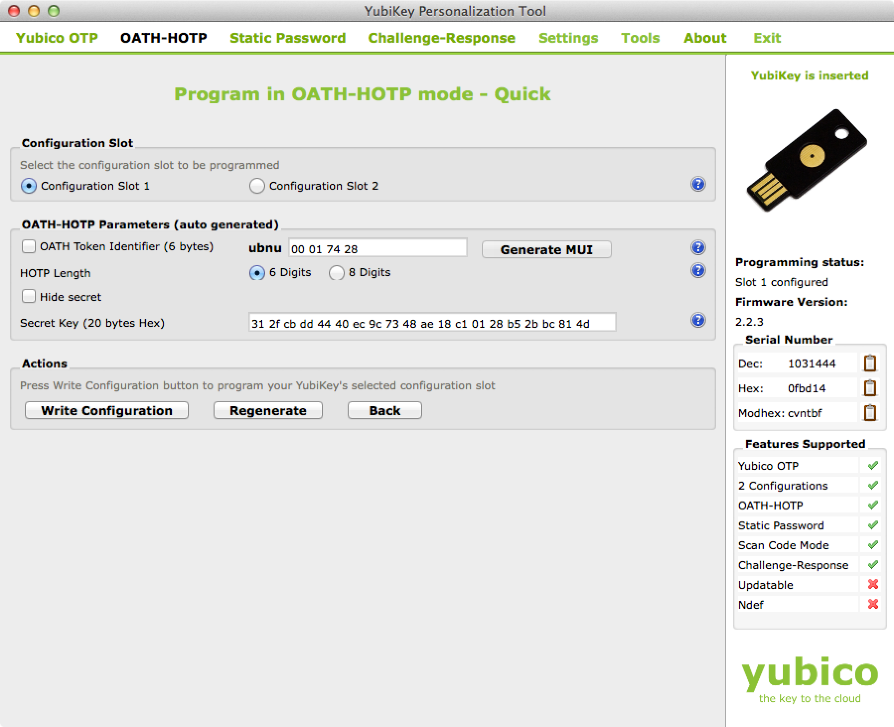
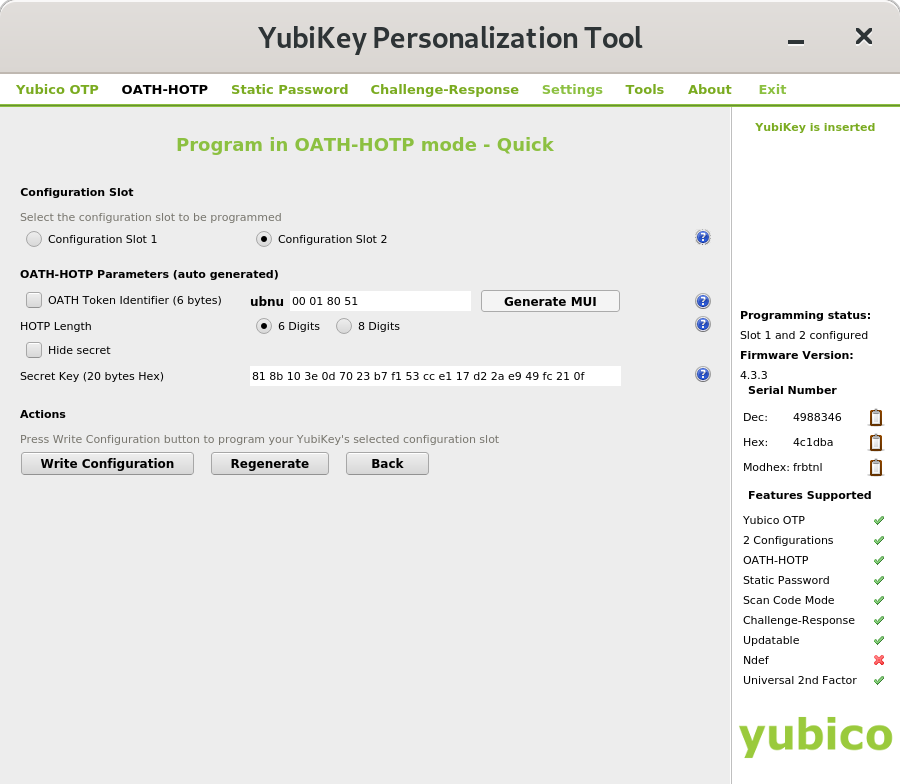

Using a YubiKey with the *Journalist Interface*
===============================================

This guide describes in detail how to set up a YubiKey for two-factor
authentication on the *Journalist Interface*. This setup is performed
once per journalist to create a secure log-in method. The process
requires some configuration steps using a separate software tool.

.. note:: You will do all of these steps from within the Tails
          operating system.

What is a YubiKey?
------------------

A YubiKey is a physical token used for two-factor authentication. They
are made by a company called Yubico and are `commercially available`_. Note
that not all physical tokens are compatible with the YubiKey Personalization
Tool; for this, you require `a key that can support OATH-HOTP`_.

.. _`commercially available`: https://www.yubico.com/products/yubikey-hardware/fido-u2f-security-key

.. _`a key that can support OATH-HOTP`: https://support.yubico.com/support/solutions/articles/15000006467-oath-hotp-yubico-best-practices-guide

Download and Launch the YubiKey Personalization Tool
----------------------------------------------------

#. Start Tails. At the log in-screen, choose the option to allow an
   administrator passphrase.
#. Open a terminal and enter

.. code:: sh

   sudo apt-get update;
   sudo apt-get install yubikey-personalization-gui

#. Once you have downloaded and installed the personalization program,
   open a **Root Terminal** by choosing **Applications ▸ System Tools
   ▸ Root Terminal**.

#. Open the YubiKey personalization tool by entering

.. code:: sh

   yubikey-personalization-gui

Setting Up Hardware-Based Codes
-------------------------------

After opening the personalization tool, click the heading
**OATH-HOTP**. This will bring you to a window called **Program in
OATH-HOTP mode**.

Click on the **Quick** button.

|YubiKey Overview|

Under **Configuration Slot**, click **Configuration Slot 1**.

.. note:: If you are already using this YubiKey for something else,
          you should choose **Configuration Slot 2**. You will have to
          press and hold for several seconds to use the token from
          **Slot 2** instead of the one in **Slot 1**. See the
          `YubiKey manual`_ for more information.

.. _`Yubikey manual`: https://www.yubico.com/wp-content/uploads/2015/03/YubiKeyManual_v3.4.pdf

In the section titled **OATH-HOTP parameters**, uncheck the box for
**OATH Token Identifier (6 bytes)**. Leave the HOTP length at 6 digits. 
Next, uncheck the box for **Hide secret**. This will display the **Secret Key 
(20 bytes Hex)** field.

.. important:: Make a note somewhere safe of the **Secret Key (20
               bytes Hex)** value.

|YubiKey Config|

When ready, click the **Write Configuration** button.

Click through the warning about overwriting the configuration slot and
choose a location to save the log file. When the configuration is
done, you should see green text saying **YubiKey configured** at the
top of the window.

|YubiKey Config Successful|

Adding Users
------------

When adding new users, a SecureDrop admin will need the
**Secret Key** value described above. She will enter it after
selecting the **I'm Using a YubiKey** option while :ref:`adding users
<Adding Users>`. The new user will then have to verify their YubiKey before
being added to the system. This means that the new user and the admin should be
physically present for this process.

Using Your YubiKey
------------------

When using a Yubikey to log-in to the *Journalist Interface*, insert
the Yubikey into the USB port and enter your username and
passphrase. Then click the **Two-factor Code** field to focus the
cursor there. Quickly press the lighted button on your YubiKey. This
will insert the 6-digit code that you will need to log in.

.. note:: When using **Configuration Slot 2**, be sure to press and hold
          the YubiKey button for approximately 3 seconds. This can be somewhat
          finicky.

.. |YubiKey Overview| image:: images/yubikey_overview.png

